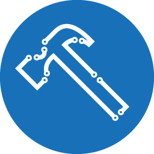
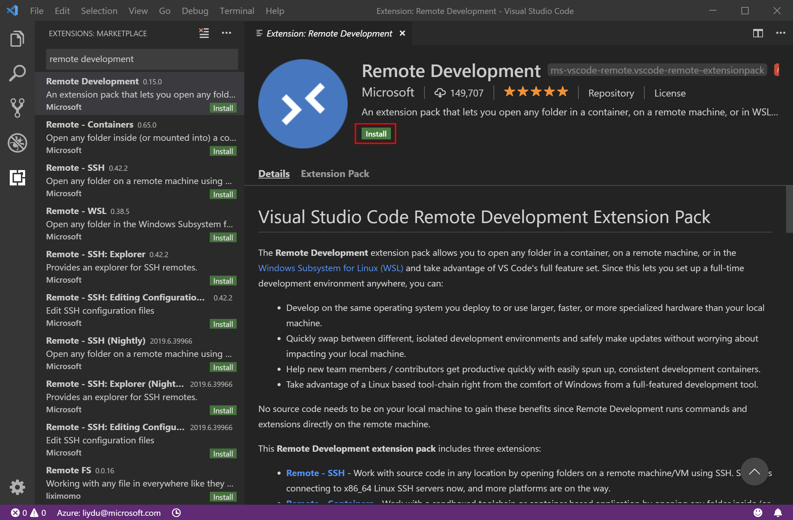
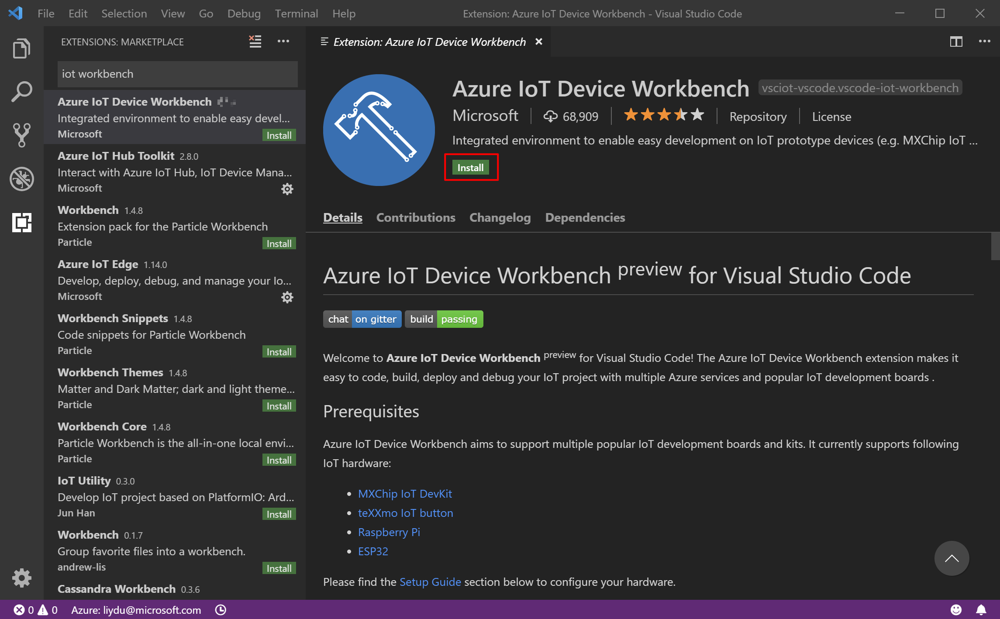
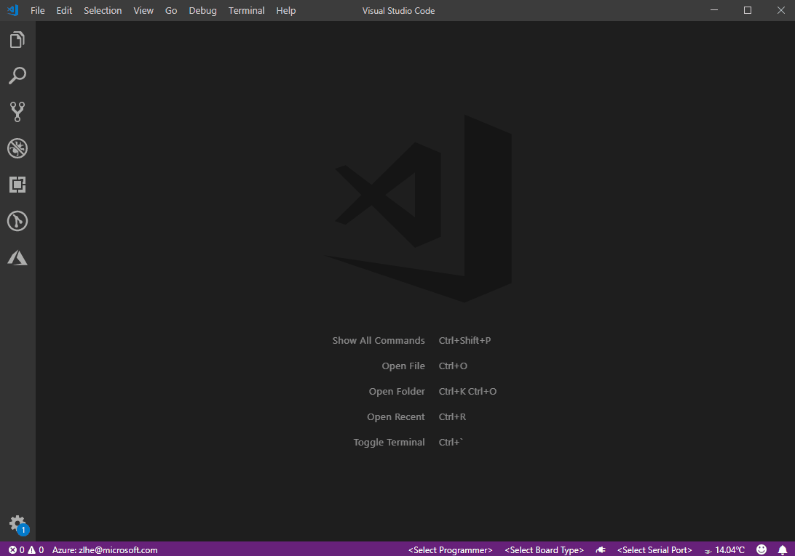
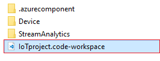

# Azure IoT Device Workbench <sup>preview</sup> for Visual Studio Code

[](https://gitter.im/Microsoft/vscode-iot-workbench)
[](https://travis-ci.org/Microsoft/vscode-iot-workbench)



The **Azure IoT Device Workbench** <sup>preview</sup> is an extension in Visual Studio Code that provides an integrated environment to code, build, deploy and debug your IoT device project with multiple Azure services supported.

## Device platforms and languages supported

Azure IoT Device Workbench aims to support multiple device platforms and its devices. Currently the following device platforms and languages are supported :

### Embedded Linux

Languages supported: `C / C++`

Devices supported: [Cortex-A series](https://developer.arm.com/ip-products/processors/cortex-a) devices (e.g. Raspberry Pi, NXP i.MX6) that are running Embedded Linux such as Debian, Ubuntu or Yocto Linux.

### Arduino

Languages supported: `Arduino C`

Devices supported:

- [MXChip IoT DevKit](https://aka.ms/iot-devkit)
- [ESP32](https://www.espressif.com/en/products/hardware/esp-wroom-32/overview)
- [teXXmo IoT button](https://aka.ms/button)

Please help to take the [survey](https://www.surveymonkey.com/r/C7NY7KJ) to let us know extra device platforms and languages you want to have for Device Workbench.

## Installation

### Prerequisite

- [Visual Studio Code](https://code.visualstudio.com/), with version >= 1.35.1.
- [Docker Desktop](https://www.docker.com/products/docker-desktop) (Docker CE)

You will need Docker Desktop and Visual Studio Code version with [VS Code Remote Development](https://aka.ms/vscode-remote) to compile the device code in the [containerized device toolchain](#).

### Install extensions

1. Launch VS Code, in the Extension tab, find and install **"Remote Development"** extension pack. This will enable the VS Code Remote Development.
    

2. Then, in the same Extension tab, find and install **"Azure IoT Device Workbench"**.
    

3. Reload the window and make sure all the dependency extensions are correctly installed.

4. Open Docker settings page, enable "Shared Device" so that local environment can access the folders in container.
    

## Usage

Depending on the device platform you choose, follow the resources below to develop on it.

### Embedded Linux

To simplify the cross compiling toolchain, Azure IoT Device SDK and dependencies setup and configuration, Device Workbench put all these components in the container. All cross-compiling works happen in it. Here is the quick start of using it to develop and compile a simple device app written in C and running on Raspberry Pi to send telemetry data to Azure IoT Hub.

*[TBD]*

### Arduino

#### MXChip IoT DevKit

Follow the [setup guide](https://docs.microsoft.com/en-us/azure/iot-hub/iot-hub-arduino-iot-devkit-az3166-get-started#prepare-the-development-environment) to setup the environment including the Arduino extension.

Here are a set of tutorials that will help you get started:

- [Get Started](https://docs.microsoft.com/en-us/azure/iot-hub/iot-hub-arduino-iot-devkit-az3166-get-started)
- [Use Azure IoT Hub Device Provisioning Service auto-provisioning device with IoT Hub](https://docs.microsoft.com/en-us/azure/iot-dps/how-to-connect-mxchip-iot-devkit)
- [Connect to the Remote Monitoring solution accelerator](https://docs.microsoft.com/en-us/azure/iot-accelerators/iot-accelerators-arduino-iot-devkit-az3166-devkit-remote-monitoring-v2)
- [Translate voice message with Azure Cognitive Services](https://docs.microsoft.com/en-us/azure/iot-hub/iot-hub-arduino-iot-devkit-az3166-translator)
- [Retrieve a Twitter message with Azure Functions](https://docs.microsoft.com/en-us/azure/iot-hub/iot-hub-arduino-iot-devkit-az3166-retrieve-twitter-message)
- [Send messages to an MQTT server using Eclipse Paho APIs](https://docs.microsoft.com/en-us/azure/iot-hub/iot-hub-arduino-iot-devkit-az3166-mqtt-helloworld)
- [DevKit State](./docs/iot-devkit/devkit-state.md)
- [Door Monitor](./docs/iot-devkit/devkit_door_monitor.md)
- [DevKit OTA](./docs/iot-devkit/devkit-ota.md)
- [Stream Analytics and Cosmos DB](./docs/iot-devkit/devkit-stream-analytics-cosmos-db.md)

#### ESP32

Follow the [setup guide](docs/esp32.md) to setup ESP32 device including the Arduino extension.

Here are a set of tutorials that will help you get started:

- [Get Started](./docs/esp32/esp32-get-started.md)
- [Stream Analytics and Cosmos DB](./docs/esp32/esp32-stream-analytics-cosmos-db.md)
- [ESP32 State](./docs/esp32/esp32-state.md)
- [M5Stack Email Receiver](./docs/esp32/m5stack-email-receiver.md)

#### teXXmo IoT button

- [Get Started](./docs/iot-button/teXXmo_IoT_button_get_started.md)

## Commands

*[TBD]*

| Command | Description |
| --- | --- |
| `Azure IoT Device Workbench: Create Project...`  | Create new IoT Device Workbench projects. |
| `Azure IoT Device Workbench: Open Examples... ` | Load existing examples of IoT Device Workbench project. |
| `Azure IoT Device Workbench: Provision Azure Services...` | Provison Azure services for current project. |
| `Azure IoT Device Workbench: Deploy to Azure...`  | Deploy the code of the Azure services. |
| `Azure IoT Device Workbench: Compile Device Code`  | Compile device code. |
| `Azure IoT Device Workbench: Upload Device Code`  | Compile and upload device code. |
| `Azure IoT Device Workbench: Configure Device Settings...`  | Manage the settings on the device. |
| `Azure IoT Device Workbench: Install Device Compiler Toolchain...`  | Install device compiler toolchain. |
| `Azure IoT Device Workbench: Set Workbench Path` | Set the default path for Azure IoT Device Workbench. |
| `Azure IoT Device Workbench: Help` | Get help for Azure IoT Device Workbench. |

### Create Project


### Provision Azure Services


### Open Examples



#### Note: 
-  When invoking the **Azure IoT Device Workbench: Provision Azure Services...** command with Azure IoT Hub and Azure Functions, by default, Azure Functions would use the IoT Hub consumer group of `$Default`. To switch to another consumer group, please follow the [guide](https://docs.microsoft.com/en-us/azure/iot-hub/iot-hub-create-through-portal) to create a new consumer group in Azure Portal. Then in IoT project, modify the following setting in **function.json**:
    ```
    "consumerGroup": "[consumer_group_name]"
    ```
-  You may open an existing IoT project after you close it. To do so:
    -  In the menu of **Visual Studio Code**, choose *File -> Open Workspace...* .
    -  In file selection panel, navigate to the folder that contains your project and select *{PROJECT_NAME}.code-project*.

        
    -  Click **Open**.

## Privacy Statement
The [Microsft Enterprise and Developer Privacy Statement](https://www.microsoft.com/en-us/privacystatement/EnterpriseDev/default.aspx) describes the privacy statement of this software.

## Contributing
There are a couple of ways you can contribute to this repo:

- **Ideas, feature requests and bugs**: We are open to all ideas and we want to get rid of bugs! Use the Issues section to either report a new issue, provide your ideas or contribute to existing threads.
- **Documentation**: Found a typo or strangely worded sentences? Submit a PR!
- **Code**: Contribute bug fixes, features or design changes:
  - Clone the repository locally and open in VS Code.
  - Install [TSLint for Visual Studio Code](https://marketplace.visualstudio.com/items?itemName=eg2.tslint).
  - Open the terminal (press <code>Ctrl + &#96;</code>) and run `npm install`.
  - To build, press `F1` and type in `Tasks: Run Build Task`.
  - Debug: press `F5` to start debugging the extension.
  - Run `gts check` and `gts fix` to follow TypeScript style guide.  
- **Example**: Contribute examples for the supported devices.

  - Create a git repo to host the code of your example project.
  - Write a tutorial to describe how to run the example.
  - Submit a [new issue](https://github.com/Microsoft/vscode-iot-workbench/issues/new) and provide the following information:
  
    | Item | Description |
    | --- | --- |
    | `Name` | Name of the example to be displayed in example gallery. |
    | `Description` | A short statement to describe the example. |
    | `Location` | URL of the GitHub repo. |
    | `Image` | URL of the example image (size: 640*370) shown in the gallery, if not provided, the default image will be used. |
    | `Tutorial` | URL of tutorial that describes how to run the example. |
    | `Difficulty` | Difficulty of the example, easy, medium or difficult. |

## Code of Conduct
This project has adopted the [Microsoft Open Source Code of Conduct](https://opensource.microsoft.com/codeofconduct). For more information please see the [Code of Conduct FAQ](https://opensource.microsoft.com/codeofconduct/faq/#howadopt) or contact opencode@microsoft.com with any additional questions or comments.

## Contact Us
If you would like to help to build the best IoT experience with Azure IoT Device Workbench, you can reach us directly at [gitter chat room](https://gitter.im/Microsoft/vscode-iot-workbench).

## Telemetry
VS Code collects usage data and sends it to Microsoft to help improve our products and services. Read our [privacy statement](https://go.microsoft.com/fwlink/?LinkID=528096&clcid=0x409) to learn more. If you don’t wish to send usage data to Microsoft, you can set the `telemetry.enableTelemetry` setting to `false`. Learn more in our [FAQ](https://code.visualstudio.com/docs/supporting/faq#_how-to-disable-telemetry-reporting).


