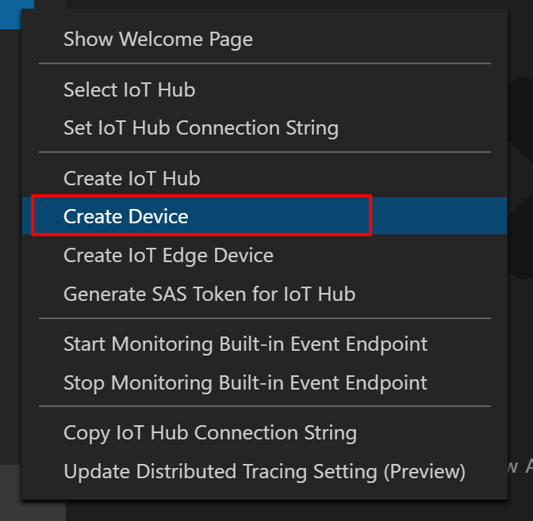
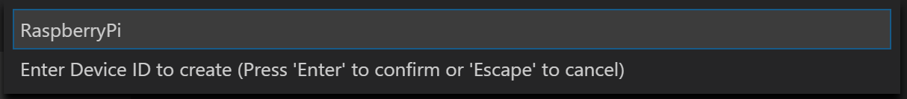
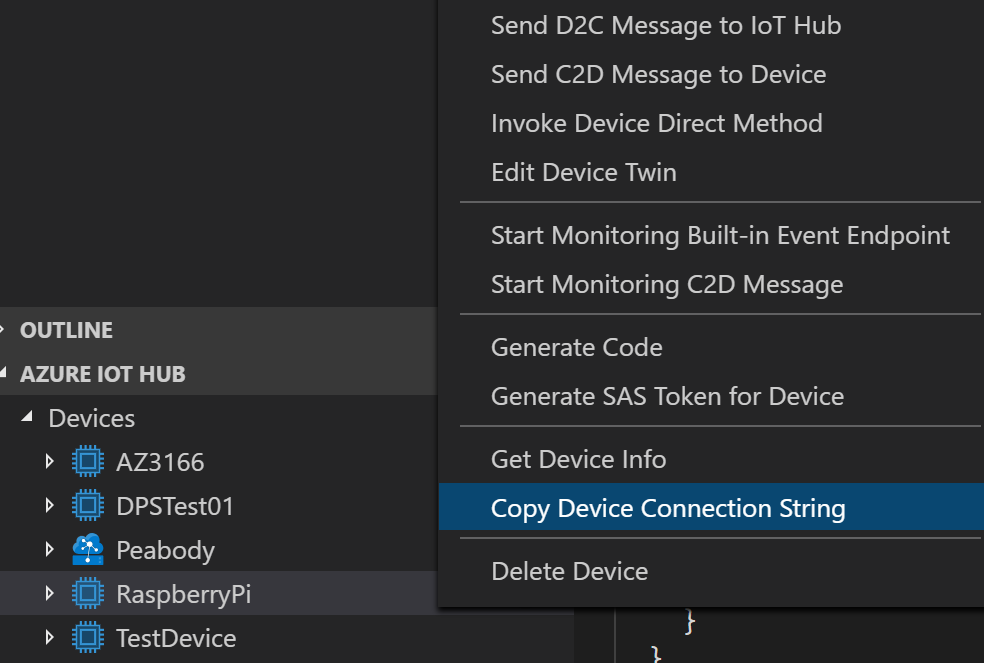

# Create Azure IoT Hub Device

Follow these steps to use Azure IoT Hub Toolkit in VS Code to create an IoT Hub device and restrieve its connection string.

## Prerequisite

- An active Azure subscription. [Activate a free 30-day trial Microsoft Azure account](https://azureinfo.microsoft.com/us-freetrial.html).
- [Azure Iot Hub Toolkit extension](https://marketplace.visualstudio.com/items?itemName=vsciot-vscode.azure-iot-toolkit). If you have the Azure IoT Device Workbench installed, you are good to go.

## Steps

1. In VS Code, press `F1`, type and select **Azure: Sign In**.

2. Once you signed in, you can see your Azure account at the status bar.
    

3. If you don't have Azure IoT Hub created before, Press `F1`, type and select **Azure IoT Hub: Create IoT Hub**. Follow the step by step wizard to finish creating new IoT Hub.

4. Otherwise, use command **Azure IoT Hub: Select IoT Hub** to select the one either you have already or just created.

5. On the sidebar, in **AZURE IOT HUB** section, click More Actions button and select **Create Device** to create a new IoT Hub device.
    

    

6. Enter the device ID and press enter.
    

7. You will see the device in the "Devices" list. Right click on it and select **Copy Device Connection String**. Note it down.
    
