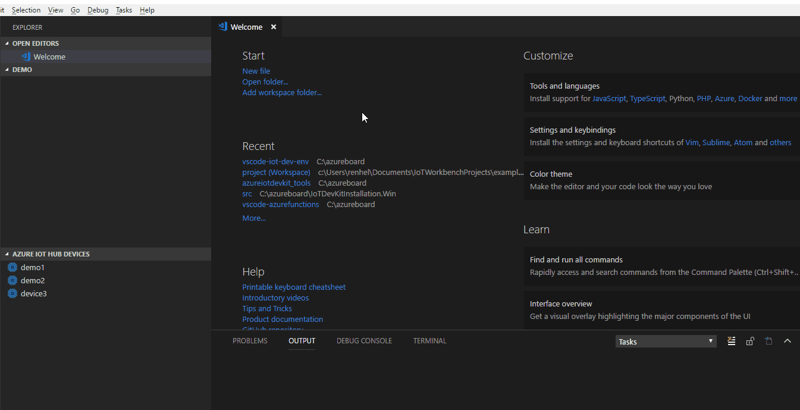
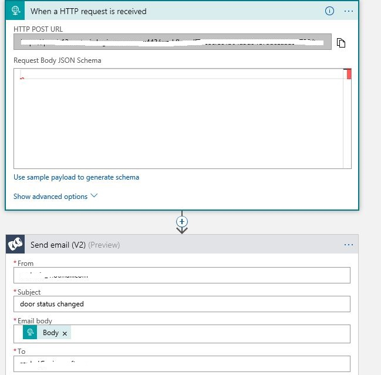
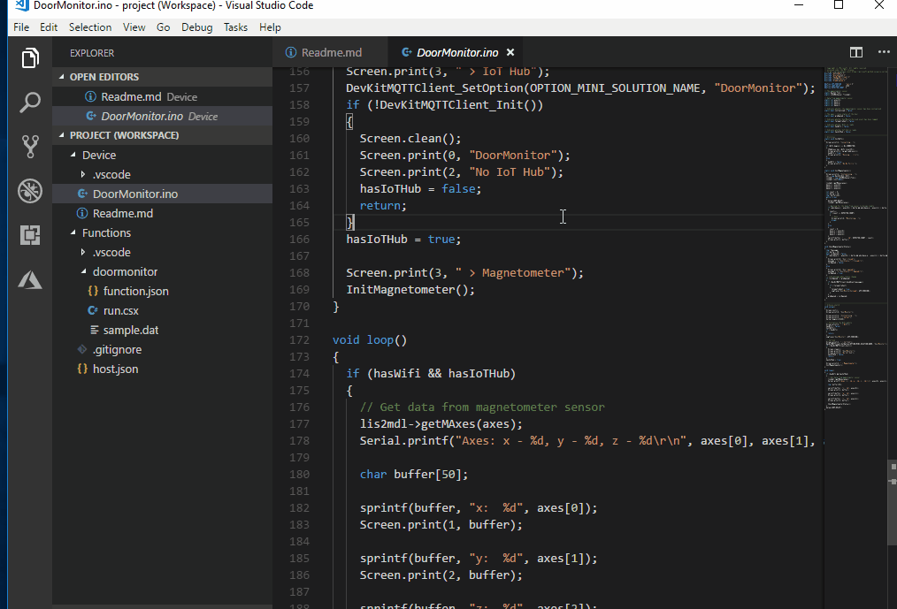
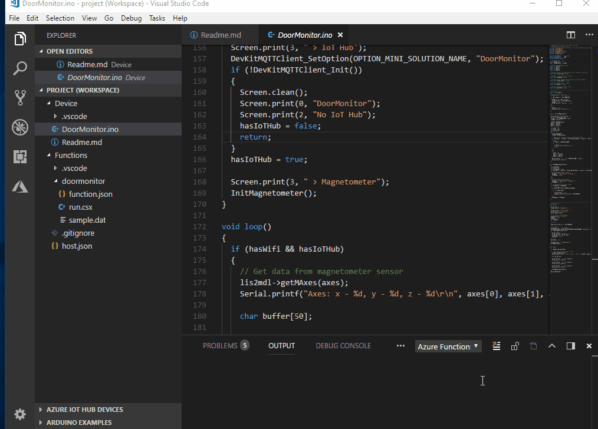

# Door Monitor          

The MXChip IoT DevKit contains a built-in magnetic sensor. In this project, you detect the presence or absence of a nearby strong magnetic field--in this case, coming from a small. permanent magnet.

## What you learn

In this project, you learn:
- How to use the MXChip IoT DevKit's magnetic sensor to detect the movement of a nearby magnet.
- How to use the SendGrid service to send a notification to your email address.

> [!NOTE]
> For a practical use of this project:
> - Mount a magnet to the edge of a door.
> - Mount the DevKit on the door jamb close to the magnet. Opening or closing the door will trigger the sensor, resulting in your receiving an email notification of the event.

## What you need

Finish the [Getting Started Guide](https://microsoft.github.io/azure-iot-developer-kit/docs/get-started/) to:

* Have your DevKit connected to Wi-Fi.
* Prepare the development environment.

* An active Azure subscription. If you do not have one, you can register via one of these methods:

  * Activate a [free 30-day trial Microsoft Azure account](https://azure.microsoft.com/free/).
  * Claim your [Azure credit](https://azure.microsoft.com/pricing/member-offers/msdn-benefits-details/) if you are an MSDN or Visual Studio subscriber.

## Open the DoorMonitor sample

1. Start VS Code. Make sure [Azure IoT Workbench](https://marketplace.visualstudio.com/items?itemName=vsciot-vscode.vscode-iot-workbench) is installed.

1. Use `Ctrl+Shift+P` (macOS: `Cmd+Shift+P`) to open the command palette, type **IoT Workbench**, and then select the command of **IoT Workbench: Examples**. 

1. Please select the board **IoT DevKit**. Find **Door Monitor** 

1. Click **Open Sample** button. A new VS Code window with a project folder in it opens.



## Deploy SendGrid service in Azure

[SendGrid](https://sendgrid.com/) is a cloud-based email delivery platform. This service will be used to send email notifications.

> [!NOTE]
> If you have already deployed a SendGrid service, you may proceed directly to [Deploy IoT Hub in Azure](#deploy-iot-hub-in-azure).

### SendGrid Deployment

To provision Azure services, use the **Deploy to Azure** button. This button enables quick and easy deployment of your open-source projects to Microsoft Azure.

Click the **Deploy to Azure** button, below. 

[](https://portal.azure.com/#create/Microsoft.Template/uri/https%3A%2F%2Fraw.githubusercontent.com%2FIoTDevEnvExamples%2FDevKitDoorMonitor%2Fdeploy%2FSendGridDeploy%2Fazuredeploy.json)

You then see the following page.


> [!NOTE]
> If you do not see the above page, you may need to first sign in to your Azure account.

Complete the sign-up form:

  * **Resource group**: Create a resource group to host the SendGrid service, or use an existing one. See [Using resource groups to manage your Azure resources](https://docs.microsoft.com/azure/azure-resource-manager/resource-group-portal).

  * **Name**: The name for your SendGrid service. Choose a unique name, differing from other services you may have.

  * **Password**: The service requires a password, which will not be for anything in this project.

  * **Email**: The SendGrid service will send verification to this email address.

  > [!NOTE]
  > Check the **Pin to dashboard** option to make this application easier to find in the future.
 
### SendGrid API Key creation

After the deployment succeeds, click it and then click the **Manage** button. You are taken to your SendGrid page, and need to verify your email address.


On the SendGrid page, click **Settings** > **API Keys** > **Create API Key**. Input the **API Key Name** and click **Create & View**.


Your API key is displayed only one time. Be sure to copy and store it safely, as it is used in the next step.

## Creating Azure Logic App

1. Open [Azure Portal](https://portal.azure.com)
1. Select the **+** or **Create a resource** button and under **Enterprise Integration** choose **Logic App**.
1. Give it a Name, Resource Group, and Region (any will do) and click **Create**.
1. After the logic app is created, open it.
1. The designer should automatically load - if not click the **Edit** button.
1. Select the **When an HTTP request is received** trigger.
1. Click **New Step** to add a step to the workflow and **Add an action**.
1. Search for the key word of **Send email** action.
    > NOTE: You are more than welcome to use any action you want to perform on an IoT event


1. Select the **SendGrid - Send email(V2)** action and provide the detailed information of the email. For **Email body**, please use the dynamic content of **Body**.
1. Authenticate this logic app by using the SendGrid API key you created before.

1. Click the **Save** button to save this serverless workflow.
1. Click the **When a HTTP request is received** card to open and reveal the URL generated after saving.  Copy that URL.


## Provision Azure services

1. Press **F1** or **Ctrl + Shift + P** in Visual Studio Code - **IoT Workbench:Cloud** and click **Azure Provision**
1. You need to login with your Azure subscrption if you didn't do that before.
1. A popup window will open and guide you to provision the required Azure services. The whole process includes:
    * Select an existing IoT Hub or create a new IoT Hub.
    * Select an existing IoT Hub device or create a new IoT Hub device. 
    * Create a new Function App.


## Deploy Azure Functions

1. In Visual Studio Code, open the `run.csx` file (default named `Functions\doormonitor\run.csx`) to edit the code for your function.
1. Edit the code with the following lines
    ```csharp
    client.PostAsync("https://prod-07..yourLogicAppURL..", httpContent);  
    ```
    > NOTE: replace the URL with the unique URL of your workflow
1. Press **F1** or **Ctrl + Shift + P** in Visual Studio Code - **IoT Workbench:Cloud** and click **Azure Deploy**. This command will deploy the function code to Azure Functions App.


## Config IoT Hub Connection String

1. Open the command palette and select **IoT Workbench: Device**, then select **Config Device Settings** and select **Select IoT Hub Device Connection String**.
1. VS Code prompts you to enter configuration mode. To do so:

   * Hold down button A
   * Push and release the reset button.

1. The screen displays the DevKit ID and 'Configuration'.
1. This sets the connection string that is retrieved from the `Azure Provision` step.


## Build and upload the device code

1. Open the command palette and select **IoT Workbench: Device**, then select **Device Upload**.
1. VS Code then starts verifying and uploading the Arduino sketch to your DevKit:

1. The DevKit reboots and starts running the code.

## Test the project

The program first initializes when the DevKit is in the presence of a stable magnetic field.

After initialization, `Door closed` is displayed on the screen. When there is a change in the magnetic field, the state changes to `Door opened`. Each time the door state changes, you receive an email notification. (These email messages may take up to five minutes to be received.)


## Problems and feedback

If you encounter problems, refer to [FAQs](https://microsoft.github.io/azure-iot-developer-kit/docs/faq/) or connect using the following channels:

* [Gitter.im](http://gitter.im/Microsoft/azure-iot-developer-kit)
* [Stackoverflow](https://stackoverflow.com/questions/tagged/iot-devkit)
