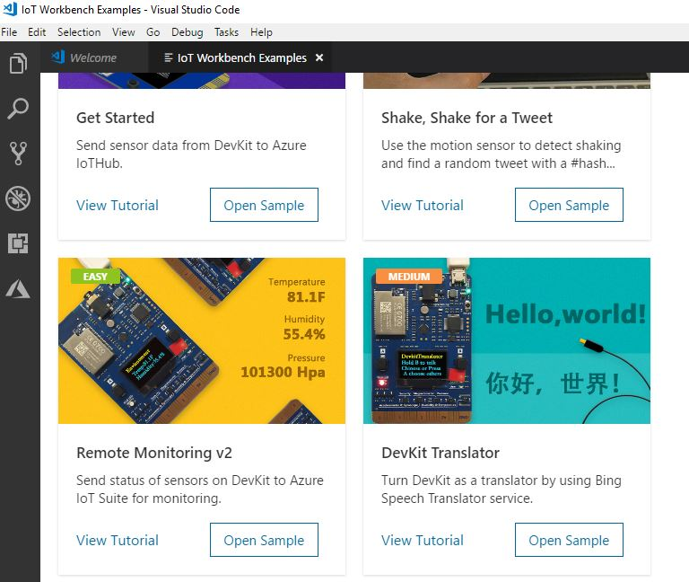
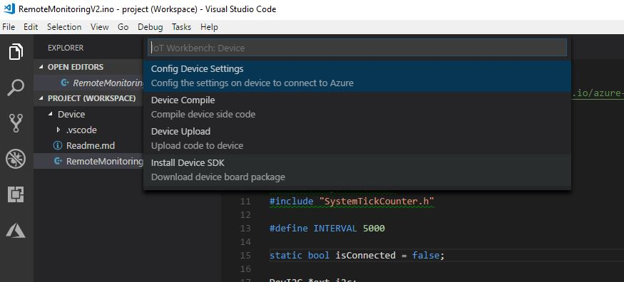

# Connect MXChip IoT DevKit AZ3166 to the IoT Remote Monitoring solution accelerator

In this tutorial, you learn how to run a sample app on your DevKit to send sensor data to your Azure IoT Suite.

The [MXChip IoT DevKit](https://aka.ms/iot-devkit) is an all-in-one Arduino compatible board with rich peripherals and sensors. You can develop for it using [Visual Studio Code extension for Arduino](https://aka.ms/arduino). And it comes with a growing [projects catalog](https://microsoft.github.io/azure-iot-developer-kit/docs/projects/) to guide you prototype Internet of Things (IoT) solutions that take advantage of Microsoft Azure services.

## What you need

Finish the [Getting Started Guide](https://docs.microsoft.com/azure/iot-hub/iot-hub-arduino-iot-devkit-az3166-get-started) to:

* Have your DevKit connected to Wi-Fi
* Prepare the development environment

## Before you start

Before you write any code for your device, deploy your Remote Monitoring solution accelerator and add a new physical device to the solution.

### Deploy your Remote Monitoring solution accelerator

The **AZ3166** device you create in this tutorial sends data to an instance of the [Remote Monitoring](https://docs.microsoft.com/en-us/azure/iot-accelerators/iot-accelerators-remote-monitoring-explore) solution accelerator. If you haven't already provisioned the Remote Monitoring solution accelerator in your Azure account, see [Deploy the Remote Monitoring solution accelerator](https://docs.microsoft.com/en-us/azure/iot-accelerators/iot-accelerators-remote-monitoring-deploy)

When the deployment process for the Remote Monitoring solution finishes, click **Launch** to open the solution dashboard in your browser.

### Add your device to the Remote Monitoring solution

> [!NOTE]
> If you have already added a device in your solution, you can skip this step. However, the next step requires your device connection string. You can retrieve a device's connection string from the [Azure portal](https://portal.azure.com) or using the [az iot](https://docs.microsoft.com/cli/azure/iot?view=azure-cli-latest) CLI tool.

For a device to connect to the solution accelerator, it must identify itself to IoT Hub using valid credentials. You have the opportunity to save the device connection string that contains these credentials when you add the device the solution. You include the device connection string in your client application later in this tutorial.

In the portal, go to **Devices** section and there, click in the  **+New Device** button. 

The *new device form* should be filled in.
1. Click **Physical** in the *Device type* section.
2. Define your own Device ID (for example *MXChip* or *AZ3166*).
3. Choose **Auto generate keys** in the *Authentication key* section.
4. Click *Apply* button.

Wait until the portal finishes the provisioning of the new device.

Then the configuration of the new device, will be shown.
Copy the **Connection String** generated.

This connection string will be used in the next section.

## Open the RemoteMonitoring sample

1. Start VS Code. Make sure [Azure IoT Workbench](https://marketplace.visualstudio.com/items?itemName=vsciot-vscode.vscode-iot-workbench) is installed.

1. Use `Ctrl+Shift+P` (macOS: `Cmd+Shift+P`) to open the command palette, type **IoT Workbench**, and then select the command of **IoT Workbench: Examples**. 

1. Please select the board **IoT DevKit**. Find **Remote Monitoring V2** 

1. Click **Open Sample** button. A new VS Code window with a project folder in it opens.

## Build and upload the device code

Go back to the Visual Studio Code: 

1. Use `Ctrl+Shift+P` (macOS: `Cmd+Shift+P`) to open the command palette, type **IoT Workbench**, and then select the command of **IoT Workbench: Device**. In the popup menu, please select **COnfig Device Settings**.

  

2. The popup menu asks you to **Input IoT Hub Device Connection String**. Select that option and paste the connection string.

3. The terminal sometimes prompts you to enter configuration mode. To do so, hold down button A, then push and release the reset button and then release the button A. 
The screen displays the DevKit ID and 'Configuration'.

  

  > [!NOTE]
  > The connection string should be saved in your clipboard if you followed the last section of this tutorial. If not, you should go to the Azure portal and look for the IoT Hub of your Remote Monitoring resource group. There, you can see the IoT Hub connected devices and copy the Device connection string.

  

Now, you can see your new physical device in the VS Code section "Azure IoT Hub Devices":

## Test the project

When the sample app runs, DevKit sends sensor data over Wi-Fi to your Azure IoT Suite. To see the result, follow these steps:

1. Go to your Azure IoT Suite, and click **DASHBOARD**.

2. On the Azure IoT Suite solution console, you will see your DevKit sensor status. 

If you click on the sensor name (AZ3166) a tab opens on the right side of the dashboard, where you can see the MX Chip sensors chart in real time.

## Send a C2D message
Remote Monitoring v2 allows you to invoke remote method on the device.
The MX Chip example code publishes three methods that you can see in the Method section when the sensor is selected.

You can change the color of one of the MX Chip leds using the method "LedColor". For doing it, select the checkbox of the device and click on the Schedule button. 

Choose the method called ChangeColor in the dropdown where all the methods appear, write a name, and Apply.

In several seconds, your physical MX Chip should change the color of the RGB led (below of the A button)

## Change device ID

You can change the device ID in IoT Hub by following [this guide](https://microsoft.github.io/azure-iot-developer-kit/docs/customize-device-id/).

## Problems and feedback

If you encounter problems, refer to [FAQs](https://microsoft.github.io/azure-iot-developer-kit/docs/faq/) or reach out to us from the following channels:

* [Gitter.im](http://gitter.im/Microsoft/azure-iot-developer-kit)
* [Stackoverflow](https://stackoverflow.com/questions/tagged/iot-devkit)

## Next steps

Now that you have learned how to connect a DevKit device to your Azure IoT Suite and visualize the sensor data, here are the suggested next steps:

* [Azure IoT Suite overview](https://docs.microsoft.com/azure/iot-suite/)
* [Connect an MXChip IoT DevKit device to your Microsoft IoT Central application](https://docs.microsoft.com/en-us/microsoft-iot-central/howto-connect-devkit)