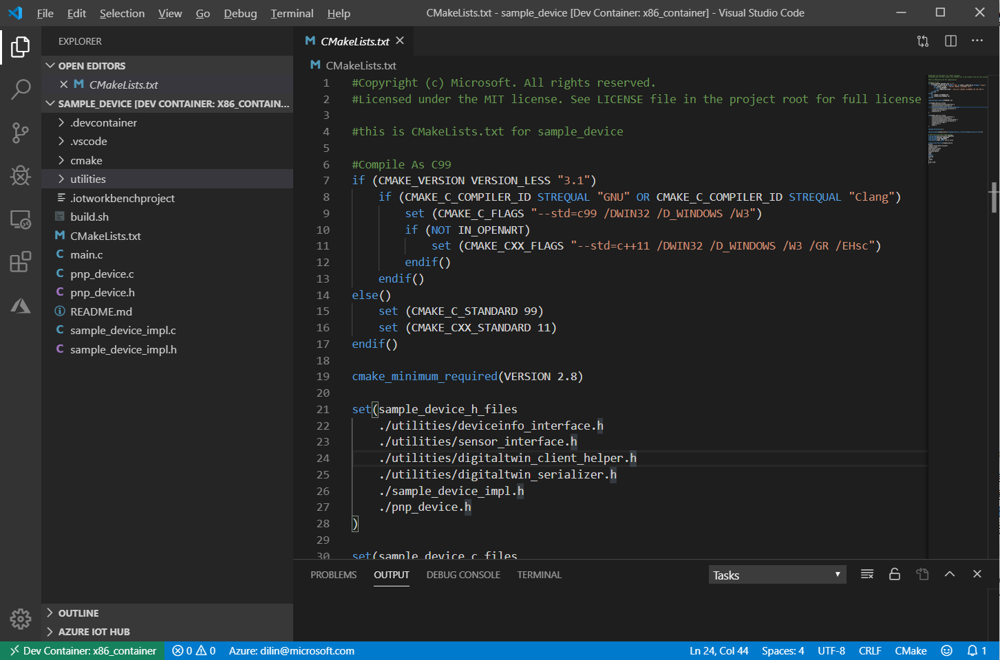

# Configure an External CMake Project as Embedded Linux Project

You can now configure an external CMake project to be an Embedded Linux IoT Project, which you can develop leveraging the container toolchain: `armv7`, `arm64` or `x86`. It is convenient for cross-compilation or simulation.

## Configure an External CMake Project to be an Embedded Linux Project

1. Open your external CMake project folder, which is supposed to have `CMakeLists.txt` file under the root directory.

2. Open command palette and select "**Azure IoT Device Workbench: Configure Project for Device Development Environment...**"

3. Select **Embedded Linux (Preview)** as platform type.

4. Select **Azure IoT Device C SDK for x86 Linux** as your toolchain container for your device platform. (Select **Azure IoT Device C SDK for armv7 Linux** or **Azure IoT Device C SDK for arm64 Linux** if you would like to cross-compile your application.) Later the built application will be able to be executed in x86 Linux machine.

5. Select **Yes** to open the configured project in remote container.

    > The first time you use a container, it takes around 1 to 3 minutes to download and prepare the dev container. Click the details link on the notification for the progress:
    

6. Once it's done, you are in container toolchain development environment. You can execute "**Azure IoT Device Workbench: Compile Device Code**" and "**Azure IoT Device Workbench: Upload Device Code**" to develop your application with Azure IoT C SDK and container toolchain pre-installed.

    
