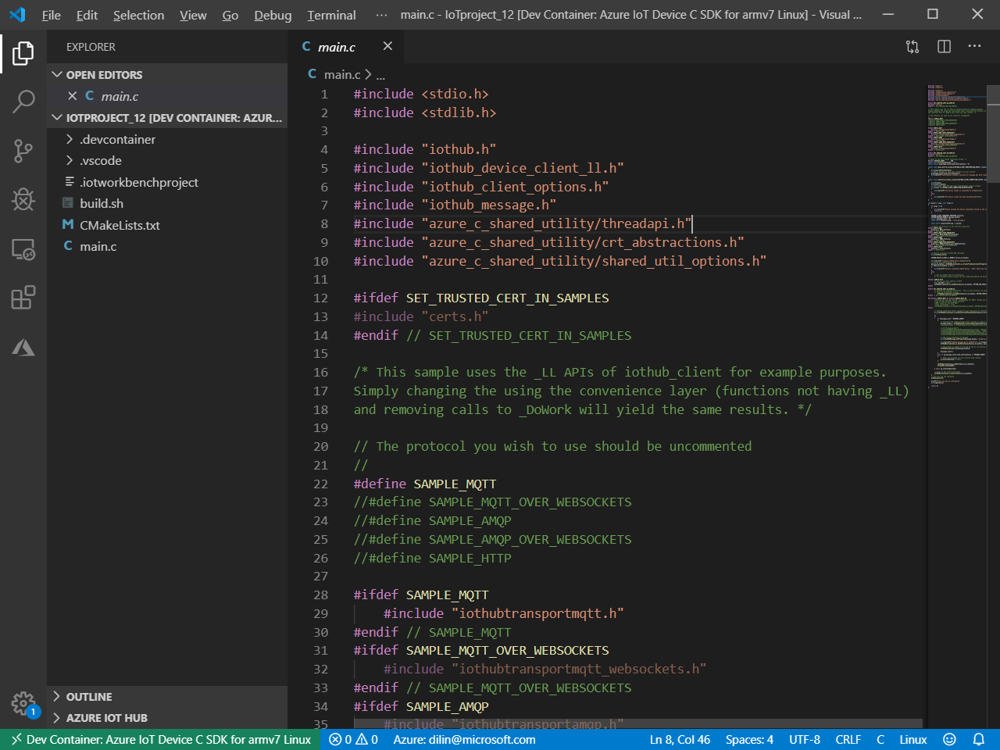
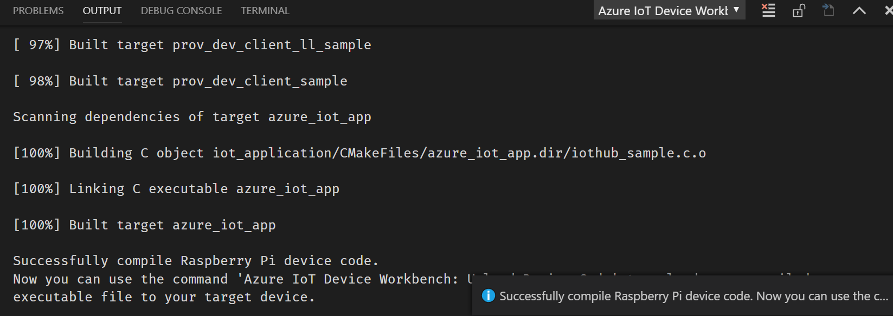

# Get Started with connecting Raspberry Pi to Azure IoT Hub

This tutorial shows how to develop and compile a simple device app written in C and running on Raspberry Pi to send telemetry data to Azure IoT Hub.

## What you learn

- How to install the development environment.
- How to create an IoT Hub and register a ESP32 device.
- How to send sample data to your IoT hub.

## What you need

- A [Raspberry Pi](https://www.raspberrypi.org/products/raspberry-pi-3-model-b-plus/) device with [Raspbian](https://www.raspberrypi.org/downloads/raspbian/) running on it.
- A computer running Windows 10, Ubuntu 18.04+ or macOS 10.10+.
- An active Azure subscription. [Activate a free 30-day trial Microsoft Azure account](https://azure.microsoft.com/en-us/free/).

## Create new project

1. Within VS Code, press `F1` to open the command palette, then type and select **Azure IoT Device Workbench: Create Project...**.

2. Enter the name of your project.

3. Select **Embedded Linux (Preview)** from device platform list.

4. Select the dev container based on your target device, in this sample, select **Azure IoT Device C SDK for armv7 Linux** for Raspberry Pi 3 Model B+ running [Raspbian](https://www.raspberrypi.org/downloads/raspbian/).

5. Select **No** to open the configured project in remote container.

6. The first time you use a container, it takes around 1 to 3 minutes to download and prepare the dev container. Click the **details** link on the notification for the progress:
    

7. Once the dev container is ready, you can see the status in the status bar and output window:
    

#### Compile the code

1. The `main.c` file is the source file that contains the application logic. You can modify or add your own code in this file:
    

2. To compile the code, press `F1`, type and select **Azure IoT Device Workbench: Compile Device Code** from the command palette.

3. The cross-compiling of the code happens in the dev container. Once it's done, it shows the notification:
    

4. The compiled binary file is located in the `.build` folder.

#### Upload to target device

1. Before you upload the executable binary file to the target device, make sure:

   - The running OS on the device is correct (e.g. Raspbian running on Raspberry Pi 3 Model B+).
   - SSH is enabled on the device. Follow these [instructions](https://itsfoss.com/ssh-into-raspberry/) to do so.
   - Get the IP address of the device so that you can deploy the compiled binary to the device using SSH.

2. In VS Code, press `F1`, type and select **Azure IoT Device Workbench: Upload Device Code** from the command palette, then select **Manual setup** and enter the IP address, port, user name and password to deploy the compiled binary via SSH to Raspberry Pi:

   

#### Verify the result

1. To start running the deployed binary, SSH into your Raspberry Pi device. You can follow these [instructions](https://itsfoss.com/ssh-into-raspberry/) to do so.

2. You need to pass the device connection string as a parameter to run the app, follow [this guide](./docs/create-iothub-device.md) to use Azure IoT Hub Toolkit to do so.

3. Run `azure_iot_app [connection string]` and you see the Raspberry Pi start sending telemetry data to the Azure IoT Hub:
    

4. To verify the reception of the data, use Azure IoT Hub Toolkit, right click on the device and select **Start Monitoring Built-in Event Endpoint**. In the output window, you can see that IoT Hub gets telemetry data sent from Raspberry Pi:
    