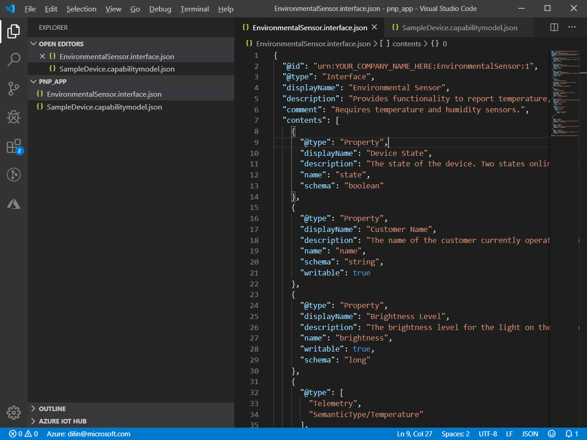
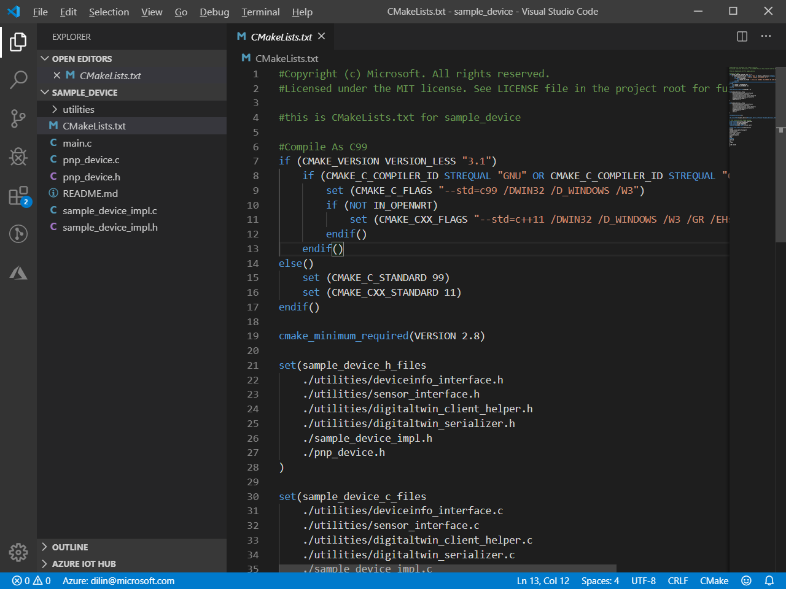
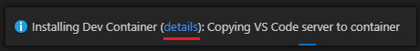
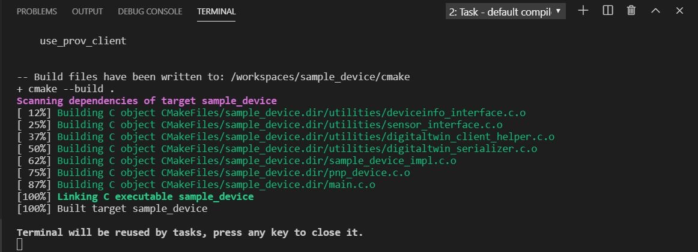
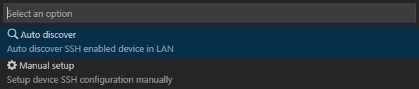
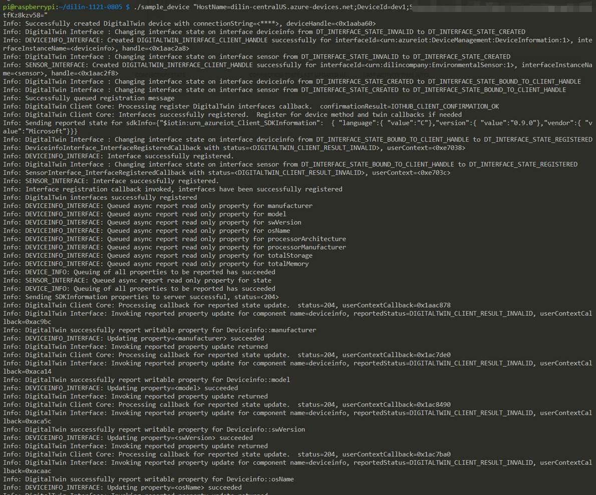
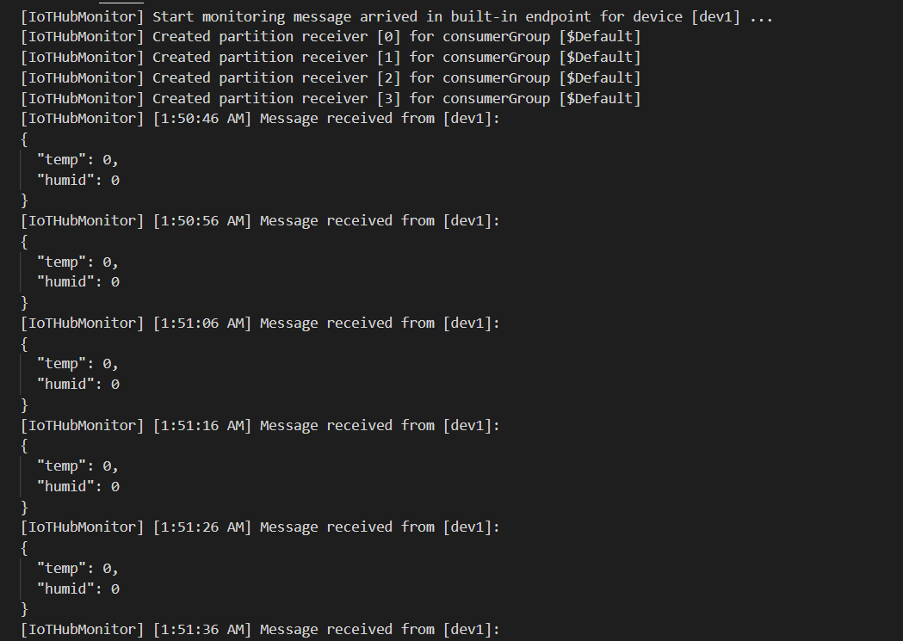

# Generate PnP Device Code and Develop in Containerized Toolchain

## Preparation

1. Follow the [setup guide](./embedded-linux-setup.md) to setup the prerequisite including Docker runtime.
2. Install [Remote Development](https://marketplace.visualstudio.com/items?itemName=ms-vscode-remote.vscode-remote-extensionpack) extension in VS Code.
3. Prepare an IoT Hub.

## Author Your Model

1. Create a `pnp_app` directory in your local drive. You use this folder for the device model files and device code stub.

2. Download the [device capability model](https://github.com/Azure/IoTPlugandPlay/blob/9004219bff1e958b7cd6ff2a52209f4b7ae19396/samples/SampleDevice.capabilitymodel.json) and [interface sample](https://github.com/Azure/IoTPlugandPlay/blob/9004219bff1e958b7cd6ff2a52209f4b7ae19396/samples/EnvironmentalSensor.interface.json) files and save files into `pnp_app` folder.

   > To download a file from GitHub, navigate to the file, right-click on **Raw**, and then select **Save link as**.

3. Open `pnp_app` folder with VS Code. You can view the files with IntelliSense:

   

4. In the files you downloaded, replace `<YOUR_COMPANY_NAME_HERE>` in the `@id` and `schema` fields with a unique value. Use only the characters a-z, A-Z, 0-9, and underscore. For more information, see [Digital Twin identifier format](https://github.com/Azure/IoTPlugandPlay/tree/master/DTDL#digital-twin-identifier-format).

## Generate PnP Device Code Stub

Now that you have a DCM and its associated interfaces, you can generate the device code that implements the model. To generate the C code stub in VS Code:

1. With the `pnp_app` folder open in VS Code, use **Ctrl+Shift+P** to open the command palette, select "**IoT Plug and Play: Generate Device Code Stub...**"

   > The first time you use the IoT Plug and Play CodeGen CLI, it takes a few seconds to download and install automatically.

2. Choose the **SampleDevice.capabilitymodel.json** file to use for generating the device code stub.

3. Enter the project name **sample_device**. This will be the name of your device application.

4. Choose **ANSI C** as your language.

5. Choose **Via IoT Hub device connection string** as connection method.

6. Choose **CMake Project on Linux** as your project template.

7. Choose **Via Vcpkg** as way to include the device SDK.

8. A new folder called **sample_device** is created in the same location as the DCM file, and in it are the generated device code stub files. VS Code opens a new window to display these.



## Build Application in Containerized Toolchain

You use the built-in containerized toolchain to build the generated device code stub. Currently you can compile code in one of these platform toolchains on the basis of your target machine platform: `armv7`, `arm64` and `x86`. The application you build simulates a device that connects to an IoT hub. The application sends telemetry and properties and receives commands.

1. Open Command Palette and select "**Azure IoT Device Workbench: Configure Project for Device Development Environment...**"

2. Select **Embedded_Linux (Preview)** as platform type.

3. Select **Azure IoT Device C SDK for x86 Linux** as your toolchain container for your device platform. Later the built application will be able to be executed in x86 Linux machine.

4. Select **No** to open the configured project in remote container.

   > The first time you use a container, it takes around 1 to 3 minutes to download and prepare the dev container. Click the details link on the notification for the progress:
   > 

5. Select **Azure IoT Device Workbench: Compile Device Code** to build device code. The cross-compiling of the code happens in the dev container. Once it's done, it shows the notification:

   

6. Select **Azure IoT Device Workbench: Upload Device Code** to upload device code to your target machine. Select **Manual setup** and enter the `IP address`, `port`, `user name`, `password` and `project destinarion path` to deploy the compiled binary via SSH to your target x86 Linux machine:

   

## Run the Application on target machine

Navigate to your target x86 Linux machine, check the binary file is successfully sent to the machine. Execute your application to validate your code.

```
./<your-binary-name> "<iothub-device-connection-string>"
```

You can see the target device starts sending telemetry data to the Azure IoT Hub:



To verify the reception of the data, use Azure IoT Hub Toolkit, right click on the device and select **Start Monitoring Built-in Event Endpoint**. In the output window, you can see that IoT Hub gets telemetry data sent from Raspberry Pi:


