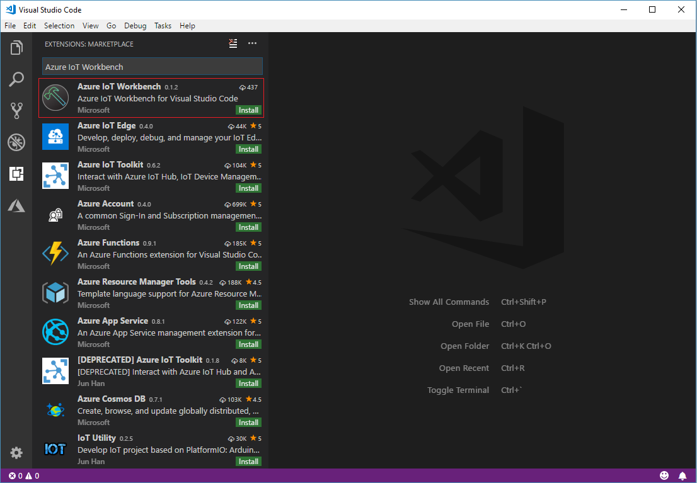
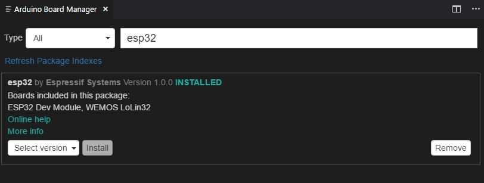

# ESP32

[ESP32](https://www.espressif.com/en/products/hardware/esp32/overview) is a series of low-cost, low-power system on a chip microcontrollers with integrated Wi-Fi and dual-mode Bluetooth. You can develop for it using [Azure IoT Device Workbench](https://aka.ms/azure-iot-workbench) to take advantage of Microsoft Azure services.

## Install development environment

We recommend [Azure IoT Device Workbench](https://marketplace.visualstudio.com/items?itemName=vsciot-vscode.vscode-iot-workbench) extension for Visual Studio Code to develop on the ESP32 devices.

Azure IoT Device Workbench provides an integrated experience to develop IoT solutions. It helps both on device and cloud development using Azure IoT and other services. You can watch this [Channel9 video](https://channel9.msdn.com/Shows/Internet-of-Things-Show/IoT-Workbench-extension-for-VS-Code) to have an overview of what it does.

Follow these steps to prepare the development environment for ESP32 devices:

1. Download and install [Arduino IDE](https://www.arduino.cc/en/Main/Software). It provides the necessary toolchain for compiling and uploading Arduino code.
   * Windows: Use Windows Installer version
   * macOS: Drag and drop the Arduino into `/Applications`
   * Ubuntu: Unzip it into `$HOME/Downloads/arduino-1.8.5`

2. Install [Visual Studio Code](https://code.visualstudio.com/), a cross platform source code editor with powerful developer tooling, like IntelliSense code completion and debugging.

3. Look for **Azure IoT Device Workbench** in the extension marketplace and install it.
    
    Together with the IoT Device Workbench, other dependent extensions will be installed.

4. Open **File > Preference > Settings** and add following lines to configure Arduino.

	* Windows

		```JSON
		"arduino.path": "C:\\Program Files (x86)\\Arduino",
		"arduino.additionalUrls": "https://dl.espressif.com/dl/package_esp32_index.json"
		```

	* macOS

		```JSON
		"arduino.path": "/Application",
		"arduino.additionalUrls": "https://dl.espressif.com/dl/package_esp32_index.json"
		```

	* Ubuntu

		```JSON
		"arduino.path": "/home/{username}/Downloads/arduino-1.8.5",
		"arduino.additionalUrls": "https://dl.espressif.com/dl/package_esp32_index.json"
		```

5. Use `F1` or `Ctrl+Shift+P` (macOS: `Cmd+Shift+P`) to open the command palette, type and select **Arduino: Board Manager**. Search for **esp32** and install the latest version.

    

## Problems and feedback

If you encounter problems, you can reach out to us from:
* [Gitter.im](https://gitter.im/Microsoft/vscode-iot-workbench)
