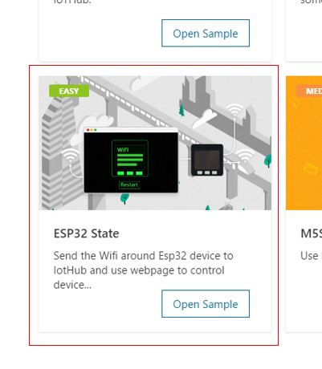
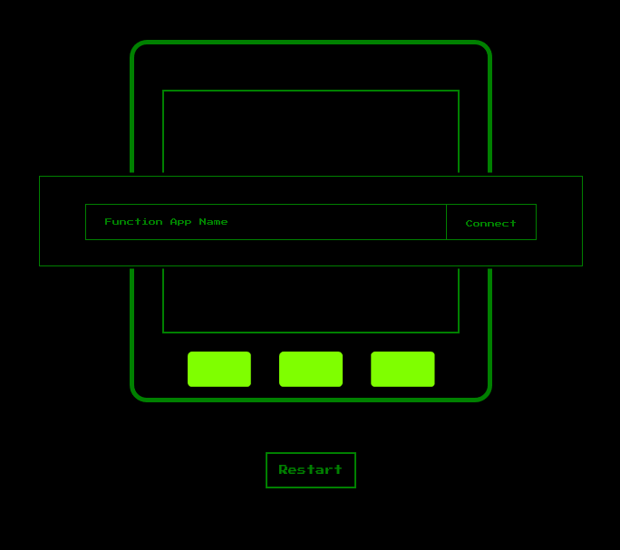

# ESP32 State

In this tutorial, you can monitor WiFi status (SSID and RSSI) surrounding the ESP32 device and let the device restart using Azure IoT Hub device twins.

## What you need

Finish the [Getting Started Guide](./esp32-get-started.md) to:

- Get basic knowledge of ESP32 device.
- Prepare the development environment.


An active Azure subscription. If you do not have one, you can register via one of these two methods:

- Activate a [free 30-day trial Microsoft Azure account](https://azure.microsoft.com/free/).
- Claim your [Azure credit](https://azure.microsoft.com/pricing/member-offers/msdn-benefits-details/) if you are MSDN or Visual Studio subscriber.


## Open the project folder

### Start VS Code

- Start Visual Studio Code.
- Make sure [Azure IoT Device Workbench](https://marketplace.visualstudio.com/items?itemName=vsciot-vscode.vscode-iot-workbench) is installed.
- Connect ESP32 to your PC.

### Open Azure IoT Device Workbench Examples

Use `F1` or `Ctrl+Shift+P` (macOS: `Cmd+Shift+P`) to open the command palette, type **Azure IoT Device Workbench**, and then select **Open Examples...**.


Select **ESP32 Arduino**.


Then the **IoT Device Workbench Example** window is shown up.


Find **ESP32 State** and click **Open Sample** button. A new VS Code window with a project folder in it opens.



## Provision Azure Services

In the solution window, open the command palette and select **Azure IoT Device Workbench: Cloud: Provision Azure Services...**.


Then VS Code guides you through provisioning the required Azure services.


The whole process includes:

- Select an existing IoT Hub or create a new IoT Hub.
- Select an existing IoT Hub device or create a new IoT Hub device. 
- Create a new Function App.

Please take a note of the Function App name and IoT Hub device name you created. It will be used in the next section.

## Modify code for Azure Functions

Open **esp32-state\run.csx** and modify the following line with the device name you provisioned in previous step:
```cpp
static string deviceName = "";
```

## Deploy Azure Functions

Open the command palette and select **Azure IoT Device Workbench: Deploy to Azure...**.


## Config Device Code

1. Open the source file(.ino) for device code and update the following lines with your WiFi ssid and password:
    ```csharp
		// Please input the SSID and password of WiFi
		const char* ssid     = "";
		const char* password = "";
    ```

2. Open the command palette and select **Azure IoT Device Workbench: Config Device Settings...**.

   

3. Select **Copy device connection string**.

	

   This copies the connection string that is retrieved from the `Provision Azure services` step.

4. Paste the device connection string into the following line in device code
    ```csharp
	/*String containing Hostname, Device Id & Device Key in the format:                         */
	/*  "HostName=<host_name>;DeviceId=<device_id>;SharedAccessKey=<device_key>"                */
	/*  "HostName=<host_name>;DeviceId=<device_id>;SharedAccessSignature=<device_sas_token>"    */
	static const char* connectionString = "";
    ```

## Build and upload the device code

1. Open the command palette and select **Azure IoT Device Workbench: Upload Device Code**.

	

2. VS Code then starts verifying and uploading the code to your DevKit.

	

3. The ESP32 device reboots and starts running the code.

>Note: M5Stack-Core-ESP32 is set as the default board after the IoT project is created. To change the setting, use `F1` or `Ctrl+Shift+P` (macOS: `Cmd+Shift+P`) to open the command palette, type and select **Arduino: Board Config**. Change to use other ESP32 board in the **Arduino Board Configuration** window.

>

## Monitor WiFi information in Browser

1. Open `web\index.html` in browser.
2. Input the Function App name you write down.
3. Click connect button.
4. You should see wiFi information in a few seconds.


## Restart ESP32 Device

Click Restart button on the web page. You may need to wait for a while to see 'Restarting'.


You can also see the restart information from serial monitor.

