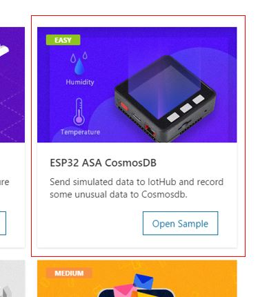
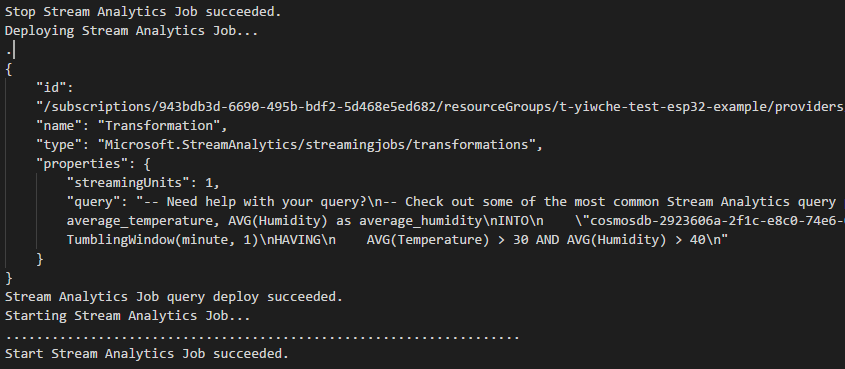

# Stream Analytics and Cosmos DB

In this tutorial, you will learn how to send data from Esp32 device to Stream Analytics Job and export it to Cosmos DB with Azure Stream Analytics Query Langauge.

## What you need

Finish the [Getting Started Guide](./esp32-get-started.md) to:

- Get basic knowledge of Esp32 device.
- Prepare the development environment.

An active Azure subscription. If you do not have one, you can register via one of these two methods:

- Activate a [free 30-day trial Microsoft Azure account](https://azure.microsoft.com/free/).
- Claim your [Azure credit](https://azure.microsoft.com/pricing/member-offers/msdn-benefits-details/) if you are MSDN or Visual Studio subscriber.

## Open the project folder

### Start VS Code

- Start Visual Studio Code.
- Make sure [Azure IoT Workbench](https://marketplace.visualstudio.com/items?itemName=vsciot-vscode.vscode-iot-workbench) is installed.
- Connect Esp32 to your PC.

### Open IoT Workbench Examples

Use `F1` or `Ctrl+Shift+P` (macOS: `Cmd+Shift+P`) to open the command palette, type **IoT Workbench**, and then select **IoT Workbench: Examples**.


Select **ESP32 Arduino**.


Then the **IoT Workbench Example** window is showed up.


Find **Esp32 ASA CosmodDB** and click **Open Sample** button. A new VS Code window with a project folder in it opens.




## Provision Azure Service

Use `F1` or `Ctrl+Shift+P` (macOS: `Cmd+Shift+P`) to open the command palette, type **IoT Workbench**, and then select **IoT Workbench: Cloud** -> **Azure Provision**.


Select subscription and resource group you want to create Azure services in. A guide line show what service will be created.


Follow the guide to create Azure services.

> Notice: Currently, you need specific subscription and resource group for IoT Hub individually.

## Deploy Azure Stream Analytics Job Query

You can change Azure Stream Analytics Job Query by editing `StreamAnalytics/query.asaql`. ASAQL (Azure Stream Analytics Query Language) is SQL-like, you can learn more about it from <https://go.microsoft.com/fwLink/?LinkID=619153>.


Output and input have already been generated automatically by default (in the example above, the output is `cosmosdb-2923606a-2f1c-e8c0-74e6-037933217447`, and input is `iothub-8341d26d-3fd9-3f82-aabf-3000238ff89f`). And you have no need to change them. `AVG(Temperature) as average_temperature, AVG(Humidity) as average_humidity` means calculating the average of variable `Temperature` and `Humidity` and represent them as `average_temperature` and `average_humidity` respectively.

You can select data in all fileds by writing query as below.

```sql
SELECT
    *
FROM
    "iothub-8341d26d-3fd9-3f82-aabf-3000238ff89f"
INTO
    "cosmosdb-2923606a-2f1c-e8c0-74e6-037933217447"
```

Azure Steam Analytics Query Language (ASAQL) has native support for windowing functions. Windowing functions enable you to perform various operations against the event data along a timeline. Such as calculating the average of the values of payload fields in a given window.

```sql
SELECT
    AVG(Temperature) as average_temperature, AVG(Humidity) as average_humidity
INTO
    "cosmosdb-2923606a-2f1c-e8c0-74e6-037933217447"
FROM
    "iothub-8341d26d-3fd9-3f82-aabf-3000238ff89f"
GROUP BY
    TumblingWindow(minute, 1)
```


You can design the conditions need to be satisfied to store the data into cosmosdb. In this example, only when average temperature is larger than 30 and average humidity is larger than 40 over past one minute will the data be saved.

```sql
SELECT
    AVG(Temperature) as average_temperature, AVG(Humidity) as average_humidity
INTO
    "cosmosdb-2923606a-2f1c-e8c0-74e6-037933217447"
FROM
    "iothub-8341d26d-3fd9-3f82-aabf-3000238ff89f"
GROUP BY
    TumblingWindow(minute, 1)
HAVING
    AVG(Temperature) > 30 AND AVG(Humidity) > 40
```

You can learn more about ASAQL windowing functions from [here](https://docs.microsoft.com/en-us/azure/stream-analytics/stream-analytics-window-functions).

Deploy the query by executing **IoT Workbench: Cloud** command and select **Azure Deploy**.


IoT Workbench will stop Stream Analytics Job, update query and restart Stream Analytics Job automatically.



## Config Device Code

1. Open the source file(.ino) for device code and update the following lines with your WiFi ssid and password:
    ```csharp
		// Please input the SSID and password of WiFi
		const char* ssid     = "";
		const char* password = "";
    ```

2. Open the command palette and select **IoT Workbench: Device**.

	

3. Select **Config Device Settings**.

	

4. Select **Copy device connection string**.

	

   This copies the connection string that is retrieved from the `Provision Azure services` step.

5. Paste the device connection string into the following line in device code
    ```csharp
	/*String containing Hostname, Device Id & Device Key in the format:                         */
	/*  "HostName=<host_name>;DeviceId=<device_id>;SharedAccessKey=<device_key>"                */
	/*  "HostName=<host_name>;DeviceId=<device_id>;SharedAccessSignature=<device_sas_token>"    */
	static const char* connectionString = "";
    ```

## Build and upload the device code

1. Open the command palette and select **IoT Workbench: Device**, then select **Device Upload**.

	

2. VS Code then starts verifying and uploading the code to your DevKit.

	

3. The ESP32 device reboots and starts running the code.

>Note: M5Stack-Core-ESP32 is set as the default board after the IoT project is created. To change the setting, use `F1` or `Ctrl+Shift+P` (macOS: `Cmd+Shift+P`) to open the command palette, type and select **Arduino: Board Config**. Change to use other ESP32 board in the **Arduino Board Configuration** window.

>

## Explore Data in Cosmos DB

You can use [Data Explorer](http://aka.ms/docdb-data-explorer) to explore Data in Cosmos DB.


