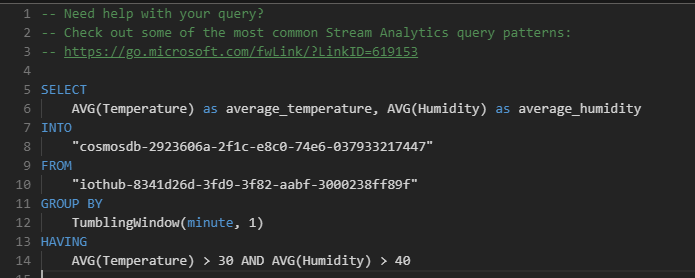
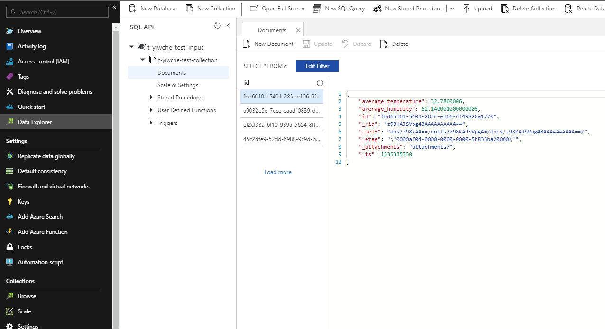

# Stream Analytics and Cosmos DB

In this tutorial, you will learn how to send data from Esp32 device to Stream Analytics Job and export it to Cosmos DB with Azure Stream Analytics Query Langauge.

## What you need

Finish the [Getting Started Guide](./esp32-get-started.md) to:

- Get basic knowledge of Esp32 device.
- Prepare the development environment.

An active Azure subscription. If you do not have one, you can register via one of these two methods:

- Activate a [free 30-day trial Microsoft Azure account](https://azure.microsoft.com/free/).
- Claim your [Azure credit](https://azure.microsoft.com/pricing/member-offers/msdn-benefits-details/) if you are MSDN or Visual Studio subscriber.

## Open the project folder

### Start VS Code

- Start Visual Studio Code.
- Make sure [Azure IoT Workbench](https://marketplace.visualstudio.com/items?itemName=vsciot-vscode.vscode-iot-workbench) is installed.
- Connect Esp32 to your PC.

### Open IoT Workbench Examples

Use `F1` or `Ctrl+Shift+P` (macOS: `Cmd+Shift+P`) to open the command palette, type **IoT Workbench**, and then select **IoT Workbench: Examples**.


Select **ESP32 Arduino**.


Then the **IoT Workbench Example** window is showed up.


Find **Esp32 ASA CosmodDB** and click **Open Sample** button. A new VS Code window with a project folder in it opens.


## Provision Azure Service

Use `F1` or `Ctrl+Shift+P` (macOS: `Cmd+Shift+P`) to open the command palette, type **IoT Workbench**, and then select **IoT Workbench: Cloud** -> **Azure Provision**.


Select subscription and resource group you want to create Azure services in. A guide line show what service will be created.


Follow the guide to create Azure services.

> Notice: Currently, you need specific subscription and resource group for IoT Hub individually.

## Deploy Azure Stream Analytics Job Query

You can change Azure Stream Analytics Job Query by editing `StreamAnalytics/query.asaql`. ASAQL (Azure Stream Analytics Query Language) is SQL-like, you can learn more about it from <https://go.microsoft.com/fwLink/?LinkID=619153>.



Output and input have already been generated automatically by default (in the example above, the output is `cosmosdb-a94a5672-867c-6b4e-db41-872d6e01e4bf`, and input is `iothub-ff8feba1-b114-48de-d8c4-d25e7efa4864`). And you have no need to change them. `*` means selecting data in all fields, which is the same as SQL.


You can select specific field data from input and export it into output. For example, your device sends data in the following JSON format:

```json
{
    "temperature": 42
}
```

You can write query as below:

```sql
SELECT
    temperature
FROM
    "iothub-ff8feba1-b114-48de-d8c4-d25e7efa4864"
INTO
    "cosmosdb-a94a5672-867c-6b4e-db41-872d6e01e4bf"
```

Azure Steam Analytics Query Language (ASAQL) has native support for windowing functions. Windowing functions enable you to perform various operations against the event data along a timeline. Such as calculating the average of the values of payload fields in a given window.

```sql
SELECT
    AVG(temperature) as avg_temp
INTO
    "cosmosdb-a94a5672-867c-6b4e-db41-872d6e01e4bf"
FROM
    "iothub-ff8feba1-b114-48de-d8c4-d25e7efa4864"
GROUP BY
    TumblingWindow(minute, 5)
```


You can design the condition used to store the data into cosmosdb. In this example, only if average temperature larger than 40 and average humidity larger than 30 over past one minute will the data be saved.


You can learn more about ASAQL windowing functions from [here](https://docs.microsoft.com/en-us/azure/stream-analytics/stream-analytics-window-functions).

Deploy the query by executing **IoT Workbench: Cloud** command and select **Azure Deploy**.


IoT Workbench will stop Stream Analytics Job, update query and restart Stream Analytics Job automatically.


## Build and Upload the Device Code

1. Open the command palette and select **IoT Workbench: Device**, then select **Device Upload**.


2. VS Code then starts verifying and uploading the code to your DevKit.


3. The IoT DevKit reboots and starts running the code.

## Explore Data in Cosmos DB

You can use [Data Explorer](http://aka.ms/docdb-data-explorer) to explore Data in Cosmos DB.

