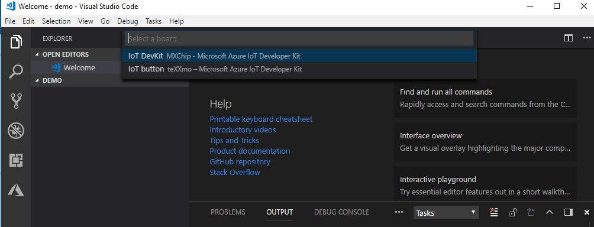
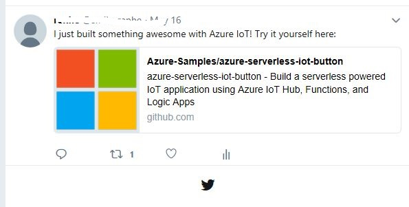

# Get Started with teXXmo IoT button in Azure IoT Device Workbench
---

# Table of Contents

-   [Introduction](#introduction)
-   [Step 1: Prerequisites](#step-1-prerequisites)
-   [Step 2: Create IoT Project](#step-2-create-iot-project)
-   [Step 3: Provision Azure Services](#step-3-provision-azure-services)
-   [Step 4: Configure the setting on IoT button](#step-4-configure-the-setting-on-iot-button)
-   [Step 5: Deploy Azure Services](#step-5-deploy-azure-services)

# Introduction

**About this document**

This document describes the steps for developing an IoT project for [teXXmo IoT button](https://aka.ms/button) in Azure IoT Device Workbench. This multi-step process includes:
-   Create an IoT project.
-   Provision and deploy Azure resources.
-   Configure device settings and run the sample.

# Step 1: Prerequisites

You need to make sure the following steps are finished before beginning the process:

* Required hardware: [teXXmo IoT button](https://aka.ms/button).
* [Visual Studio Code](https://code.visualstudio.com/download/) with [Azure IoT Device Workbench](https://marketplace.visualstudio.com/items?itemName=vsciot-vscode.vscode-iot-workbench) installed.
* [An Azure Subscription](https://azure.microsoft.com/en-us/free/) (free trial works great)

# Step 2: Create IoT Project

1. Open Visual Studio Code and open an empty folder.
1. Press **F1** or **Ctrl + Shift + P** in Visual Studio Code and select **Azure IoT Device Workbench: Create Project...** .
1. Select the device of **IoT button teXXmo - Microsoft Azure Developer Kit**.

1. From the project template, please select **With Azure Functions**. With this template, when teXXmo IoT button is clicked, a telemetry will be sent to IoT Hub and Azure Functions will be triggered to execute the code.

1. After reload, the IoT project will be created in the target folder. 
1. Please select C# language for Azure Functions.

# Step 3: Provision Azure Services

1. Press **F1** or **Ctrl + Shift + P** in Visual Studio Code and select **Azure IoT Device Workbench: Provision Azure Services...**
1. You need to login with your Azure subscrption if you didn't do that before.
1. A popup window will open and guide you to provision the required Azure services. The whole process includes:

    * Select an existing IoT Hub or create a new IoT Hub.
    * Select an existing IoT Hub device or create a new IoT Hub device. 
    * Create a new Function App.

# Step 4: Configure the setting on IoT button

1. Hold power button for 5 sec. LED changes from Green Flash to Yellow, then Red flash. When LED flashes in RED, the device is in AP Mode.

1. From any desktop machine, connect to the device via WiFi using the SSID : ESP_<Last 3 digits of MAC Address>.

1. In Visual Studio Code, press **F1** or **Ctrl + Shift + P** in Visual Studio Code and select **Azure IoT Device Workbench: Configure Device Settings...**

    For teXXmo IoT button, the following commands are provided:

    | Command | Description |
    | --- | --- |
    | `Config WiFi of IoT button`  | Set WiFi SSID and password. |
    | `Config connection of IoT Hub Device` | Set the device connection string into IoT button. |
    | `Config time server of IoT button` | Config time server of IoT button. |
    | `Config JSON data to append to message`  | Append JSON data from `Device\userdata.json` into the message.  |
    | `Shutdown IoT button` | Shutdown IoT button. |

    Please click `Config WiFi of IoT button` and `Config connection of IoT Hub Device` and follow the guide to set the WiFi and device connection string of teXXmo IoT button and then click `Shutdown IoT button`

# Step 5: Deploy Azure Services

## Creating the Azure Logic App

1. Open the [Azure Portal](https://portal.azure.com)
1. Select the **+** or **Create a resource** button and under **Enterprise Integration** choose **Logic App**
1. Give it a Name, Resource Group, and Region (any will do) and click **Create**
1. After the logic app is created, open it
1. The designer should automatically load - if not click the **Edit** button
1. Select the **When an HTTP request is received** trigger
1. Click **New Step** to add a step to the workflow and **Add an action**
1. Search for or select the **Twitter** connector
    > NOTE: You are more than welcome to use any action you want to perform on an IoT event
1. Select the **Post a tweet** action and authenticate this logic app against a valid Twitter account.
1. Provide some text to be posted. For example: `I just built something awesome with Azure IoT! Try it yourself here: http://aka.ms/azureiotdemo`
1. Click the **Save** button to save this serverless workflow
1. Click the **When a HTTP request is received** card to open and reveal the URL generated after saving.  Copy that URL.


## Deploy Azure Functions

1. In Visual Studio Code, open the `IoTHubTrigger1.cs` file (default named `Functions\IoTHubTrigger1.cs`) to edit the code for your function.
1. Edit the code with the following lines
    ```csharp
   using IoTHubTrigger = Microsoft.Azure.WebJobs.EventHubTriggerAttribute;
   using Microsoft.Azure.WebJobs;
   using Microsoft.Azure.WebJobs.Host;
   using Microsoft.Azure.EventHubs;
   using System.Text;
   using System.Net.Http;
   using Microsoft.Extensions.Logging;

   namespace IoTWorkbench
   {
    public static class IoTHubTrigger1
    {
        private static HttpClient client = new HttpClient();

        [FunctionName("IoTHubTrigger1")]
        public static void Run([IoTHubTrigger("%eventHubConnectionPath%", Connection = "eventHubConnectionString")]EventData message, ILogger log)
        {            
            log.LogInformation($"C# IoT Hub trigger function processed a message: {message}");
            var httpContent = new StringContent(message.ToString(), Encoding.UTF8, "application/json");
            client.PostAsync("your-logic-app-url", httpContent);
        }
    }
   }      
    ```
    > NOTE: replace the URL with the unique URL of your workflow
1. Press **F1** or **Ctrl + Shift + P** in Visual Studio Code and select  **Azure IoT Device Workbench: Deploy to Azure...**. This command will deploy the function code to Azure Functions App.

## Testing the deployment

After clicking teXXmo IoT button, you will see the following tweets in your tweeter account.

