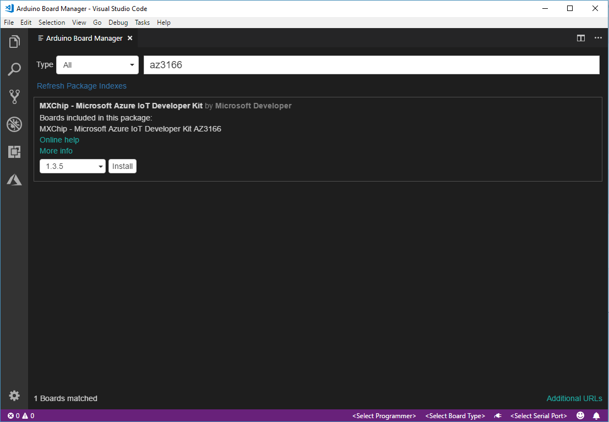

# IoT DevKit

The [MXChip IoT DevKit](https://aka.ms/iot-devkit) is an all-in-one Arduino compatible board with rich peripherals and sensors. You can develop for it using [Azure IoT Device Workbench ](https://aka.ms/azure-iot-workbench). And it comes with a growing [projects catalog](https://aka.ms/devkit/project-catalog) to guide you prototype Internet of Things (IoT) solutions that take advantage of Microsoft Azure services.

## Install development environment

Before setup the development environment, please make sure the computer is running Windows 10 or macOS 10.10+.

We recommend [Azure IoT Device Workbench](https://marketplace.visualstudio.com/items?itemName=vsciot-vscode.vscode-iot-workbench) extension for Visual Studio Code to develop on the IoT DevKit.

Azure IoT Device Workbench provides an integrated experience to develop IoT solutions. It helps both on device and cloud development using Azure IoT and other services. You can watch this [Channel9 video](https://channel9.msdn.com/Shows/Internet-of-Things-Show/IoT-Workbench-extension-for-VS-Code) to have an overview of what it does.

Follow these steps to prepare the development environment for the IoT DevKit:

1. Download and install [Arduino IDE](https://www.arduino.cc/en/Main/Software). It provides the necessary toolchain for compiling and uploading Arduino code.
   * Windows: Use Windows Installer version
   * macOS: Drag and drop the Arduino into `/Applications`
   * Ubuntu: Unzip it into `$HOME/Downloads/arduino-1.8.5`

2. Install [Visual Studio Code](https://code.visualstudio.com/), a cross platform source code editor with powerful developer tooling, like IntelliSense code completion and debugging.

3. Look for **Azure IoT Device Workbench** in the extension marketplace and install it.
    
    Together with the IoT Device Workbench, other dependent extensions will be installed.

4. Open **File > Preference > Settings** and add following lines to configure Arduino.

  * Windows

    ```JSON
    "arduino.path": "C:\\Program Files (x86)\\Arduino",
    "arduino.additionalUrls": "https://raw.githubusercontent.com/VSChina/azureiotdevkit_tools/master/package_azureboard_index.json"
    ```

  * macOS

    ```JSON
    "arduino.path": "/Applications",
    "arduino.additionalUrls": "https://raw.githubusercontent.com/VSChina/azureiotdevkit_tools/master/package_azureboard_index.json"
    ```

  * Ubuntu

    ```JSON
    "arduino.path": "/home/{username}/Downloads/arduino-1.8.5",
    "arduino.additionalUrls": "https://raw.githubusercontent.com/VSChina/azureiotdevkit_tools/master/package_azureboard_index.json"
    ```

5. Use `F1` or `Ctrl+Shift+P` (macOS: `Cmd+Shift+P`) to open the command palette, type and select **Arduino: Board Manager**. Search for **AZ3166** and install the latest version.

    

6. ST-Link configuration.
  The [ST-Link/V2](http://www.st.com/en/development-tools/st-link-v2.html) is the USB interface that IoT DevKit uses to communicate with your development machine. Follow the platform specific steps to allow the machine access to your device.

  * Windows
    Download and install USB driver from [STMicro](http://www.st.com/en/development-tools/stsw-link009.html).

  * macOS
    No driver is required for macOS.

  * Unbutu
    Run the following in terminal and logout and login for the group change to take effect:

    ```bash
    # Copy the default rules. This grants permission to the group 'plugdev'
    sudo cp ~/.arduino15/packages/AZ3166/tools/openocd/0.10.0/linux/contrib/60-openocd.rules /etc/udev/rules.d/
    sudo udevadm control --reload-rules
    
    # Add yourself to the group 'plugdev'
    # Logout and log back in for the group to take effect
    sudo usermod -a -G plugdev $(whoami)
    ```

## Telemetry

Microsoft would like to collect data about how users use Azure IoT DevKit and some problems they encounter. Microsoft uses this information to improve our IoT DevKit experience. Participation is voluntary and when you choose to participate, your device automatically sends information to Microsoft about how you use IoT DevKit.

To disable telemetry on IoT Devkit，

- Windows
  set `-DENABLETRACE=0` in `%LOCALAPPDATA%\Arduino15\packages\AZ3166\hardware\stm32f4\{version}\platform.local.txt`
- macOS
  set `-DENABLETRACE=0` in `~/Library/Arduino15/packages/AZ3166/hardware/stm32f4/{version}/platform.local.txt`
