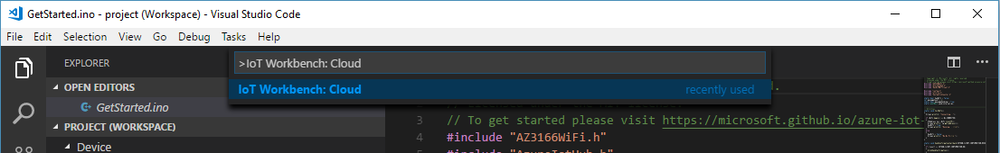
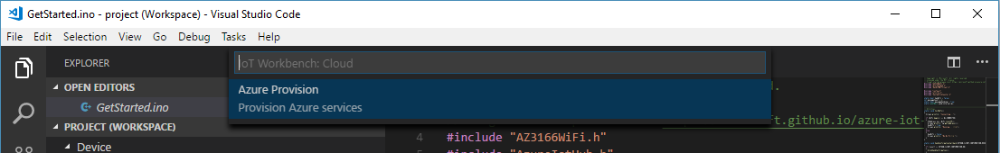
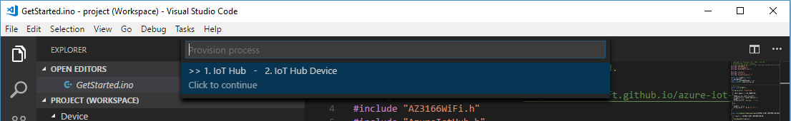
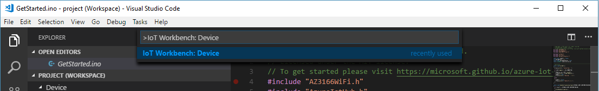
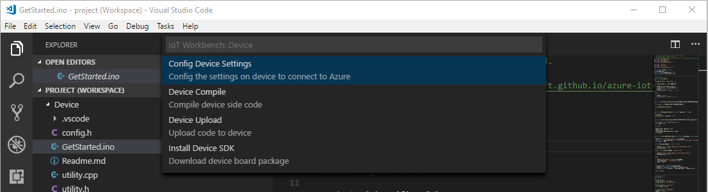
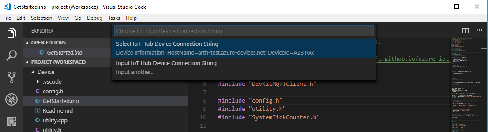
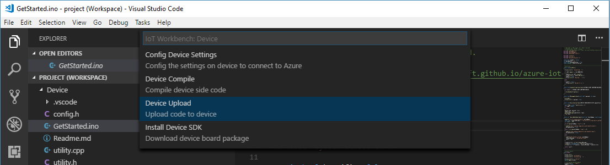

# Get Started with MXChip IoT DevKit 

For first-time users of the MXChip IoT DevKit (a.k.a. DevKit), follow these quick steps to:
- Prepare your development environment.
- Send temperature and humidity data from built-in DevKit sensors to the Azure IoT Hub.

If you have already done this, you can try more samples from the [Projects Catalog](https://microsoft.github.io/azure-iot-developer-kit/docs/projects/) or build your own IoT application.

## What you learn

* How to connect the DevKit to a wireless access point.
* How to install the development environment.
* How to create an IoT Hub and register a device for the DevKit.
* How to collect sensor data by running a sample application on the DevKit.
* How to send the DevKit sensor data to your IoT hub.

## What you need

* An MXChip IoT DevKit. [Get it now](https://aka.ms/iot-devkit-purchase).
* A computer running Windows 10 or macOS 10.10+.
* An active Azure subscription. [Activate a free 30-day trial Microsoft Azure account](https://azure.microsoft.com/en-us/free/).


## Prepare your hardware

To connect the DevKit to your computer:

1. Connect the Micro-USB end to the DevKit.
2. Connect the USB end to your computer.
3. The green LED for power confirms the connection.


## Configure Wi-Fi

IoT projects rely on internet connectivity. Use AP Mode on the DevKit to configure and connect to Wi-Fi.

1. Hold down button B, push and release the reset button, and then release button B. Your DevKit enters AP mode for configuring the Wi-Fi connection. The screen displays the service set identifier (SSID) of the DevKit and the configuration portal IP address:

    

2. Use a Web browser on a different Wi-Fi enabled device (computer or mobile phone) to connect to the DevKit SSID displayed in the previous step. If it asks for a password, leave it empty.

    

3. Open **192.168.0.1** in the browser. Select the Wi-Fi network that you want the DevKit to connect to, type the password for the Wi-Fi conection, and then click **Connect**.

    

4. The DevKit reboots in a few seconds. You then see the Wi-Fi name and assigned IP address on the screen of the DevKit:

    

> Note:  After connected to internet, the currently-installed and latest available version of the DevKit's firmware is displayed on the DevKit screen. If the DevKit is not running on the latest available version, follow the [firmware upgrading guide](https://microsoft.github.io/azure-iot-developer-kit/docs/firmware-upgrading/) to install the latest version.

## Install development environment

We recommend [Azure IoT Workbench](https://marketplace.visualstudio.com/items?itemName=vsciot-vscode.vscode-iot-workbench) extension for Visual Studio Code to develop on the IoT DevKit.

Azure IoT Workbench provides an integrated experience to develop IoT solutions. It helps both on device and cloud development using Azure IoT and other services. You can watch this [Channel9 video](https://channel9.msdn.com/Shows/Internet-of-Things-Show/IoT-Workbench-extension-for-VS-Code) to have an overview of what it does.

Follow these steps to prepare the development environment for IoT DevKit:

1. Download and install [Arduino IDE](https://www.arduino.cc/en/Main/Software). It provides the necessary toolchain for compiling and uploading Arduino code.
   * Windows: Use Windows Installer version
   * macOS: Drag and drop the Arduino into `/Applications`
   * Ubuntu: Unzip it into `$HOME/Downloads/arduino-1.8.5`

2. Install [Visual Studio Code](https://code.visualstudio.com/), a cross platform source code editor with powerful developer tooling, like IntelliSense code completion and debugging.

3. Look for **Azure IoT Workbench** in the extension marketplace and install it.
    
    Together with the IoT Workbench, other dependent extensions will be installed.

4. Open **File > Preference > Settings** and add following lines to configure Arduino.

	* Windows

		```JSON
		"arduino.path": "C:\\Program Files (x86)\\Arduino",
		"arduino.additionalUrls": "https://raw.githubusercontent.com/VSChina/azureiotdevkit_tools/master/package_azureboard_index.json"
		```

	* macOS

		```JSON
		"arduino.path": "/Application",
		"arduino.additionalUrls": "https://raw.githubusercontent.com/VSChina/azureiotdevkit_tools/master/package_azureboard_index.json"
		```

	* Ubuntu

		```JSON
		"arduino.path": "/home/{username}/Downloads/arduino-1.8.5",
		"arduino.additionalUrls": "https://raw.githubusercontent.com/VSChina/azureiotdevkit_tools/master/package_azureboard_index.json"
		```

5. Click `F1` to open the command palette, type and select **Arduino: Board Manager**. Search for **AZ3166** and install the latest version.

    

6. ST-Link configuration.
	The [ST-Link/V2](http://www.st.com/en/development-tools/st-link-v2.html) is the USB interface that IoT DevKit uses to communicate with your development machine. Follow the platform specific steps to allow the machine access to your device.

	* Windows
	Download and install USB driver from [STMicro](http://www.st.com/en/development-tools/stsw-link009.html).

	* macOS
	No driver is required for macOS.

	* Unbutu
  	Run the following in terminal and logout and login for the group change to take effect:

		```bash
		# Copy the default rules. This grants permission to the group 'plugdev'
		sudo cp ~/.arduino15/packages/AZ3166/tools/openocd/0.10.0/linux/contrib/60-openocd.rules /etc/udev/rules.d/
		sudo udevadm control --reload-rules
		
		# Add yourself to the group 'plugdev'
		# Logout and log back in for the group to take effect
		sudo usermod -a -G plugdev $(whoami)
		```

## Build your first project

Now you are all set with preparing and configuring your development environment. Let us build a "Hello World" sample for IoT: sending temperature telemetry data to Azure IoT Hub.

### Open IoT Workbench Examples

Make sure your DevKit is **not connected** to your computer. Start VS Code first, and then connect the DevKit to your computer.

In the bottom right status bar, check the **MXCHIP AZ3166** is shown as selected board and serial port with **STMicroelectronics** is used.


Use `Ctrl+Shift+P` (macOS: `Cmd+Shift+P`) to open the command palette, type **IoT Workbench**, and then select **IoT Workbench: Examples**.


Select **IoT DevKit**.
    


Then the **IoT Workbench Example** window is showed up.
    


Find **Get Started** and click **Open Sample** button. A new VS Code window with a project folder in it opens.


### Provision Azure service

In the solution window, open the command palette and select **IoT Workbench: Cloud**.



Select **Azure Provision**.



Then VS Code guides you through provisioning the required Azure services.



### Config IoT Hub Connection String

1. Switch the IoT DevKit into **Configuration mode**. To do so:

   - Hold down button **A**.
   - Push and release the **Reset** button.

2. The screen displays the DevKit ID and 'Configuration'.

	 

3. Open the command palette and select **IoT Workbench: Device**.

	

4. Select **Config Device Settings**.

	

5. Select **Select IoT Hub Device Connection String**.

	

    This sets the connection string that is retrieved from the `Provision Azure services` step.

6. Popup configuration success notification once it's done.

     

### Build and upload the device code

1. Open the command palette and select **IoT Workbench: Device**, then select **Device Upload**.

	

2. VS Code then starts verifying and uploading the code to your DevKit.

	

3. The DevKit reboots and starts running the code.

## Test the project

Click the power plug icon on the status bar to open the Serial Monitor:


The sample application is running successfully when you see the following results:

* The Serial Monitor displays the message sent to the IoT Hub.
* The LED on the MXChip IoT DevKit is blinking.


You can use [Azure IoT Toolkit](https://marketplace.visualstudio.com/items?itemName=vsciot-vscode.azure-iot-toolkit) to monitor device-to-cloud (D2C) messages in IoT Hub.

1. Log in [Azure portal](https://portal.azure.com), find the IoT Hub you created.
    

1. In the **Shared access policies pane**, click the **iothubowner policy**, and write down the Connection string of your IoT hub.
    

1. Expand **AZURE IOT HUB DEVICES** on the bottom left corner.
    

1. Click **Set IoT Hub Connection String** in context menu.
    

1. Click **IoT: Start monitoring D2C message** in context menu.

1. In **OUTPUT** pane, you can see the incoming D2C messages to the IoT Hub.
    

## Problems and feedback

If you encounter problems, you can refer to [FAQs](https://microsoft.github.io/azure-iot-developer-kit/docs/faq/) or reach out to us from [Gitter channel](https://gitter.im/Microsoft/azure-iot-developer-kit).

## Next Steps

You have successfully connected an MXChip IoT DevKit to your IoT hub, and you have sent the captured sensor data to your IoT hub. 
Check our [Projects Catalog](https://microsoft.github.io/azure-iot-developer-kit/docs/projects/) for more samples you can build with the DevKit and Azure multiple services.

```

```