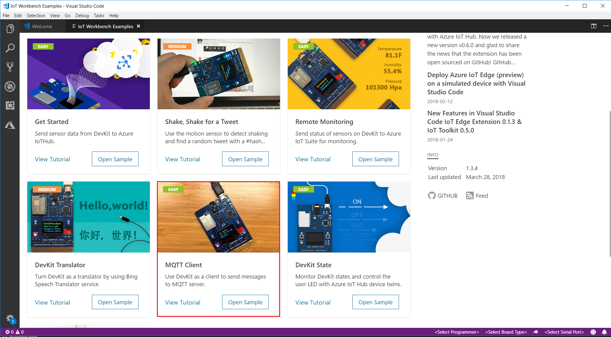
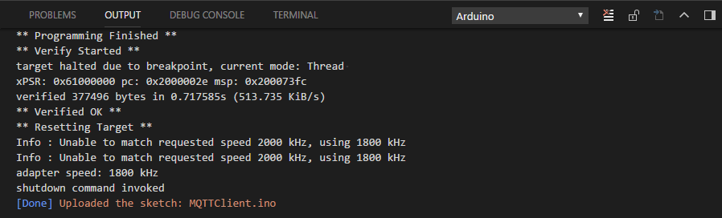
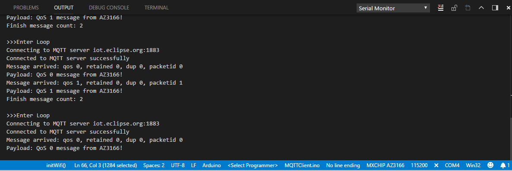

# Send messages to an MQTT server

Internet of Things (IoT) systems often deal with intermittent, poor quality, or slow internet connections. MQTT is a machine-to-machine (M2M) connectivity protocol, which was developed with such challenges in mind. 

In this tutorial, you learn how to use the MQTT Client library to send messages to an MQTT server.

The MQTT client library used here is part of the [Eclipse Paho](http://www.eclipse.org/paho/) project, which provides APIs for using MQTT over multiple means of transport.

## About IoT DevKit

The [MXChip IoT DevKit](https://aka.ms/iot-devkit) (a.k.a. IoT DevKit) is an all-in-one Arduino compatible board with rich peripherals and sensors. You can develop for it using [Azure IoT Workbench ](https://aka.ms/azure-iot-workbench). And it comes with a growing [projects catalog](https://aka.ms/devkit/project-catalog) to guide you prototype Internet of Things (IoT) solutions that take advantage of Microsoft Azure services.

## What you need

Finish the [Getting Started Guide](./devkit-get-started.md) to:

* Have your IoT DevKit connected to Wi-Fi.
* Prepare the development environment.

## Open the project folder

### Start VS Code

* Make sure your IoT DevKit is not connected to your PC.
* Start Visual Studio Code.
* Connect the IoT DevKit to your computer.
* Make sure [Azure IoT Workbench](https://marketplace.visualstudio.com/items?itemName=vsciot-vscode.vscode-iot-workbench) is installed.

### Open IoT Workbench Examples

Use `F1` or `Ctrl+Shift+P` (macOS: `Cmd+Shift+P`) to open the command palette, type **IoT Workbench**, and then select **IoT Workbench: Examples**.

Select **IoT DevKit**.

Then the **IoT Workbench Example** window is showed up.

Find **MQTT Client** and click **Open Sample** button. A new VS Code window with a project folder in it opens.

## Build and upload the device code

1. Open the command palette and select **IoT Workbench: Device**, then select **Device Upload**.

	

2. VS Code then starts verifying and uploading the code to your DevKit.

	

3. The IoT DevKit reboots and starts running the code.

## Test the project

Open [serial monitor](./devkit-get-started.md/#Serial_monitor_usage).

The sample application is running successfully when you see the Serial Monitor displays all the messages sent by the sample sketch.

## How it works

The sketch connects the DevKit to Wi-Fi. Once the Wi-Fi connection is successful, the sketch sends a message to the MQTT broker. After that, the sample repeatedly sends two "iot.eclipse.org" messages using QoS 0 and QoS 1, respectively.

## Problems and feedback

If you encounter problems, refer to [FAQs](https://microsoft.github.io/azure-iot-developer-kit/docs/faq/) or reach out to us from the following channels:

* [Gitter.im](http://gitter.im/Microsoft/azure-iot-developer-kit)
* [Stackoverflow](https://stackoverflow.com/questions/tagged/iot-devkit)

## Next Steps

Now that you have learned how to configure your MXChip Iot DevKit as an MQTT client and use the MQTT Client library to send messages to an MQTT server.

Check our [Projects Catalog](https://aka.ms/devkit/project-catalog) for more samples you can build with the IoT DevKit and Azure multiple services.