# Update IoT DevKit firmware OTA (Over-the-Air) through Azure IoT Hub Automatic Device Management

You may need to update the firmware on the devices connected to your IoT hub. For example, you might want to add new features to the firmware or apply security patches. In many IoT scenarios, it's impractical to physically visit and then manually apply firmware updates to your devices. 

In this tutorial, you will learn how to let IoT DevKit to upgrade its firmware via IoT Hub.

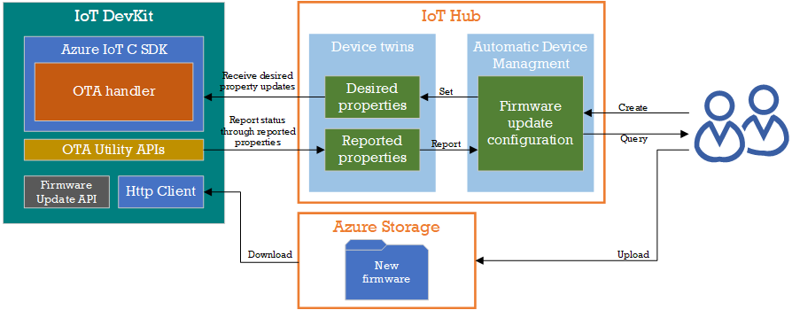

IoT Hub [automatic device management](https://docs.microsoft.com/en-us/azure/iot-hub/iot-hub-auto-device-config) uses configuration to update a set of *device twin desired properties* on all your devices. The desired properties specify the details of the firmware update that's required. While the IoT DevKit is running the firmware update process, it report its status to IoT Hub using *device twin reported properties*. 

## About IoT DevKit

The [MXChip IoT DevKit](https://aka.ms/iot-devkit) (a.k.a. IoT DevKit) is an all-in-one Arduino compatible board with rich peripherals and sensors. You can develop for it using [Azure IoT Device Workbench ](https://aka.ms/azure-iot-workbench). And it comes with a growing [projects catalog](https://aka.ms/devkit/project-catalog) to guide you prototype Internet of Things (IoT) solutions that take advantage of Microsoft Azure services.

## What you need

Finish the [Getting Started Guide](./devkit-get-started.md) to:

* Have your DevKit connected to Wi-Fi.
* Prepare the development environment.

An active Azure subscription. If you do not have one, you can register via one of these two methods:

* Activate a [free 30-day trial Microsoft Azure account](https://azure.microsoft.com/free/).
* Claim your [Azure credit](https://azure.microsoft.com/pricing/member-offers/msdn-benefits-details/) if you are MSDN or Visual Studio subscriber.

## Open the project folder

### Start VS Code

* Start Visual Studio Code.
* Make sure [Azure IoT Device Workbench](https://marketplace.visualstudio.com/items?itemName=vsciot-vscode.vscode-iot-workbench) is installed.
* Connect the IoT DevKit to your computer.
* Make sure the [bootloader](https://microsoft.github.io/azure-iot-developer-kit/docs/firmware-upgrading/) on your IoT DevKit and the [SDK](https://microsoft.github.io/azure-iot-developer-kit/versions/) are both updated to [v1.4.0](https://github.com/Microsoft/devkit-sdk/releases/tag/1.4.0) or higher.


### Open IoT Device Workbench Examples

Use `F1` or `Ctrl+Shift+P` (macOS: `Cmd+Shift+P`) to open the command palette, type **IoT Device Workbench**, and then select **IoT Device Workbench: Examples**.

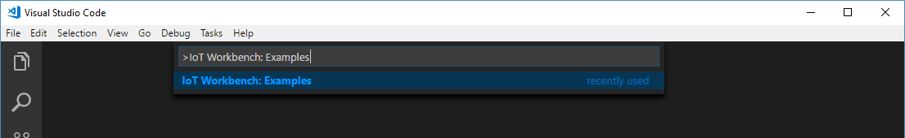

Select **IoT DevKit**.

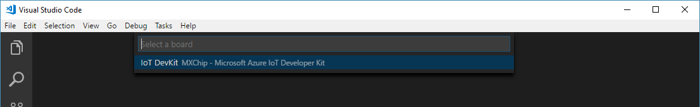

Then the **IoT Device Workbench Example** window is shown up.

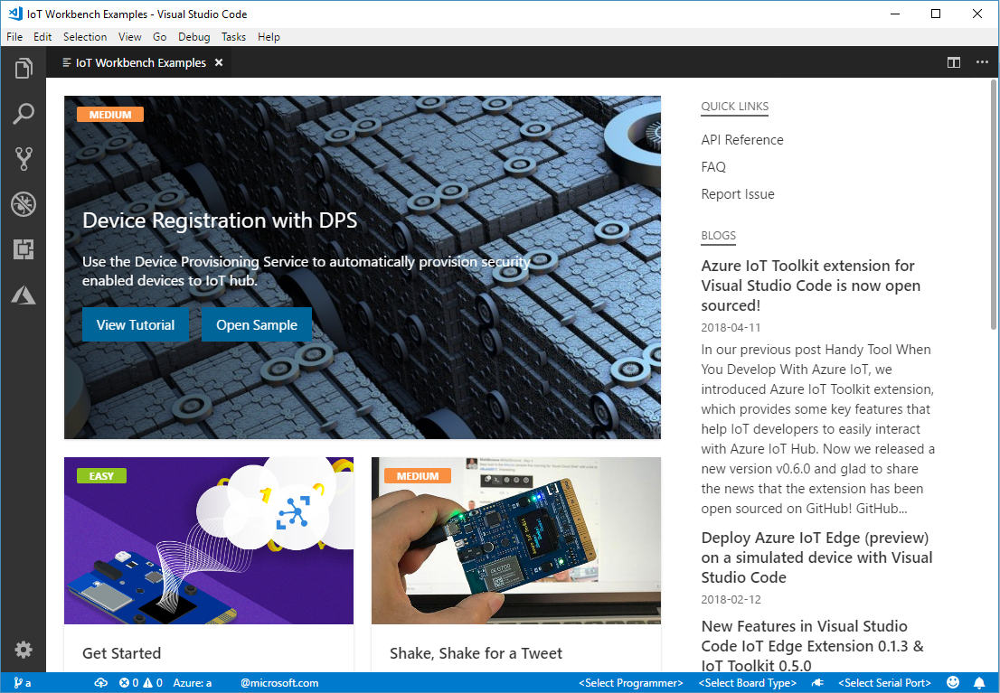

Find **Firmware OTA** and click **Open Sample** button. A new VS Code window with a project folder in it opens.


## Provision Azure service

In the solution window, open the command palette and select **IoT Device Workbench: Cloud**.


Select **Azure Provision**.


Then VS Code guides you through provisioning the required Azure services.


The whole process includes:
* Select an existing IoT Hub or create a new IoT Hub, remember your IoT Hub name as we will use it later.
* Select an existing IoT Hub device or create a new IoT Hub device. 

## Config IoT Hub Connection String

> **Notice:** for real product we highly recommend you to use the [Azure IoT Hub Device  Provisioning Service](https://docs.microsoft.com/en-us/azure/iot-dps/) which can allowing you to provision millions of devices in a secure and scalable manner. And here is the [tutorial](https://github.com/Microsoft/vscode-iot-workbench/blob/master/docs/iot-devkit/devkit_dps.md) which can help you to learn how to use  Azure IoT Hub Device Provisioning Service [auto-provisioning](https://docs.microsoft.com/en-us/azure/iot-dps/concepts-auto-provisioning) a real device.

1. Switch the IoT DevKit into **Configuration mode**. To do so:

   - Hold down button **A**.
   - Push and release the **Reset** button.

2. The screen displays the DevKit ID and 'Configuration'.

    

3. Open the command palette and select **IoT Device Workbench: Device**.

   

4. Select **Config Device Settings**.

   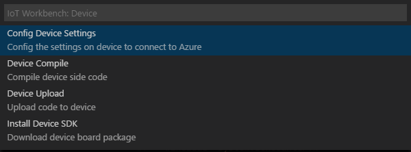

5. Select **Select IoT Hub Device Connection String**.

   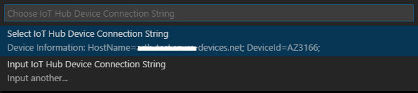

  This sets the connection string that is retrieved from the `Provision Azure services` step.

6. The configuration success notification popup bottom right corner once it's done.

   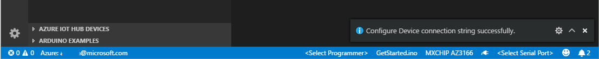 


## Prepare the firmware for OTA update 

In this section, you will build a firmware with new version and upload to the Azure storage.

### Build the new firmware

The initial version of the device firmware is 1.0.0, to complete this tutorial you should have a firmware with higher version.

1. Open the FirmwareOTA.ino, change the version from "1.0.0" to "1.0.1".

   

2. Open the command palette and select **IoT Device Workbench: Device**, then select **Device Compile** to compile the code.

   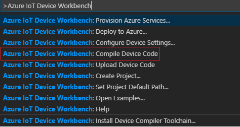

3. VS Code then compile the code and generate the **.bin** file and put it under the *.build* folder.

   

### CRC value and file size of the firmware

1. Open the command palette and select **IoT Device Workbench: Device**, then select **Generate CRC**.

   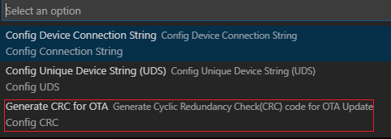

2. VS Code then generate the CRC value and print out in the OUTPUT windows, also have the full firmware filename and the file size. 

   


### Upload the firmware to cloud

You need upload the firmware to cloud for the device to download and upgrade.

1. Create a Azure Storage Account.

   Follow this [tutorial](https://docs.microsoft.com/en-us/azure/storage/common/storage-quickstart-create-account) to create a new Storage Account, or skip this step if you want to use a existing one.

2. Navigate to your new storage account in the Azure portal, scroll to the Blob Service section, then select **Blobs**. Create a public container for storing firmware files.

   

3. Upload firmware file to the blob container.

   You can use [Azure portal](https://docs.microsoft.com/en-us/azure/storage/blobs/storage-quickstart-blobs-portal), [Storage Explorer](https://docs.microsoft.com/en-us/azure/storage/blobs/storage-quickstart-blobs-storage-explorer) or [CLI](https://docs.microsoft.com/en-us/azure/storage/blobs/storage-quickstart-blobs-cli) to complete this step.

4. After the firmware file is uploaded, write down the URL for further usage.

## Create a configuration

1. In the [Azure portal](https://portal.azure.com/), go to your IoT hub.
2. Select **IoT device configuration**.
3. Select **Add Configuration**.

There are five steps to create a configuration. The following sections walk through each one. 

### Step 1: Name and Label

1. Give your configuration a unique name that is up to 128 lowercase letters. Avoid spaces and the following invalid characters: `& ^ [ ] { } \ | " < > /`.
2. Add labels to help track your configurations. Labels are **Name**, **Value** pairs that describe your configuration. For example, `HostPlatform, Linux` or `Version, 3.0.1`.
3. Select **Next** to move to step two. 

### Step 2: Specify Settings

This section specifies the target content to be set in targeted device twins. There are two inputs for each set of settings. The first is the device twin path, which is the path to the JSON section within the twin desired properties that will be set.  The second is the JSON content to be inserted in that section. 

For OTA, the device twin path is:  **properties.desired.firmware** .

and the content includes:

* "fwVersion" : [firmware version](#build-the-new-firmware).
* "fwPackageURI" : [URL of the firmware](#upload-the-firmware-to-cloud)
* "fwPackageCheckValue" : [CRC value of the firmware](#crc-value-and-file-size-of-the-firmware)
* "fwSize" : [file size of the firmware](#fcrc-value-and-file-size-of-the-firmware)

The Settings may like this:


### Step 3: Specify Metrics (optional)

Metrics provide summary counts of the various states that a device may report back as a result of applying configuration content. For example, you may create a metric for pending settings changes, a metric for errors, and a metric for successful settings changes.

1. Enter a name for **Metric Name**
2. Enter a query for **Metric Criteria**.  The query is based on device twin reported properties.  The metric represents the number of rows returned by the query.

Here you can add bellowing 5 metrics to monitor the OTA status:

**Current**: 

``` 
SELECT deviceId FROM devices WHERE properties.reported.firmware.fwUpdateStatus='Current' AND properties.reported.firmware.type='IoTDevKit' 
```
**Downloading**:
```
SELECT deviceId FROM devices WHERE properties.reported.firmware.fwUpdateStatus='Downloading' AND properties.reported.firmware.type='IoTDevKit'
```
**Verifying**:
```
SELECT deviceId FROM devices WHERE properties.reported.firmware.fwUpdateStatus='Verifying' AND properties.reported.firmware.type='IoTDevKit'
```
**Applying**:
```
SELECT deviceId FROM devices WHERE properties.reported.firmware.fwUpdateStatus='Applying' AND properties.reported.firmware.type='IoTDevKit'
```
**Error**:
```
SELECT deviceId FROM devices WHERE properties.reported.firmware.fwUpdateStatus='Error' AND properties.reported.firmware.type='IoTDevKit'
```


### Step 4 Target Devices

Use the tags property from your device twins to target the specific devices that should receive this configuration.  You can also target devices by device twin reported properties.

 Since multiple configurations may target the same device, you should give each configuration a priority number. If there's ever a conflict, the configuration with the highest priority wins. 

1. Enter a positive integer for the configuration **Priority**. Highest numerical value is considered the highest priority. If two configurations have the same priority number, the one that was created most recently wins. 

2. Enter a **Target condition** to determine which devices will be targeted with this configuration. The condition is based on device twin tags or device twin reported properties and should match the expression format. For example, `tags.environment='test'` or `properties.reported.chillerProperties.model='4000x'`. 


Here just you can set the **Priority**  ```10``` and specify `*` to target all devices.

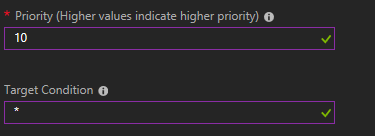

Select **Next** to move on to the final step.

### Step 5 Review Configuration

Review your configuration information, then select **Submit**.

## Start OTA firmware update

Now everything on Azure cloud is ready, let's upload the device code and begin the firmware update process.

### Build and upload the device code

1. Set back the version to 1.0.0

   

2. Open the command palette and select **IoT Device Workbench: Device**, then select **Device Upload**.

   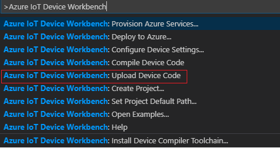

3. VS Code then start verifying and uploading the code to your IoT DevKit.

   

4. The DevKit reboot and start running.

### Update the firmware Over-the-Air 

After reboot, the screen of IoT DevKit show version 1.0.0, and is checking for the new firmware.


After a while, IoT DevKit get the new firmware information from Azure IoT Hub, and start downloading.


The download may take 1 minute (depend on the speed of the network). After downloaded the new firmware to device, it verify the file size and CRC value whether it's the same as the firmware information in [device twins](#step-2:-specify-settings).  

Display "passed" if match.

 

Then the device will reboot after counting down from 5 - 0.

 

After reboot, the  underlying bootloader in IoT DevKit upgrade the firmware to the new version, it might take several seconds. 

During this stage you can see the RGB LEG show RED and the screen is black.

 

Then the IoT DevKit run the new firmware with version 1.0.1.

 

### Firmware update status

During the whole update process, the device report its status via *device twin reported properties* to Azure IoT Hub. 

### View metrics in Azure portal

You can see the status update in the portal in the **Automatic device management -> IoT device configuration** section of your IoT hub (Because of latency in the IoT Hub device identity registry, you many not see every status).

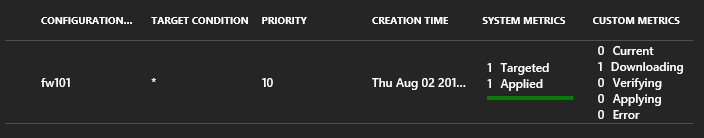

### View status in device twins

You can check them by using the Azure IoT Toolkit extension:

1. In Explorer of VS Code, click "Azure IoT Hub Devices" in the bottom left corner.

   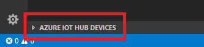

2. Right click on the device you created, here is AZ3166, select **Edit Device Twin**.

   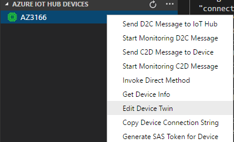

3. In **azure-iot-device-twin.json** window you can see the complete device twins includes the firmware update status.

   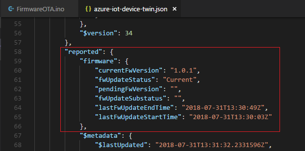


## Problems and feedback

If you encounter problems, you can refer to [FAQs](https://microsoft.github.io/azure-iot-developer-kit/docs/faq/) or connect using the following channels:

- [Gitter.im](http://gitter.im/Microsoft/azure-iot-developer-kit)
- [Stackoverflow](https://stackoverflow.com/questions/tagged/iot-devkit)

## Next Steps

In this tutorial, you learned how to implement a OTA firmware update process by using MXChip IoT DevKit and  IoT Hub [automatic device management](https://docs.microsoft.com/en-us/azure/iot-hub/iot-hub-auto-device-config).
Check our [Projects Catalog](https://aka.ms/devkit/project-catalog) for more samples you can build with the IoT DevKit and Azure multiple services.
