# Use IoT DevKit AZ3166 with IoT Hub to make OTA firmware update

You may need to update the firmware on the devices connected to your IoT hub. For example, you might want to add new features to the firmware or apply security patches. In many IoT scenarios, it's impractical to physically visit and then manually apply firmware updates to your devices. 

In this tutorial, you will learn how to let IoT DevKit to upgrade its firmware via IoT Hub.

IoT Hub [automatic device management](https://docs.microsoft.com/en-us/azure/iot-hub/iot-hub-auto-device-config) uses configuration to update a set of *device twin desired properties* on all your devices. The desired properties specify the details of the firmware update that's required. While the IoT DevKit is running the firmware update process, it report its status to IoT Hub using *device twin reported properties*. 

## About IoT DevKit

The [MXChip IoT DevKit](https://aka.ms/iot-devkit) (a.k.a. IoT DevKit) is an all-in-one Arduino compatible board with rich peripherals and sensors. You can develop for it using [Azure IoT Workbench ](https://aka.ms/azure-iot-workbench). And it comes with a growing [projects catalog](https://aka.ms/devkit/project-catalog) to guide you prototype Internet of Things (IoT) solutions that take advantage of Microsoft Azure services.

## What you need

Finish the [Getting Started Guide](./devkit-get-started.md) to:

* Have your DevKit connected to Wi-Fi.
* Prepare the development environment.

An active Azure subscription. If you do not have one, you can register via one of these two methods:

* Activate a [free 30-day trial Microsoft Azure account](https://azure.microsoft.com/free/).
* Claim your [Azure credit](https://azure.microsoft.com/pricing/member-offers/msdn-benefits-details/) if you are MSDN or Visual Studio subscriber.

## Open the project folder

### Start VS Code

* Start Visual Studio Code.
* Make sure [Azure IoT Workbench](https://marketplace.visualstudio.com/items?itemName=vsciot-vscode.vscode-iot-workbench) is installed.
* Connect the IoT DevKit to your computer.

### Open IoT Workbench Examples

Use `F1` or `Ctrl+Shift+P` (macOS: `Cmd+Shift+P`) to open the command palette, type **IoT Workbench**, and then select **IoT Workbench: Examples**.


Select **IoT DevKit**.


Then the **IoT Workbench Example** window is showed up.


Find **Firmware OTA** and click **Open Sample** button. A new VS Code window with a project folder in it opens.


## Provision Azure service

In the solution window, open the command palette and select **IoT Workbench: Cloud**.


Select **Azure Provision**.


Then VS Code guides you through provisioning the required Azure services.


The whole process includes:
* Select an existing IoT Hub or create a new IoT Hub, remember your IoT Hub name as we will use it later.
* Select an existing IoT Hub device or create a new IoT Hub device. 

## Config IoT Hub Connection String

1. Switch the IoT DevKit into **Configuration mode**. To do so:

   - Hold down button **A**.
   - Push and release the **Reset** button.

2. The screen displays the DevKit ID and 'Configuration'.

	 

3. Open the command palette and select **IoT Workbench: Device**.

	

4. Select **Config Device Settings**.

	

5. Select **Select IoT Hub Device Connection String**.

	

   This sets the connection string that is retrieved from the `Provision Azure services` step.

6. The configuration success notification popup bottom right corner once it's done.

     

## Prepare the firmware for OTA update 

In this step, you will get bellow 3 items for further to enable OTA firmware update:

- V1.0.1 firmware: *FirmwareOTA.ino.bin*
- File size of the firmware
- CRC value of the firmware

And upload the firmware to Azure.

### Build the new firmware

The initial version of the device firmware is 1.0.0, to complete this tutorial you should have a firmware with higher version.

1. Open the FirmwareOTA.ino, change the version from "1.0.0" to "1.0.1".


2. Open the command palette and select **IoT Workbench: Device**, then select **Device Compile** to compile the code.


3. VS Code then compile the code and generate the **.bin** file under the *.build* folder.


4. Right click on the *FimwareOTA.ino* file, select *Copy Path*, then you have the path in clipboard.

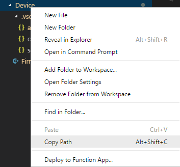

5. Open a **File Explorer** window and paste the path in, navigate to *.build* folder, you can see the *FirmwareOTA.ino.bin* which is the new firmware be used in next steps.

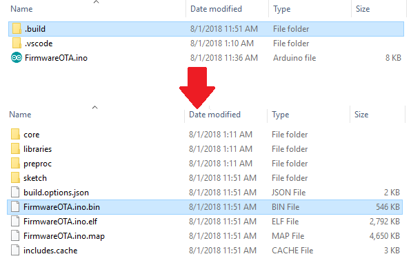

6. Write down the file size of this file for further usage.

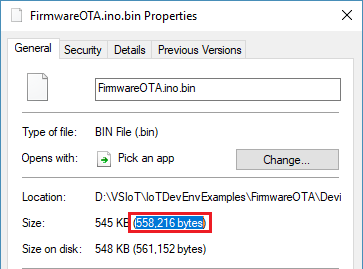

### Calculate the CRC value

A check value is mandatory to ensure the integrity of the firmware.

Here we use [pycrc](https://github.com/tpircher/pycrc) (you can pick up any other CRC tools you like) :

* [Download and install the Python](https://wiki.python.org/moin/BeginnersGuide/Download) if you don't have it installed.

* Clone the [pycrc](https://github.com/tpircher/pycrc) from github

  ```git clone https://github.com/tpircher/pycrc```

* Run and generate the CRC value

  ``` python pycrc.py --model=xmodem --check-file <path>\FirmwareOTA.ino.bin```

Record the CRC value for further usage.

### Upload the firmware to Azure

You need upload the firmware to cloud for IoT DevKit downloading and upgrading.

1. Create a Azure Storage Account.

   Skip this step if you already have one, and follow this [tutorial](https://docs.microsoft.com/en-us/azure/storage/common/storage-quickstart-create-account) to create a new Storage Account.

2. Create a public container to save firmware file.

   

3. Upload firmware file to the blob container.

   You can use [Azure portal](https://docs.microsoft.com/en-us/azure/storage/blobs/storage-quickstart-blobs-portal), [Storage Explorer](https://docs.microsoft.com/en-us/azure/storage/blobs/storage-quickstart-blobs-storage-explorer) or [CLI](https://docs.microsoft.com/en-us/azure/storage/blobs/storage-quickstart-blobs-cli) to complete this step.

4. After the firmware file is uploaded, write down the URL for further usage.


## Create a configuration

1. In the [Azure portal](https://portal.azure.com/), go to your IoT hub.
2. Select **IoT device configuration**.
3. Select **Add Configuration**.

There are five steps to create a configuration. The following sections walk through each one. 

### Step 1: Name and Label

1. Give your configuration a unique name that is up to 128 lowercase letters. Avoid spaces and the following invalid characters: `& ^ [ ] { } \ | " < > /`.
2. Add labels to help track your configurations. Labels are **Name**, **Value** pairs that describe your configuration. For example, `HostPlatform, Linux` or `Version, 3.0.1`.
3. Select **Next** to move to step two. 

### Step 2: Specify Settings

This section specifies the target content to be set in targeted device twins. There are two inputs for each set of settings. The first is the device twin path, which is the path to the JSON section within the twin desired properties that will be set.  The second is the JSON content to be inserted in that section. 

For OTA, the device twin path is 

```properties.desired.firmware```

and the content includes 

```json
{
	"fwVersion": <firmware version>,
	"fwPackageURI": <url>,
	"fwPackageCheckValue": <CRC value>,
	"fwSize": <file size>
}
```


### Step 3: Specify Metrics (optional)

Metrics provide summary counts of the various states that a device may report back as a result of applying configuration content. For example, you may create a metric for pending settings changes, a metric for errors, and a metric for successful settings changes.

1. Enter a name for **Metric Name**
2. Enter a query for **Metric Criteria**.  The query is based on device twin reported properties.  The metric represents the number of rows returned by the query.

Here you can just skip this step.

### Step 4 Target Devices

Use the tags property from your device twins to target the specific devices that should receive this configuration.  You can also target devices by device twin reported properties.

 Since multiple configurations may target the same device, you should give each configuration a priority number. If there's ever a conflict, the configuration with the highest priority wins. 

1. Enter a positive integer for the configuration **Priority**. Highest numerical value is considered the highest priority. If two configurations have the same priority number, the one that was created most recently wins. 

2. Enter a **Target condition** to determine which devices will be targeted with this configuration. The condition is based on device twin tags or device twin reported properties and should match the expression format. For example, `tags.environment='test'` or `properties.reported.chillerProperties.model='4000x'`. 

   Here just specify `*` to target all devices.


Select **Next** to move on to the final step.

### Step 5 Review Configuration

Review your configuration information, then select **Submit**.


In order to trigger firmware update event, you need to use Azure portal to set automatic device management configuration.

1. In the [Azure portal](https://portal.azure.com), go to the IoT hub you previously provisioned.

2. In Section **AUTOMATIC DEVICE MANAGEMENT**, select **IoT device configuration**.

3. Select **Add Configuration** and create a new configuration.

	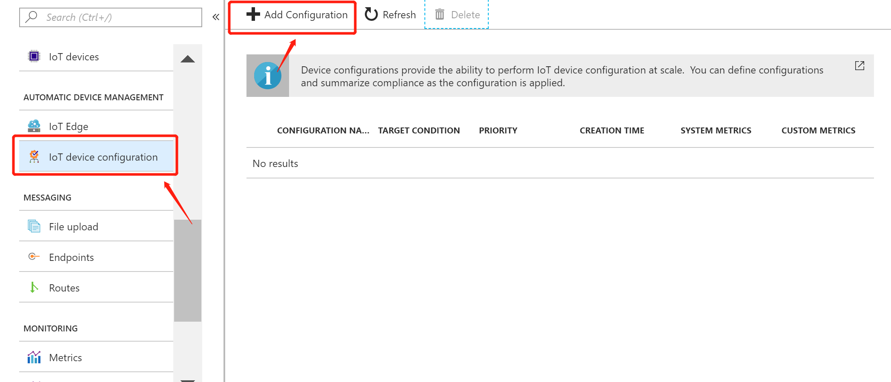

4. Give your OTA configuration a unique name, for example, "ota-firmware-update", and add labels to help track our configurations if necessary. Select **Next** to move to next step.

	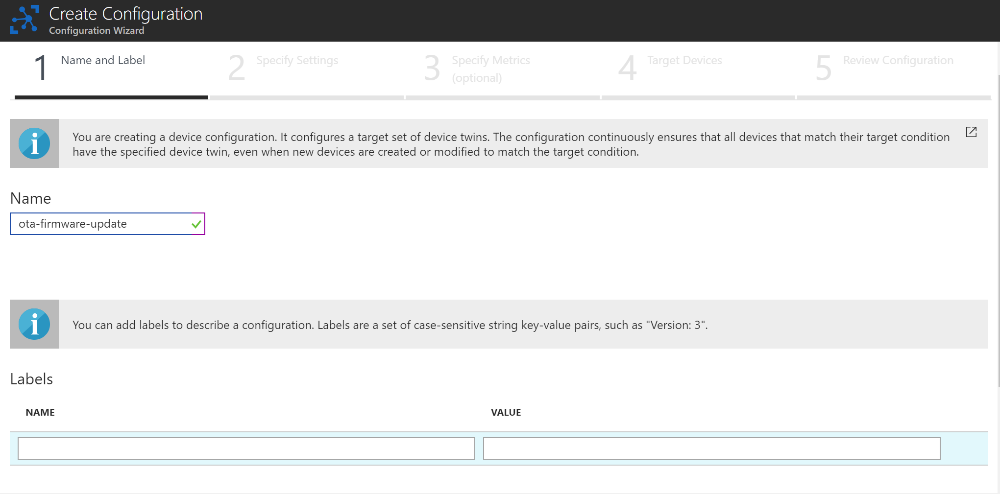

5. Specifies the target content to be set in targeted device twins. Set **Device Twin Path** as "properties.desired.firmware", and set **Content** in the following JSON format:

	```json
	{
		"fwVersion": "1.3.7.56",
		"fwPackageURI": "https://raw.githubusercontent.com/IoTDevEnvExamples/FirmwareOTA/master/Device/tool/devkit-firmware-1.3.7.56.bin",
		"fwPackageCheckValue": "AAAA",
		"fwSize": 0
	}
	```

	In this example, we use DevKit 1.3.7.56 as the firmware to be upgraded. Since we set the firmware version in the example code to be 1.1.1, the upgrade will always proceed.

	The .bin file of the firmware is already in the example directory. Run **CRC16Calculator.exe**(or **CRC16Calculator.out** in Mac) under the **tool/** folder in command line, and set **devkit-firmware-1.3.7.56.bin** as running argument. You would see the size of the .bin file and its CRC-16 checksum represented in 4-digit hexadecimal form.
	
	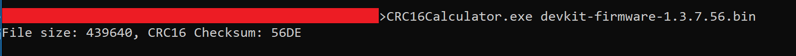
	
	Set them as the value of **fwPackageCheckValue** and **fwSize** in desired properties of JSON twin. Select **Next** to move to next step.

	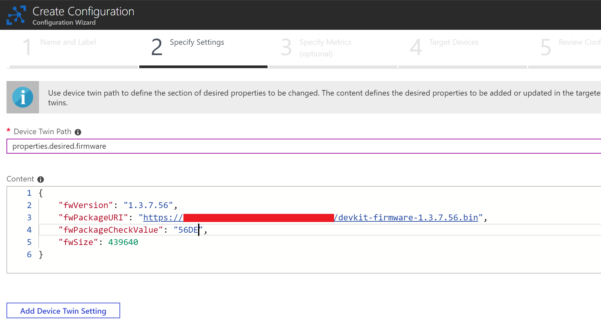

6. Select **Next** to skip step 3 of creating configuration. In step 4, set the **Priority** of the configuration as 10, and set **Target Condition** as "*", which means that the configuration would target all devices. Select **Next**.

	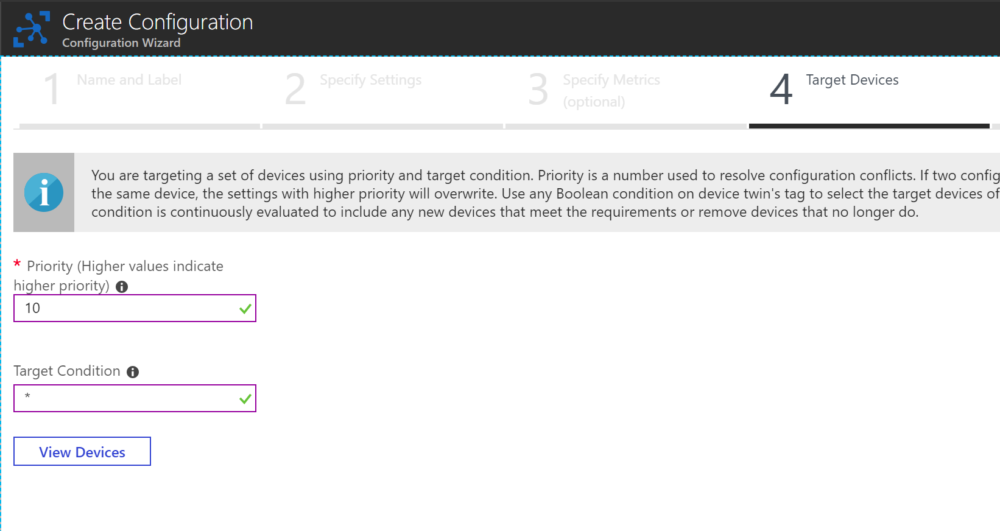

7. In step 5, review your configuration information, then select **Submit**.

## Build and upload the device code

1. Open the command palette and select **IoT Workbench: Device**, then select **Device Upload**.

	

2. VS Code then starts verifying and uploading the code to your DevKit.

	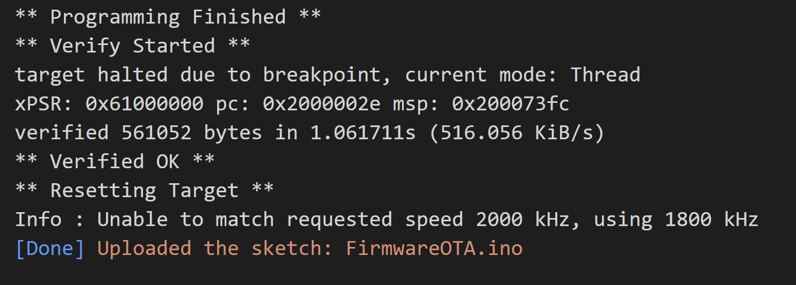

3. The DevKit reboots and starts running the code.

If DevKit is currently connected to a WiFi network, it would get the firmware update information and start to download and verify the firmware specified in the URL. During the whole update process, the device will report its status to IoT Hub via device twin. 

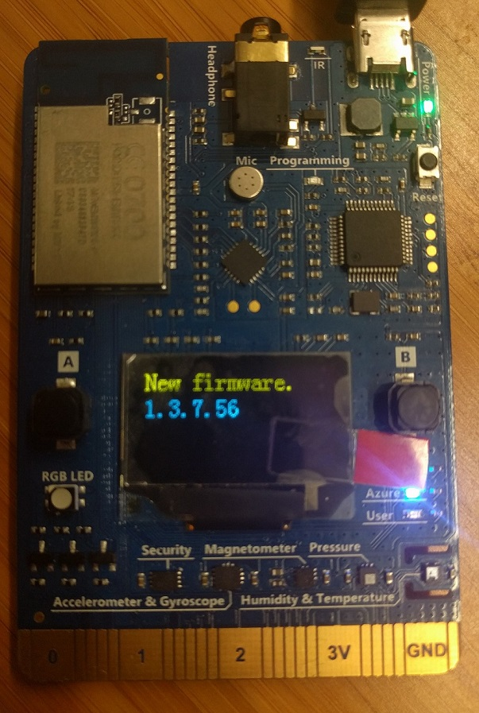

To see the reported status,

1. In Section **EXPLORERS** in your IoT Hub portal, select **IoT devices**, then select your device by its device id in the list.

	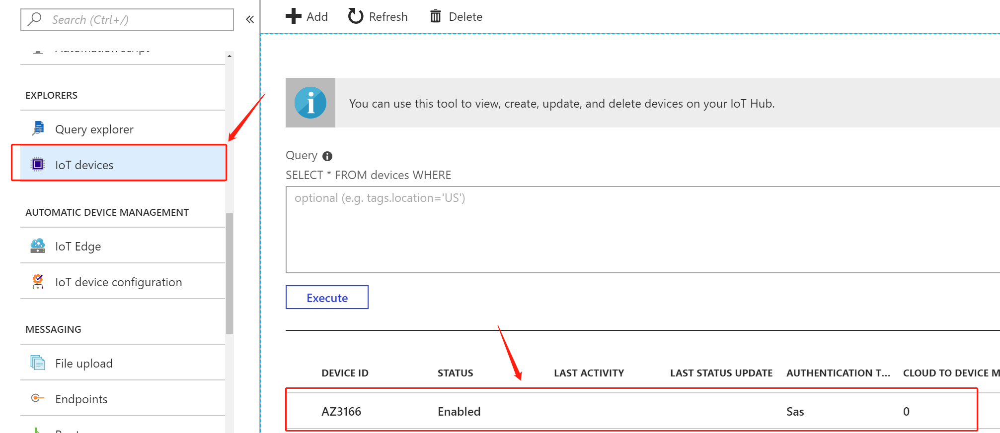

2. Select **Device Twin** tab.

	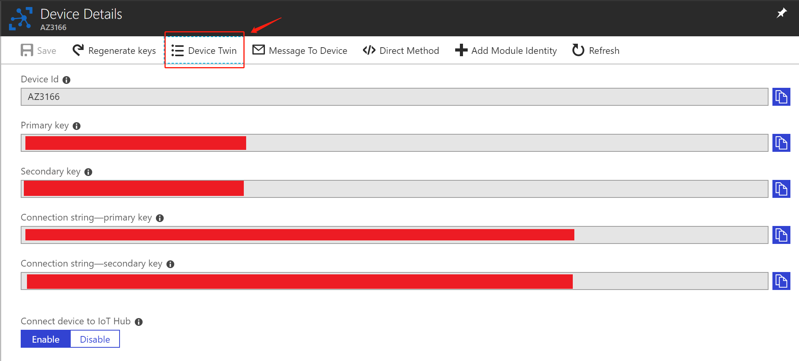

3. In **Device Twin** tab you will see the complete device twin JSON of your device. In **"reported"** object you will see the reported status of the OTA process.

	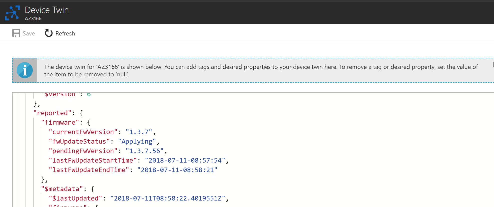

After the process the device would restart automatically and apply the new firmware to the device.