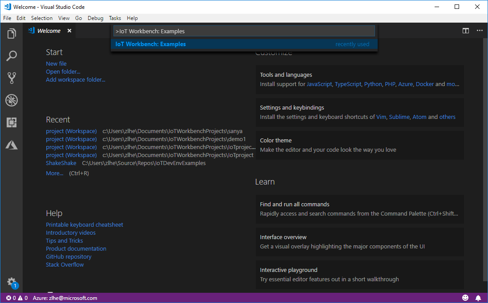
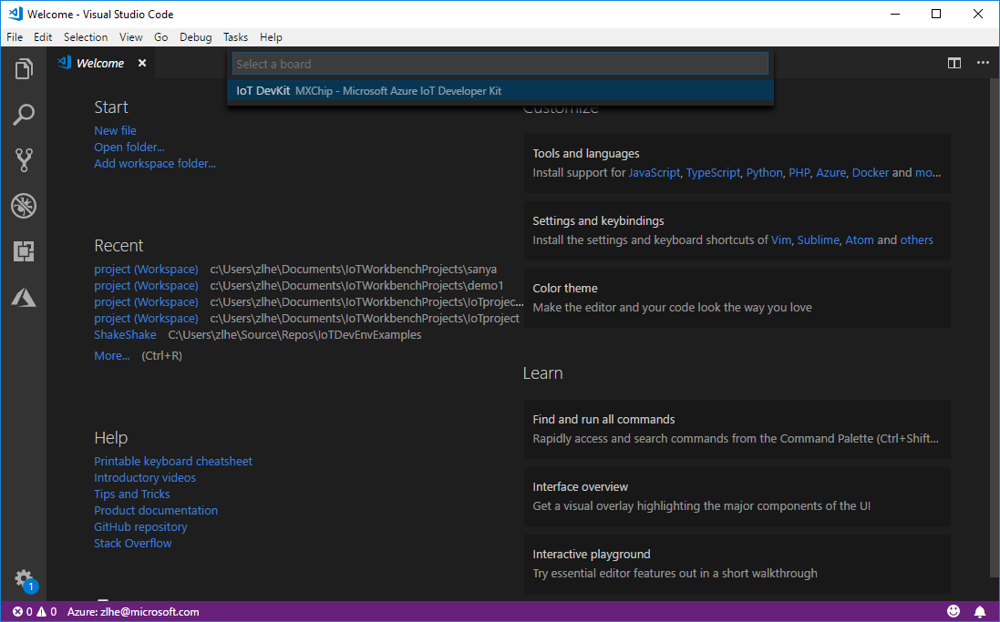
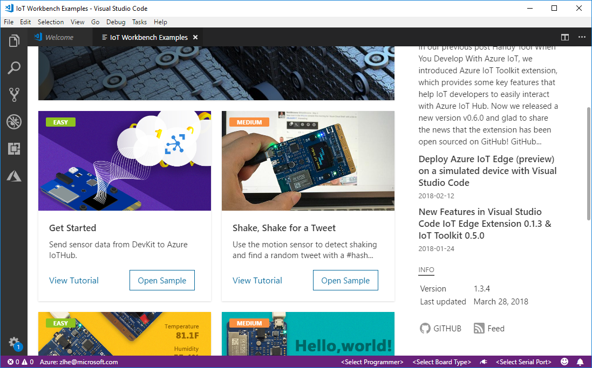
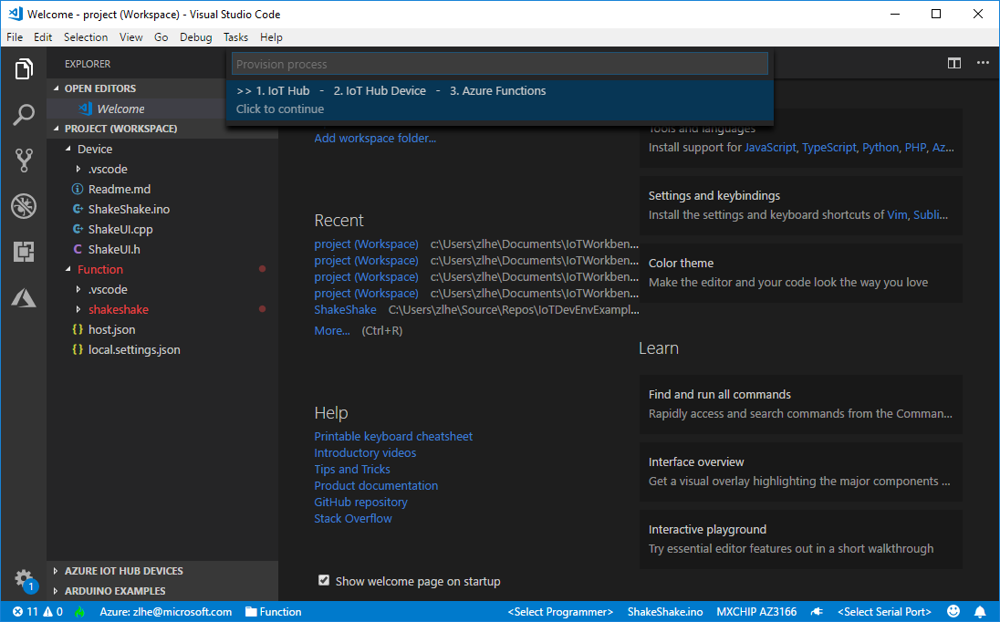
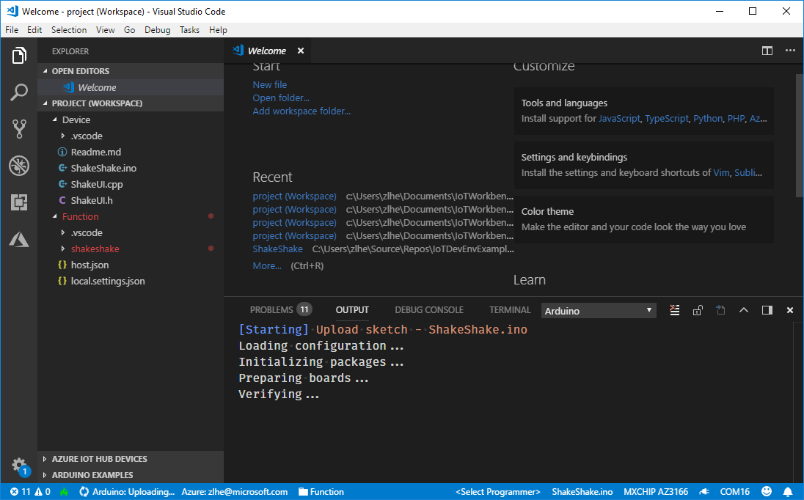

# Shake, Shake for a Tweet -- Retrieve a Twitter message with Azure Functions!

In this tutorial, you learn how to use the motion sensor to trigger an event using Azure Functions. The app retrieves a random tweet with a #hashtag you configure in your Arduino sketch. The tweet displays on the DevKit screen.

## Open the project folder

### Start VS Code

- Start VS Code.
- Connect the DevKit to your computer.

### Open IoT Workbench Examples

Use `Ctrl+Shift+P` (macOS: `Cmd+Shift+P`) to open the command palette, type **IoT Workbench**, and then select **IoT Workbench: Examples**. Select **IoT DevKit**. Find **Shake, Shake for a Tweet** and click **Open Sample** button. A new VS Code window with a project folder in it opens.







## Provision Azure services

In the solution window, open the command palette and select **IoT Workbench: Cloud**, then select **Azure Provision**.

VS Code guides you through provisioning the required Azure services:



## Modify the #hashtag

Open `ShakeShake.ino` and look for this line of code:

```cpp
static const char* iot_event = "{\"topic\":\"iot\"}";
```

Replace the string `iot` within the curly braces with your preferred hashtag. DevKit later retrieves a random tweet that includes the hashtag you specify in this step.

## Deploy Azure Functions

Open the command palette and select **IoT Workbench: Cloud**, then select **Azure Deploy**.


## Config IoT Hub Connection String

1. Open the command palette and select **IoT Workbench: Device**, then select **Config Device Settings** and select **Select IoT Hub Device Connection String**.
2. VS Code prompts you to enter configuration mode. To do so:

   * Hold down button A
   * Push and release the reset button.

3. The screen displays the DevKit ID and 'Configuration'.
4. This sets the connection string that is retrieved from the `Azure Provision` step.


## Build and upload the device code

1. Open the command palette and select **IoT Workbench: Device**, then select **Device Upload**.
2. VS Code then starts verifying and uploading the Arduino sketch to your DevKit:

   

3. The DevKit reboots and starts running the code.

## Test the project

After app initialization, click and release button A, then gently shake the DevKit board. This action retrieves a random tweet, which contains the hashtag you specified earlier. Within a few seconds, a tweet displays on your DevKit screen:

### Arduino application initializing...


### Press A to shake...


### Ready to shake...


### Processing...


### Press B to read...


### Display a random tweet...


- Press button A again, then shake for a new tweet.
- Press button B to scroll through the rest of the tweet.

## How it works


The Arduino sketch sends an event to the Azure IoT Hub. This event triggers the Azure Functions app. Azure Functions app contains the logic to connect to Twitter's API and retrieve a tweet. It then wraps the tweet text into a C2D (Cloud-to-device) message and sends it back to the device.

## Optional: Use your own Twitter bearer token

For testing purposes, this sample project uses a pre-configured Twitter bearer token. However, there is a [rate limit](https://dev.twitter.com/rest/reference/get/search/tweets) for every Twitter account. If you want to consider using your own token, follow these steps:

1. Go to [Twitter Developer portal](https://dev.twitter.com/) to register a new Twitter app.

2. [Get Consumer Key and Consumer Secrets](https://support.yapsody.com/hc/en-us/articles/203068116-How-do-I-get-a-Twitter-Consumer-Key-and-Consumer-Secret-key-) of your app.

3. Use [some utility](https://gearside.com/nebula/utilities/twitter-bearer-token-generator/) to generate a Twitter bearer token from these two keys.

4. In the [Azure portal](https://portal.azure.com/){:target="_blank"}, get into the **Resource Group** and find the Azure Function (Type: App Service) for your "Shake, Shake" project. The name always contains 'shake...' string.
  

5. Update the code for `run.csx` within **Functions > shakeshake-cs** with your own token:
  ```csharp
  ...
  string authHeader = "Bearer " + "[your own token]";
  ...
  ```
  

6. Save the file and click **Run**.