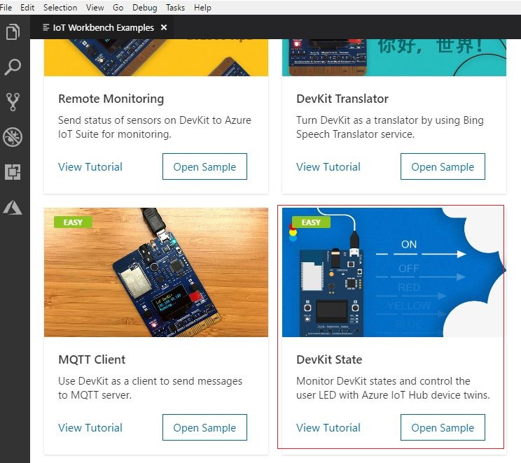
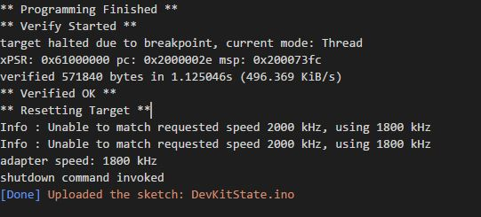

# DevKit State

In this tutorial, you can monitor the MXChip IoT DevKit WiFi information and sensor states and control the color of the user LED using Azure IoT Hub device twins.

## About IoT DevKit

The [MXChip IoT DevKit](https://aka.ms/iot-devkit) (a.k.a. IoT DevKit) is an all-in-one Arduino compatible board with rich peripherals and sensors. You can develop for it using [Azure IoT Workbench ](https://aka.ms/azure-iot-workbench). And it comes with a growing [projects catalog](https://aka.ms/devkit/project-catalog) to guide you prototype Internet of Things (IoT) solutions that take advantage of Microsoft Azure services.

## What you need

Finish the [Getting Started Guide](./devkit-get-started.md) to:

- Have your DevKit connected to Wi-Fi.
- Prepare the development environment.

An active Azure subscription. If you do not have one, you can register via one of these two methods:

- Activate a [free 30-day trial Microsoft Azure account](https://azure.microsoft.com/free/).
- Claim your [Azure credit](https://azure.microsoft.com/pricing/member-offers/msdn-benefits-details/) if you are MSDN or Visual Studio subscriber.


## Open the project folder

### Start VS Code

- Start VS Code.
- Connect the DevKit to your computer.
- Connect the IoT DevKit to your computer.
- Make sure [Azure IoT Workbench](https://marketplace.visualstudio.com/items?itemName=vsciot-vscode.vscode-iot-workbench) is installed.

### Open IoT Workbench Examples

Use `F1` or `Ctrl+Shift+P` (macOS: `Cmd+Shift+P`) to open the command palette, type **IoT Workbench**, and then select **IoT Workbench: Examples**.


Select **IoT DevKit**.


Then the **IoT Workbench Example** window is showed up.


Find **Shake, Shake for a Tweet** and click **Open Sample** button. A new VS Code window with a project folder in it opens.



## Provision Azure Services

In the solution window, open the command palette and select **IoT Workbench: Cloud**.


Select **Azure Provision**.


Then VS Code guides you through provisioning the required Azure services.


The whole process includes:

- Select an existing IoT Hub or create a new IoT Hub.
- Select an existing IoT Hub device or create a new IoT Hub device. 
- Create a new Function App.

Please take a note of the Function App name and IoT Hub device name you created. It will be used in the next section.

## Modify code for Azure Functions
Open **devkit-state\run.csx** and modify the following line with the device name you provisioned in previous step:
```cpp
static string deviceName = "";
```

## Deploy Azure Functions

Open the command palette and select **IoT Workbench: Cloud**, then select **Azure Deploy**.


## Config IoT Hub Connection String

1. Switch the IoT DevKit into **Configuration mode**. To do so:

   - Hold down button **A**.
   - Push and release the **Reset** button.

2. The screen displays the DevKit ID and 'Configuration'.

    

3. Open the command palette and select **IoT Workbench: Device**.

   

4. Select **Config Device Settings**.

   

5. Select **Select IoT Hub Device Connection String**.

   

   This sets the connection string that is retrieved from the `Provision Azure services` step.

6. The configuration success notification popup bottom right corner once it's done.

    

## Build and upload the device code

1. Open the command palette and select **IoT Workbench: Device**, then select **Device Upload**.

   

2. VS Code then starts verifying and uploading the code to your DevKit.

   

3. The IoT DevKit reboots and starts running the code.

## Monitor DevKit State in Browser

1. Open `web\index.html` in browser.
2. Input the function app name you write down.
3. Click connect button.
4. You should see DevKit state in a few seconds.


## Control DevKit User LED

1. Click User LED or RGB LED on the web page
2. You should see the state of the leds changed in few seconds
