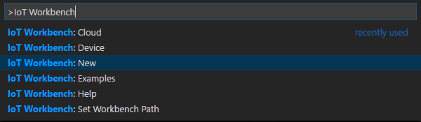
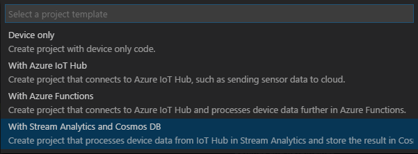
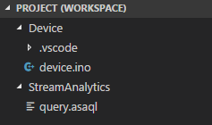
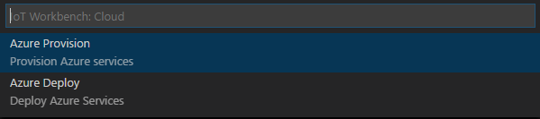
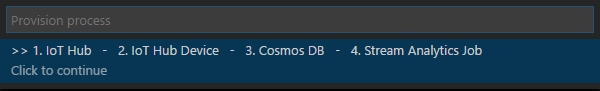
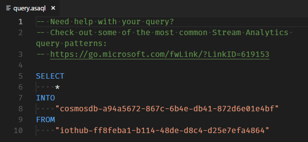
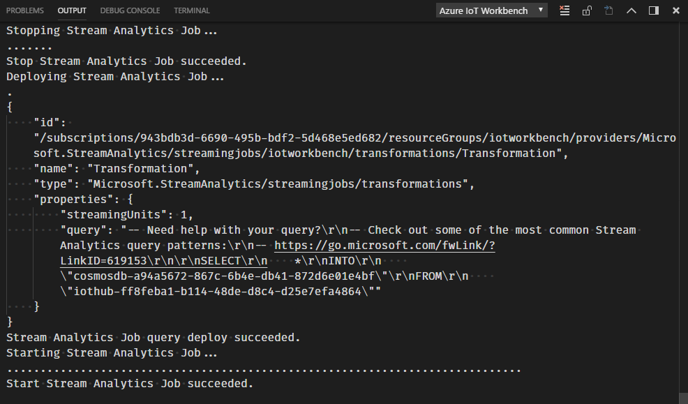
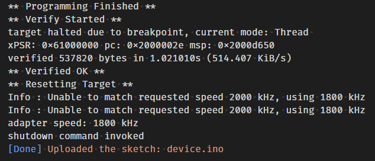
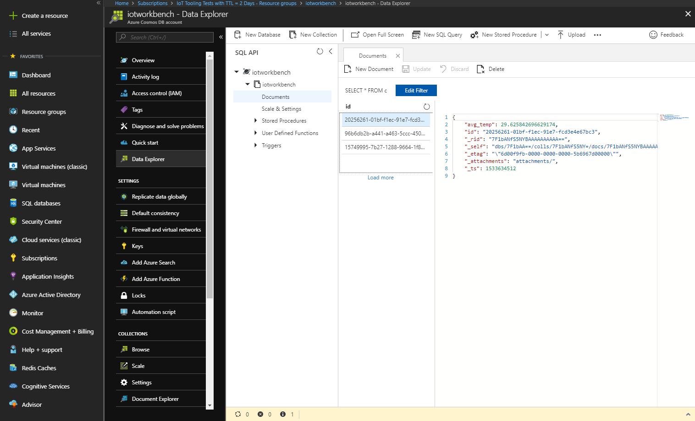

# Stream Analytics and Cosmos DB

In this tutorial, you will learn how to send data to Stream Analytics Job and export it to Cosmos DB with Azure Stream Analytics Query Langauge.

## What you need

Finish the [Getting Started Guide](./devkit-get-started.md) to:

- Have your DevKit connected to Wi-Fi.
- Prepare the development environment.

An active Azure subscription. If you do not have one, you can register via one of these two methods:

- Activate a [free 30-day trial Microsoft Azure account](https://azure.microsoft.com/free/).
- Claim your [Azure credit](https://azure.microsoft.com/pricing/member-offers/msdn-benefits-details/) if you are MSDN or Visual Studio subscriber.

## Create a New Project

Use `F1` or `Ctrl+Shift+P` (macOS: `Cmd+Shift+P`) to open the command palette, type **IoT Workbench**, and then select **IoT Workbench: New**.



Select **IoT DevKit**.


Select **With Stream Analytics and Cosmos DB**.



A new project will be opened in a new window with two folders named Device and StreamAnalytics.



## Send DevKit Temperature Sensor Data to IoT Hub

Open `Device/device.ino`, include temperature sensor header file.

```cpp
#include "HTS221Sensor.h"
```

Declare two variables for I2C and the sensor instance.

```cpp
DevI2C *i2c;
HTS221Sensor *sensor;
```

Create a new function to initialize the sensor.

```cpp
void initSensor() {
  i2c = new DevI2C(D14, D15);
  sensor = new HTS221Sensor(*i2c);
  sensor->init(NULL);
}
```

Next create a new function to read the sensor data.

```cpp
float readTemperature() {
  sensor->reset();
  float temperature = 0;
  sensor->getTemperature(&temperature);
  return temperature;
}
```

Call `initSensor` function in `setup` to initialize the sensor when the device start up.

```cpp
void setup() {
  initSensor();
  // ...
}
```

In the loop function, declare a variable to store temperature sensor data, then send the JSON string to IoT Hub.

```cpp
void loop() {
  // ...
  float temperature = readTemperature();
  snprintf(buff, 128, "{\"temperature\":%.2f}", temperature);
  // ...
}
```

The complete code of `device.ino` is shown as below:

```cpp
#include "AZ3166WiFi.h"
#include "DevKitMQTTClient.h"
#include "HTS221Sensor.h"

static bool hasWifi = false;
static bool hasIoTHub = false;
DevI2C *i2c;
HTS221Sensor *sensor;

void initSensor() {
  i2c = new DevI2C(D14, D15);
  sensor = new HTS221Sensor(*i2c);
  sensor->init(NULL);
}

float readTemperature() {
  sensor->reset();
  float temperature = 0;
  sensor->getTemperature(&temperature);
  return temperature;
}

void setup() {
  // put your setup code here, to run once:
  initSensor();
  if (WiFi.begin() == WL_CONNECTED)
  {
    hasWifi = true;
    Screen.print(1, "Running...");

    if (!DevKitMQTTClient_Init())
    {
      hasIoTHub = false;
      return;
    }
    hasIoTHub = true;
  }
  else
  {
    hasWifi = false;
    Screen.print(1, "No Wi-Fi");
  }
}

void loop() {
  // put your main code here, to run repeatedly:
  if (hasIoTHub && hasWifi)
  {
    char buff[128];
    float temperature = readTemperature();

    // replace the following line with your data sent to Azure IoTHub
    snprintf(buff, 128, "{\"temperature\":%.2f}", temperature);
    
    if (DevKitMQTTClient_SendEvent(buff))
    {
      Screen.print(1, "Sending...");
    }
    else
    {
      Screen.print(1, "Failure...");
    }
    delay(2000);
  }
}
```

## Provision Azure Service

Use `F1` or `Ctrl+Shift+P` (macOS: `Cmd+Shift+P`) to open the command palette, type **IoT Workbench**, and then select **IoT Workbench: Cloud** -> **Azure Provision**.



Select subscription and resource group you want to create Azure services in. A guide line shows what service will be created.



Follow the guide to create Azure services.

> Notice: Currently, you need specific subscription and resource group for IoT Hub individually.

## Deploy Azure Stream Analytics Job Query

You can change Azure Stream Analytics Job Query by editing `StreamAnalytics/query.asaql`. ASAQL (Azure Stream Analytics Query Language) is SQL-like, you can learn more about it from <https://go.microsoft.com/fwLink/?LinkID=619153>.



Output and input have already been generated automatically by default (in the example above, the output is `cosmosdb-a94a5672-867c-6b4e-db41-872d6e01e4bf`, and input is `iothub-ff8feba1-b114-48de-d8c4-d25e7efa4864`). And you have no need to change them. `*` means selecting data in all fields, which is the same as SQL.

You can select specific field data from input and export it into output. For example, your device sends data in the following JSON format:

```json
{
    "temperature": 42
}
```

You can write query as below:

```sql
SELECT
    temperature
FROM
    "iothub-ff8feba1-b114-48de-d8c4-d25e7efa4864"
INTO
    "cosmosdb-a94a5672-867c-6b4e-db41-872d6e01e4bf"
```

Azure Steam Analytics Query Language (ASAQL) has native support for windowing functions. Windowing functions enable you to perform various operations against the event data along a timeline. Such as calculating the average of the values of payload fields in a given window.

```sql
SELECT
    AVG(temperature) as avg_temp
INTO
    "cosmosdb-a94a5672-867c-6b4e-db41-872d6e01e4bf"
FROM
    "iothub-ff8feba1-b114-48de-d8c4-d25e7efa4864"
GROUP BY
    TumblingWindow(minute, 5)
```

You can learn more about ASAQL windowing functions from [here](https://docs.microsoft.com/en-us/azure/stream-analytics/stream-analytics-window-functions).

Deploy the query by executing **IoT Workbench: Cloud** command and select **Azure Deploy**.


IoT Workbench will stop Stream Analytics Job, update query and restart Stream Analytics Job automatically.



## Build and Upload the Device Code

1. Open the command palette and select **IoT Workbench: Device**, then select **Device Upload**.


2. VS Code then starts verifying and uploading the code to your DevKit.



3. The IoT DevKit reboots and starts running the code.

## Explore Data in Cosmos DB

You can use [Data Explorer](http://aka.ms/docdb-data-explorer) to explore Data in Cosmos DB.

