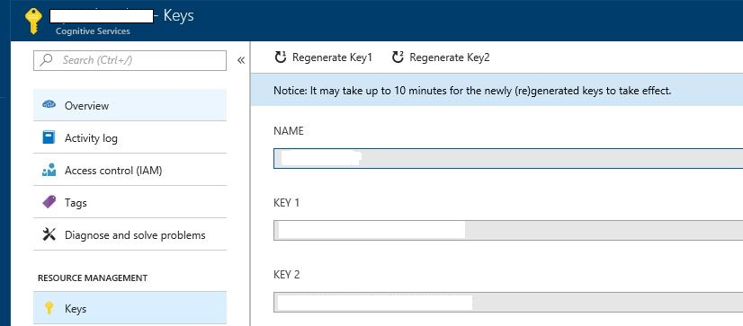
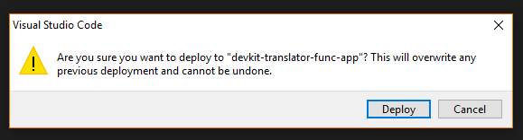
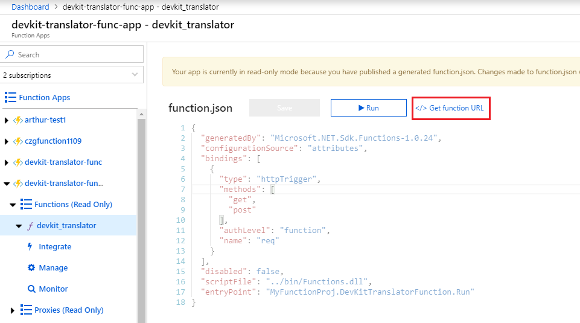
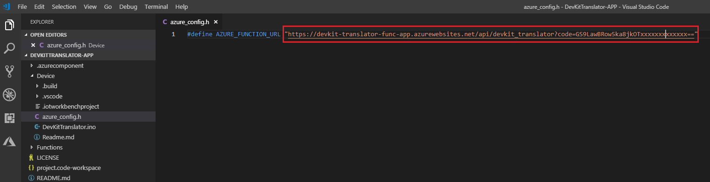

# Use IoT DevKit AZ3166 with Azure Functions and Cognitive Services to make a language translator

In this tutorial, you learn how to make IoT DevKit as a language translator by using [Azure Cognitive Services](https://azure.microsoft.com/services/cognitive-services/). It records your voice and translates it to English text shown on the DevKit screen.

## About IoT DevKit

The [MXChip IoT DevKit](https://aka.ms/iot-devkit) (a.k.a. IoT DevKit) is an all-in-one Arduino compatible board with rich peripherals and sensors. You can develop for it using [Azure IoT Device Workbench ](https://aka.ms/azure-iot-workbench). And it comes with a growing [projects catalog](https://aka.ms/devkit/project-catalog) to guide you prototype Internet of Things (IoT) solutions that take advantage of Microsoft Azure services.

## What you need

Finish the [Getting Started Guide](./devkit-get-started.md) to:

* Have your DevKit connected to Wi-Fi.
* Prepare the development environment.

An active Azure subscription. If you do not have one, you can register via one of these two methods:

* Activate a [free 30-day trial Microsoft Azure account](https://azure.microsoft.com/free/).
* Claim your [Azure credit](https://azure.microsoft.com/pricing/member-offers/msdn-benefits-details/) if you are MSDN or Visual Studio subscriber.

## Open the project folder

### Start VS Code

* Start Visual Studio Code.
* Make sure [Azure IoT Device Workbench](https://marketplace.visualstudio.com/items?itemName=vsciot-vscode.vscode-iot-workbench) is installed.
* Connect IoT DevKit to your PC.

### Open Azure IoT Device Workbench Examples

Use `F1` or`Ctrl+Shift+P` (macOS: `Cmd+Shift+P`) to open the command palette, type **Azure IoT Device Workbench**, and then select **Open Examples...**.


Select **IoT DevKit**.


Then the **IoT Device Workbench Example** window is shown up.


Find **DevKit Translator** and click **Open Sample** button. A new VS Code window with a project folder in it opens.


## Provision Cognitive Service
* Sign in to [Azure Portal](http://portal.azure.com) using your Microsoft account.
* Select **Create a resource** at the top left of the portal.
* In the **New** window, search for **speech**.
* In the search results, select **Speech**.
* Under Speech, select the **Create** button.

  

* Fill out the rest of the form, and click the **Create** button.

  

* Go to **All Resources** and select the Microsoft Translator you created.
* Go to the **Keys** option and copy your subscription key to access the service. We will use that value in later sections.
  

## Provision Azure services

In the solution window, open the command palette and select **Azure IoT Device Workbench: Provision Azure Services...**.


Then VS Code guides you through provisioning the required Azure services.


The whole process includes:
* Select an existing IoT Hub or create a new IoT Hub.
* Select an existing IoT Hub device or create a new IoT Hub device. 
* Create a new Azure Functions App.

Please take a note of the device name you created. It will be used in next section.

## Modify code for Azure Functions
* Open **Functions\DevKitTranslatorFunction.cs** and modify the following lines with the device name and subscription key you provisioned in previous step:

  ```csharp
  // Subscription Key of Speech Service
  const string speechSubscriptionKey = "";

  // Region of the speech service, see https://docs.microsoft.com/en-us/azure/cognitive-services/speech-service/regions for more details.
  // Use e.g. "West Europe" as region. Do not use "westeurope" or "https://westeurope.cris.ai".
  const string speechServiceRegion = "";

  // Device ID
  const string deviceName = "";
  ```

## Deploy Azure Functions

* Open the command palette and select **Azure IoT Device Workbench: Deploy to Azure...**.

  

* If VS Code ask your confirmation to deploy the Azure Function, please click the **Deploy** button to confirm.

  

* Check VS Code **Output** window to make sure the deployment is sucessful.

  

* After the Function deploys successfully, go to the Function APP you've just created in Azure Portal. Click the **devkit-translator** function in the left panel, and click **</>Get function URL** link to get function URL.

  

* Copy the function URL and fill in the azure_config.h file. 

  

> Note: If the Function App does not work properly, check this [FAQs](https://microsoft.github.io/azure-iot-developer-kit/docs/faq#compilation-error-for-azure-function) section to resolve it.

## Config IoT Hub Device Connection String

1. Switch the IoT DevKit into **Configuration mode**. To do so:

   - Hold down button **A**.
   - Push and release the **Reset** button.

2. The screen displays the DevKit ID and 'Configuration'.

	 

3. Open the command palette and select **Azure IoT Device Workbench: Configure Device Settings...**.

	

4. Select **Config Device Connection string**.

5. Then select **Select IoT Hub Device Connection String**.

	

	This sets the connection string that is retrieved from the `Provision Azure services` step.

6. The configuration success notification popup bottom right corner once it's done.

     

## Build and upload the device code

1. Open the command palette and select **IoT Device Workbench:Upload Device Code**.

	

2. VS Code then starts verifying and uploading the code to your DevKit.

	

3. The IoT DevKit reboots and starts running the code.


## Test the project

After app initialization, follow the instructions on the DevKit screen. The default source language is Chinese.

To select another language for translation:

1. Press button **A** to enter setup mode.

2. Press button **B** to scroll all supported source languages.
   
	

3. Press button **A** to confirm your choice of source language.

4. Press and hold button **B** while speaking, then release button **B** to initiate the translation.


5. The translated text in English shows on the screen.
   
	

6. On the translation result screen, you can:
	- Press button **A** and **B** to scroll and select the source language.
	- Press button **B** to talk, release to send the voice and get the translation text.

## How it works


The IoT DevKit records your voice then posts an HTTP request to trigger Azure Functions. Azure Functions calls the cognitive service speech translator API to do the translation. After Azure Functions gets the translation text, it sends a C2D message to the device. Then the translation is displayed on the screen.

## Problems and feedback

If you encounter problems, refer to [FAQs](https://microsoft.github.io/azure-iot-developer-kit/docs/faq/) or reach out to us from the following channels:

* [Gitter.im](http://gitter.im/Microsoft/azure-iot-developer-kit)
* [Stackoverflow](https://stackoverflow.com/questions/tagged/iot-devkit)

## Next Steps

Now you make the IoT DevKit as a translator by using Azure Functions and Cognitive Services. In this tutorial, you learned how to:

- [x] Use Azure IoT Device Workbench to build a Azure IoT solution includes both device and cloud.
- [x] Configure Azure IoT device connection string.
- [x] Deploy Azure Functions.
- [x] Test the voice message translation.

Check our [Projects Catalog](https://aka.ms/devkit/project-catalog) for more samples you can build with the IoT DevKit and Azure multiple services.