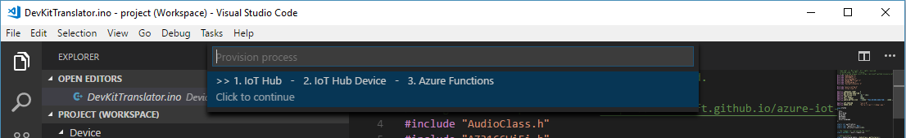
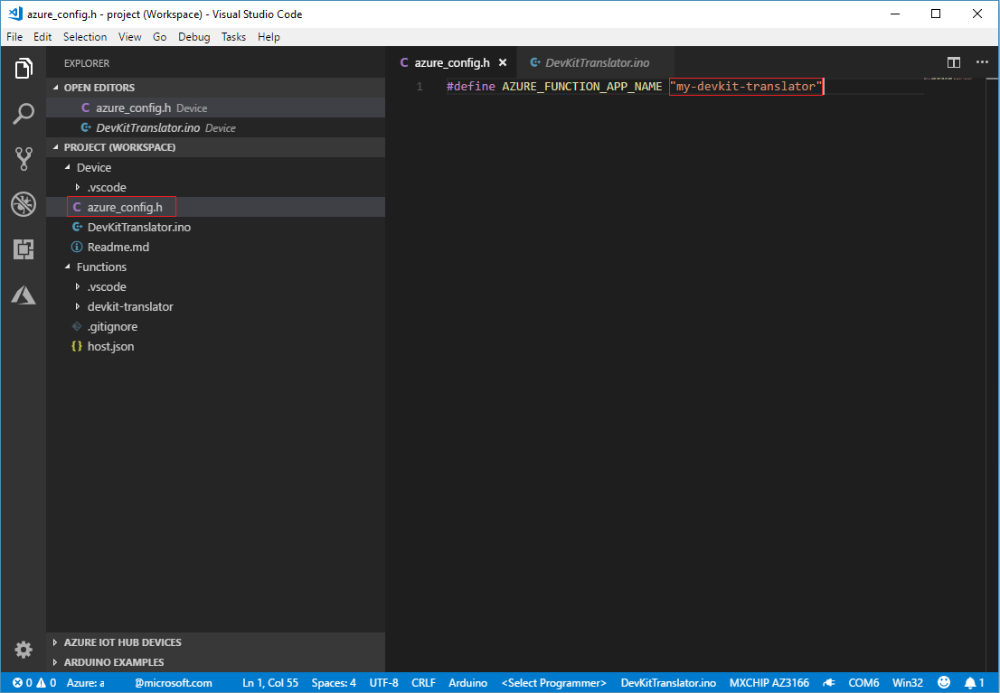
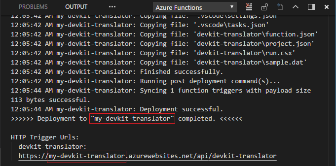
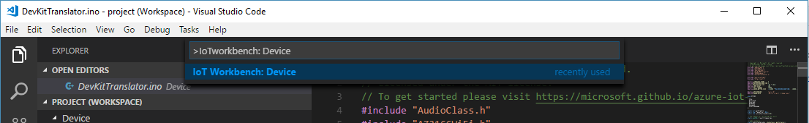
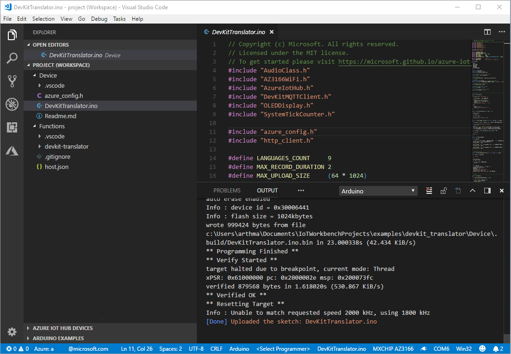

# Use IoT DevKit AZ3166 with Azure Functions and Cognitive Services to make a language translator

In this article, you learn how to make IoT DevKit as a language translator by using [Azure Cognitive Services](https://azure.microsoft.com/services/cognitive-services/). It records your voice and translates it to English text shown on the DevKit screen.

The [MXChip IoT DevKit](https://aka.ms/iot-devkit) is an all-in-one Arduino compatible board with rich peripherals and sensors. You can develop for it using [Azure IoT Workbench ](https://aka.ms/azure-iot-workbench). And it comes with a growing [projects catalog](https://microsoft.github.io/azure-iot-developer-kit/docs/projects/) to guide you prototype Internet of Things (IoT) solutions that take advantage of Microsoft Azure services.

## What you need

Finish the [Getting Started Guide](https://docs.microsoft.com/azure/iot-hub/iot-hub-arduino-iot-devkit-az3166-get-started) to:

* Have your DevKit connected to Wi-Fi.
* Prepare the development environment.

An active Azure subscription. If you do not have one, you can register via one of these two methods:

* Activate a [free 30-day trial Microsoft Azure account](https://azure.microsoft.com/free/).
* Claim your [Azure credit](https://azure.microsoft.com/pricing/member-offers/msdn-benefits-details/) if you are MSDN or Visual Studio subscriber.

## Open the project folder

### A. Start VS Code

* Make sure your DevKit is not connected to your PC.
* Start VS Code.
* Connect the DevKit to your computer.
* Make sure [Azure IoT Workbench](https://marketplace.visualstudio.com/items?itemName=vsciot-vscode.vscode-iot-workbench) is installed.

### B. Open IoT Workbench Examples

Use `Ctrl+Shift+P` (macOS: `Cmd+Shift+P`) to open the command palette, type **IoT Workbench**, and then select **IoT Workbench: Examples**.

Select **IoT DevKit**.

Then the **IoT Workbench Example** window is showed up.

Find **DevKit Translator** and click **Open Sample** button. A new VS Code window with a project folder in it opens.

## Provision Azure services

In the solution window, open the command palette and select **IoT Workbench: Cloud**.

Select **Azure Provision**.

Then VS Code guides you through provisioning the required Azure services.

## Deploy Azure Functions

Open the command palette and select **IoT Workbench: Cloud**, then select **Azure Deploy**.

After the Function deploys successfully, fill in the azure_config.h file with Function App name. 

You can get back the Function App name from the VS Code **OUTPUT** window if you forgot it.

> Note: If the Function App does not work properly, check this [FAQs](https://microsoft.github.io/azure-iot-developer-kit/docs/faq#compilation-error-for-azure-function) section to resolve it.

## Config IoT Hub Connection String

1. Switch the IoT DevKit into **Configuration mode**. To do so:

   - Hold down button **A**.
   - Push and release the **Reset** button.

2. The screen displays the DevKit ID and 'Configuration'.

	 

3. Open the command palette and select **IoT Workbench: Device**.

	

4. Select **Config Device Settings**.

	

5. Select **Select IoT Hub Device Connection String**.

	

6. This sets the connection string that is retrieved from the `Provision Azure services` step.

## Build and upload the device code

1. Open the command palette and select **IoT Workbench: Device**, then select **Device Upload**.

	

2. VS Code then starts verifying and uploading the code to your DevKit.

	

3. The DevKit reboots and starts running the code.

## Test the project

After app initialization, follow the instructions on the DevKit screen. The default source language is Chinese.

To select another language for translation:

1. Press button A to enter setup mode.

2. Press button B to scroll all supported source languages.
   
	

3. Press button A to confirm your choice of source language.

4. Press and hold button B while speaking, then release button B to initiate the translation.

5. The translated text in English shows on the screen.
   
	

6. On the translation result screen, you can:
	- Press button A and B to scroll and select the source language.
	- Press button B to talk, release to send the voice and get the translation text.

## How it works

The IoT DevKit records your voice then posts an HTTP request to trigger Azure Functions. Azure Functions calls the cognitive service speech translator API to do the translation. After Azure Functions gets the translation text, it sends a C2D message to the device. Then the translation is displayed on the screen.

## Problems and feedback

If you encounter problems, refer to [FAQs](https://microsoft.github.io/azure-iot-developer-kit/docs/faq/) or reach out to us from the following channels:

* [Gitter.im](http://gitter.im/Microsoft/azure-iot-developer-kit)
* [Stackoverflow](https://stackoverflow.com/questions/tagged/iot-devkit)

## Next Steps

Now you make the IoT DevKit as a translator by using Azure Functions and Cognitive Services. In this tutorial, you learned how to:

- [x] Use Azure IoT Workbench to build a Azure IoT solution includes both device and cloud.
- [x] Configure Azure IoT device connection string.
- [x] Deploy Azure Functions.
- [x] Test the voice message translation.

Advance to the other tutorials to learn:

* [Connect IoT DevKit AZ3166 to Azure IoT Remote Monitoring solution accelerator](https://docs.microsoft.com/azure/iot-hub/iot-hub-arduino-iot-devkit-az3166-devkit-remote-monitoring)