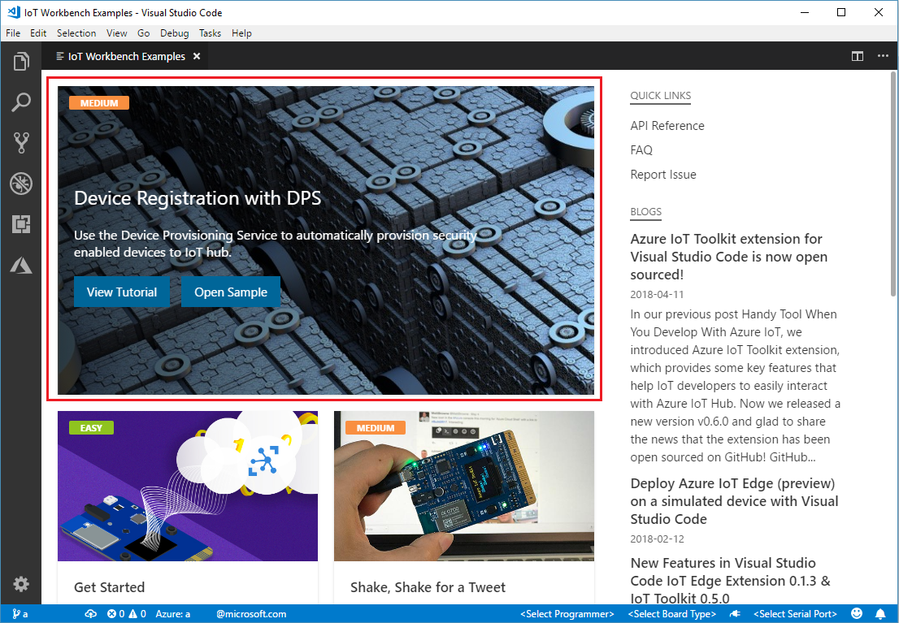
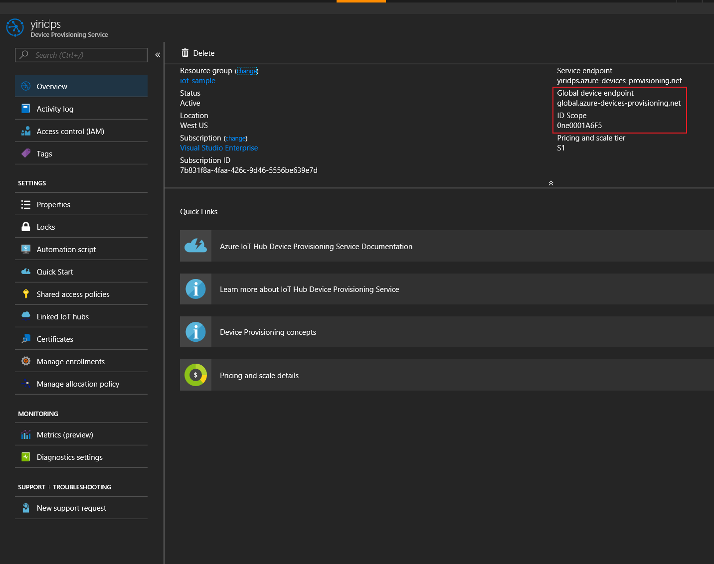
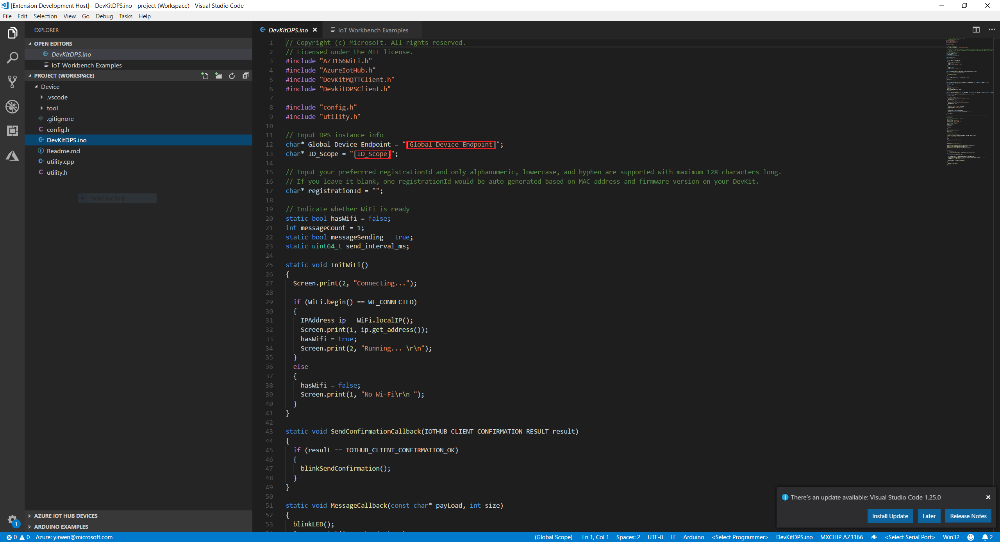
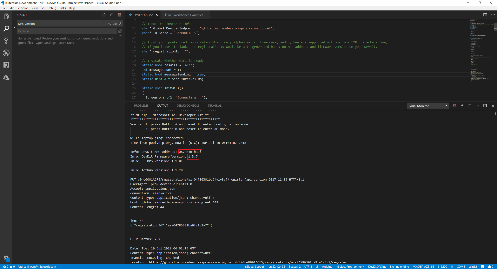
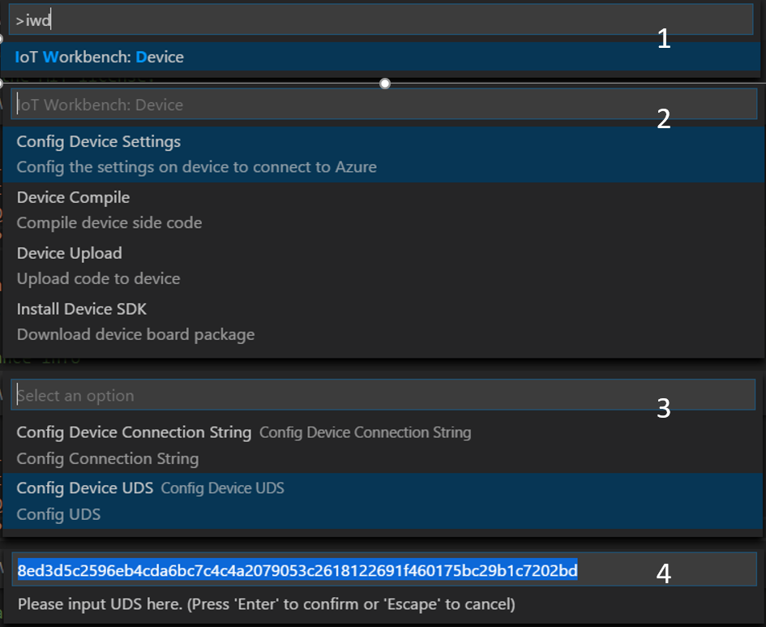
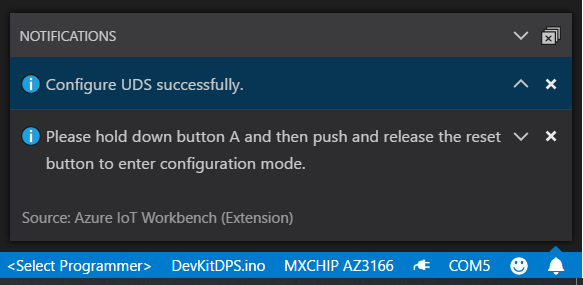
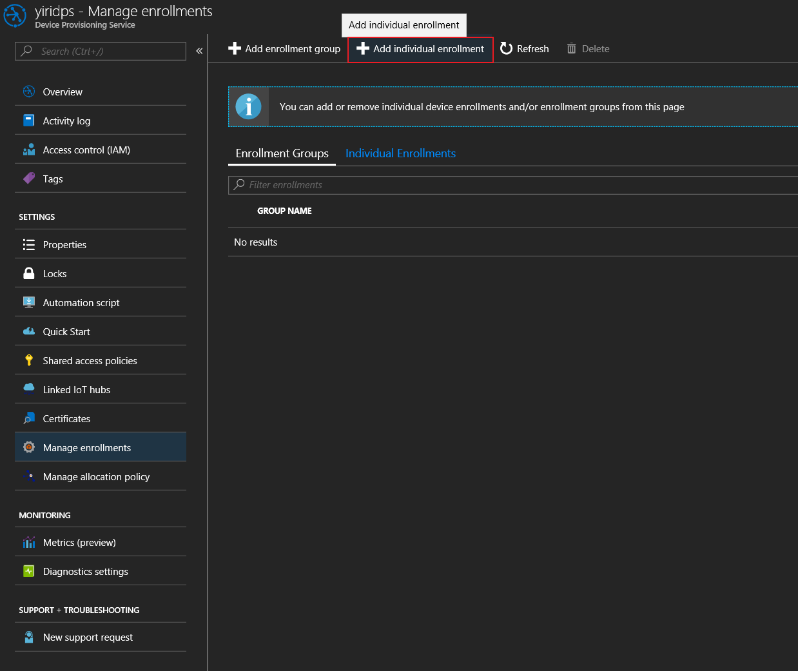
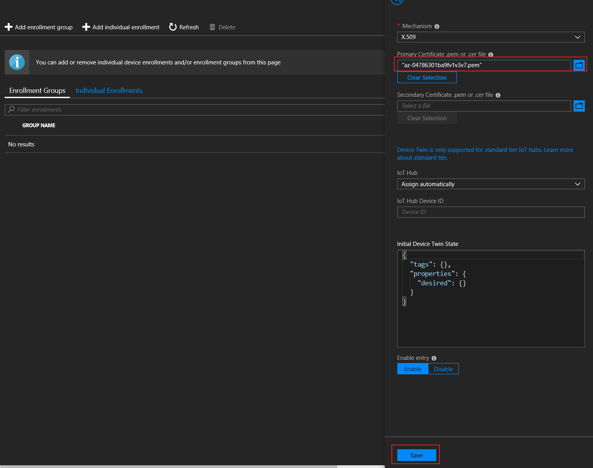
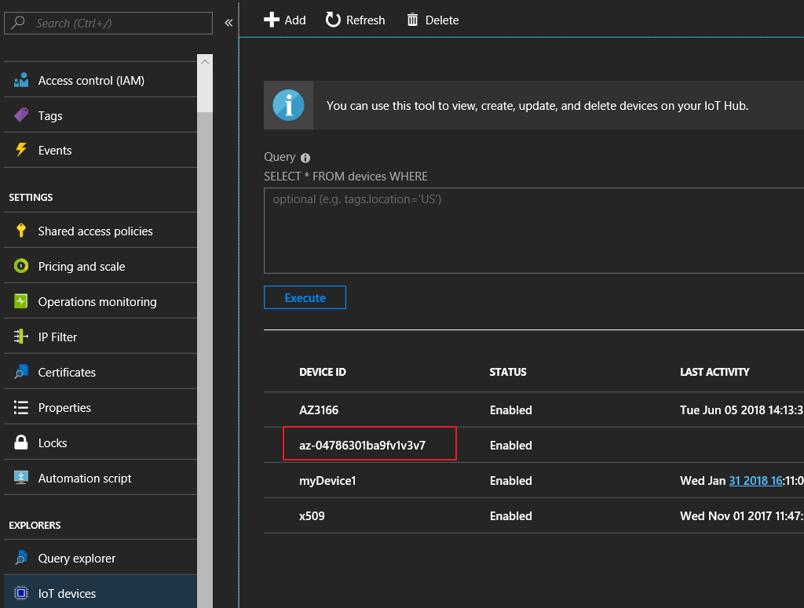

# Device registration with DPS

Microsoft Azure provides a rich set of integrated public cloud services for all your IoT solution needs. The IoT Hub Device Provisioning Service is a helper service for IoT Hub that enables zero-touch, just-in-time provisioning to the right IoT hub without requiring human intervention, enabling customers to provision millions of devices in a secure and scalable manner.

## What you learn

In this tutorial, you learn:
- How to set up the Device Provisioning Service configuration on the device.
- How to save Unique Device Secret on STSAFE security chip.
- How to generate X.509 certificate.
- How to create a device enrollment entry in the Device Provisioning Service.

## What you need

Finish the [Getting Started Guide](./devkit-get-started.md) to:

* Have your IoT DevKit connected to Wi-Fi.
* Prepare the development environment.

An active Azure subscription. If you do not have one, you can register via one of these methods:

* Activate a [free 30-day trial Microsoft Azure account](https://azure.microsoft.com/free/).
* Claim your [Azure credit](https://azure.microsoft.com/pricing/member-offers/msdn-benefits-details/) if you are an MSDN or Visual Studio subscriber.

Create and link IoT Hub with Device Provisioning Service instance with [Set up auto provisioning](https://docs.microsoft.com/en-us/azure/iot-dps/quick-setup-auto-provision).

## Open the project folder

### Start VS Code

* Start Visual Studio Code.
* Make sure [Azure IoT Workbench](https://marketplace.visualstudio.com/items?itemName=vsciot-vscode.vscode-iot-workbench) is installed.
* Connect IoT DevKit to your PC.

### Open IoT Workbench Examples

Use `F1` or `Ctrl+Shift+P` (macOS: `Cmd+Shift+P`) to open the command palette, type **IoT Workbench**, and then select **IoT Workbench: Examples**.

Select **IoT DevKit**.

Then the **IoT Workbench Example** window is showed up.

Find **DevKit DPS** and click **Open Sample** button. A new VS Code window with a project folder in it opens.

## Build and upload the device code

1. In the Azure portal, select the **Overview** blade for your Device Provisioning Service and note down the **Global device endpoint** and **ID Scope** value.
  

2. Open **DevKitDPS.ino**, Find and replace `[Global Device Endpoint]` and `[ID Scope]` with the values you just note down.
  
  You can leave the **registrationId** as blank, the application will generate one for you based on the MAC address and firmware version. If you want to customized it, the Registration ID has to use alphanumeric, lowercase, and hyphen combinations only with maximum 128 characters long. See [Manage device enrollments with Azure portal](https://docs.microsoft.com/en-us/azure/iot-dps/how-to-manage-enrollments) for more details.

3. Open the command palette and select **IoT Workbench: Device**, then select **Device Upload**. 

	

4. VS Code then starts verifying and uploading the code to your DevKit.

	

5. The DevKit reboots and starts running the code.

6. Note down **DevKit MAC Address** and **DevKit Firmware Version** value from serial monitor.
  

## Save Unique Device Secret on STSAFE security chip

Device Provisioning Service can be configured on device based on its [Hardware Security Module (HSM)](https://azure.microsoft.com/en-us/blog/azure-iot-supports-new-security-hardware-to-strengthen-iot-security/). DevKit uses [Device Identity Composition Engine (DICE)](https://trustedcomputinggroup.org/wp-content/uploads/Foundational-Trust-for-IOT-and-Resource-Constrained-Devices.pdf) from the [Trusted Computing Group (TCG)](https://trustedcomputinggroup.org). A **Unique Device Secret (UDS)** saved in STSAFE security chip on the DevKit is used to generate the device unique [X.509](https://docs.microsoft.com/en-us/azure/iot-dps/tutorial-set-up-device#select-a-hardware-security-module) certificate. The certificate can be later used for the enrollment process in the Device Provisioning Service.

A typical **Unique Device Secret (UDS)** is a 64 characters long hexadecimal digit.

1. Open the command palette and select **IoT Workbench: Device**.

2. Select **Config Device Settings**.

3. Select **Config Dvice UDS**.

4. Note down the generated uds string and then press enter.

Here you may need to close [serial monitor](./devkit-get-started.md/#Serial_monitor_usage) and let devkit enter configuration mode. After UDS string configed successfully, you will see a Visual Studio Code notification.

## Generate X.509 certificate

Open integrated terminal in Visual Studio Code and run dps_cert_gen in tool folder. Input information just noted down. And you will see a **.pem** file generated in your folder.

**Note:** Here we input **.build\DevKitDPS** when program ask for project name. Then the program will find compiled file with path **.build\DevKitDPS.ino.bin** and **.build\DevKitDPS.ino.elf**. Output compiled binary file to **.build** path is our default setting. If you changed build path or .ino file name before, you will need to provide a path to your compiled output file.

## Create a device enrollment entry in the Device Provisioning Service

1. In the Azure portal, navigate to your provisioning service. Click **Manage enrollments**, and select the **Add individual enrollments** tab.
  

2. Upload the **.pem** certificate you just have.

3. Leave the rest as default and click **Save**.
  

## Start the DevKit

1. Launch VS Code and open [serial monitor](./devkit-get-started.md/#Serial_monitor_usage).

2. Press the **Reset** button on your DevKit.

You should see the DevKit start the registration with your Device Provisioning Service and **DPS connected!** on DevKit Screen.

## Verify the DevKit is registered on IoT Hub

Once your device boots, the following actions should take place:

1. The device sends a registration request to your Device Provisioning Service.
2. The Device Provisioning Service sends back a registration challenge to which your device responds.
3. On successful registration, the Device Provisioning Service sends the IoT hub URI, device ID and the encrypted key back to the device.
4. The IoT Hub client application on the device then connects to your hub.
5. On successful connection to the hub, you should see the device appear in the IoT hub's Device Explorer.
  

## Problems and feedback

If you encounter problems, refer to [FAQs](https://microsoft.github.io/azure-iot-developer-kit/docs/faq/) or reach out to us from the following channels:

* [Gitter.im](http://gitter.im/Microsoft/azure-iot-developer-kit)
* [Stackoverflow](https://stackoverflow.com/questions/tagged/iot-devkit)

## Next Steps

Now that you have learned prepare the DevKit to enroll a device securely to DPS using DICE, so that it will automatically register to IoT Hub with zero-touch.

Advance to the other tutorials to learn:

* [Create and provision a simulated device](https://docs.microsoft.com/en-us/azure/iot-dps/quick-create-simulated-device)
* [Manage device enrollments](https://docs.microsoft.com/en-us/azure/iot-dps/how-to-manage-enrollments)
* [Revoke device access](https://docs.microsoft.com/en-us/azure/iot-dps/how-to-revoke-device-access-portal)
* [Use HSM with SDK](https://docs.microsoft.com/en-us/azure/iot-dps/how-to-revoke-device-access-portal)
* [Control access to Provisioning Service](https://docs.microsoft.com/en-us/azure/iot-dps/how-to-control-access)
