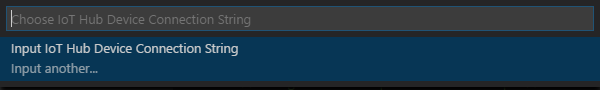
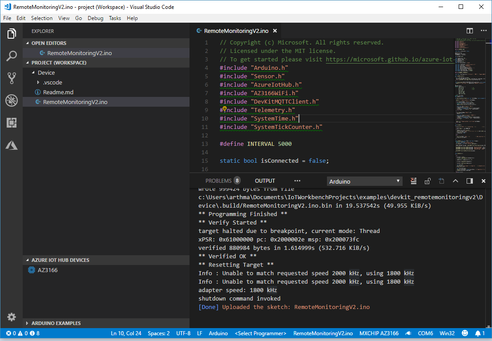

# Connect MXChip IoT DevKit AZ3166 to the IoT Remote Monitoring solution accelerator

In this tutorial, you learn how to run a sample app on your DevKit to send sensor data to your Azure IoT Suite.

The [MXChip IoT DevKit](https://aka.ms/iot-devkit) is an all-in-one Arduino compatible board with rich peripherals and sensors. You can develop for it using [Azure IoT Workbench ](https://aka.ms/azure-iot-workbench). And it comes with a growing [projects catalog](https://aka.ms/devkit/project-catalog) to guide you prototype Internet of Things (IoT) solutions that take advantage of Microsoft Azure services.

## What you need

Finish the [Getting Started Guide](./devkit-get-started.md) to:

* Have your DevKit connected to Wi-Fi.
* Prepare the development environment.

## Before you start

Before you write any code for your device, deploy your Remote Monitoring solution accelerator and add a new physical device to the solution.

### Deploy your Remote Monitoring solution accelerator

The **AZ3166** device you create in this tutorial sends data to an instance of the [Remote Monitoring](https://docs.microsoft.com/en-us/azure/iot-accelerators/iot-accelerators-remote-monitoring-explore) solution accelerator. If you haven't already provisioned the Remote Monitoring solution accelerator in your Azure account, see [Deploy the Remote Monitoring solution accelerator](https://docs.microsoft.com/en-us/azure/iot-accelerators/iot-accelerators-remote-monitoring-deploy)

When the deployment process for the Remote Monitoring solution finishes, click **Launch** to open the solution dashboard in your browser.

### Add your device to the Remote Monitoring solution

> Note: If you have already added a device in your solution, you can skip this step. However, the next step requires your device connection string. You can retrieve a device's connection string from the [Azure portal](https://portal.azure.com) or using the [az iot](https://docs.microsoft.com/cli/azure/iot?view=azure-cli-latest) CLI tool.

For a device to connect to the solution accelerator, it must identify itself to IoT Hub using valid credentials. You have the opportunity to save the device connection string that contains these credentials when you add the device the solution. You include the device connection string in your client application later in this tutorial.

In the portal, go to **Devices** section and there, click in the  **+New Device** button. 

The *new device form* should be filled in.
1. Click **Physical** in the *Device type* section.
2. Define your own Device ID (for example *MXChip* or *AZ3166*).
3. Choose **Auto generate keys** in the *Authentication key* section.
4. Click *Apply* button.

Wait until the portal finishes the provisioning of the new device.

Then the configuration of the new device, will be shown.
Copy the **Connection String** generated.

This connection string will be used in the next section.

## Open the Remote Monitoring sample

### A. Start VS Code

* Make sure your DevKit is not connected to your PC.
* Start VS Code.
* Connect the DevKit to your computer.
* Make sure [Azure IoT Workbench](https://marketplace.visualstudio.com/items?itemName=vsciot-vscode.vscode-iot-workbench) is installed.

### B. Open IoT Workbench Examples

Use `F1` or `Ctrl+Shift+P` (macOS: `Cmd+Shift+P`) to open the command palette, type **IoT Workbench**, and then select **IoT Workbench: Examples**.

Select **IoT DevKit**.

Then the **IoT Workbench Example** window is showed up.

Find **Remote Monitoring** and click **Open Sample** button. A new VS Code window with a project folder in it opens.

## Config IoT Hub Connection String

1. Switch the IoT DevKit into **Configuration mode**. To do so: 

   - Hold down button **A**.

   - Push and release the **Reset** button. 

2. The screen displays the DevKit ID and 'Configuration'.

	 

3. Open the command palette and select **IoT Workbench: Device**.

	         

4. Select **Config Device Settings**.       

	 

5. Select **Select IoT Hub Device Connection String**. 

	 

6. The popup menu asks you to Input IoT Hub Device Connection String. Select that option and paste the connection string.

  > The connection string should be saved in your clipboard if you followed the **Add your device to the Remote Monitoring solution** section. If not, you should go to the Azure portal and look for the IoT Hub of your Remote Monitoring resource group. There, you can see the IoT Hub connected devices and copy the Device connection string. 
  > 

## Build and upload the device code

Go back to the Visual Studio Code: 

1. Open the command palette and select **IoT Workbench: Device**, then select **Device Upload**. 

	

2. VS Code then starts verifying and uploading the code to your DevKit.

	

3. The DevKit reboots and starts running the code.

## Test the project

When the sample app runs, DevKit sends sensor data over Wi-Fi to your Azure IoT Suite. To see the result, follow these steps:

1. Go to your Azure IoT Suite, and click **Devices**.

2. Click on the device name (AZ3166) a tab opens on the right side of the dashboard, where you can see the MX Chip sensors chart in real time.

	

## Send a C2D message
Remote Monitoring v2 allows you to invoke remote method on the device.
The MX Chip example code publishes three methods that you can see in the Method section when the sensor is selected.

You can change the color of one of the MX Chip leds using the method "LedColor". For doing it, select the checkbox of the device and click on the **Jobs** button. 

Choose **Run method**, the method name is **LedColor**, write a name of this job like "ChangeLedColor", and Apply.

In several seconds, your physical MX Chip should change the color of the RGB led (below of the button **A**).

## Problems and feedback

If you encounter problems, refer to [FAQs](https://microsoft.github.io/azure-iot-developer-kit/docs/faq/) or reach out to us from the following channels:

* [Gitter.im](http://gitter.im/Microsoft/azure-iot-developer-kit)
* [Stackoverflow](https://stackoverflow.com/questions/tagged/iot-devkit)

## Next steps

Now that you have learned how to connect a IoT DevKit device to your Azure IoT Suite and visualize the sensor data.

Check our [Projects Catalog](https://aka.ms/devkit/project-catalog) for more samples you can build with the IoT DevKit and Azure multiple services.