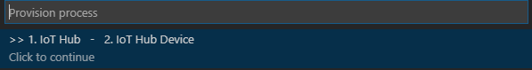
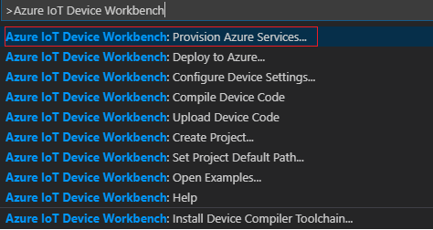
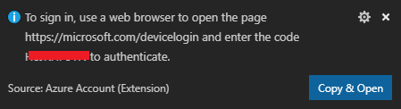
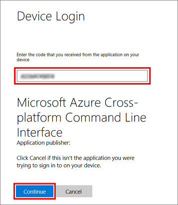

# Provision Azure IoT Hub #

## Overview ##

When provisioning Azure Services in **Azure IoT Device Workbench**, the common provision process includes the provision of **Azure IoT Hub**. 

  

This document contains the detailed steps on how to provision Azure IoT Hub.

## Steps for Provision Azure IoT Hub ##

1. In the solution window, open the command palette and select **Azure IoT Device Workbench: Provision Azure Services...**.

	

1. If you haven't login to Azure in Visual Studio Code before, the following will be pop-up to guide you for Azure sign-in. 

	

1. Click **Copy & Open** and go to the "Device Login" screen in the browser, paste the login code into the input field, and click **Continue**.

	

1. Input your Azure Account Id and password in the next window in browser and after sign-in successfully, open the command palette in Visual Studio Code, type **Azure: Select Subscription** to select the subscription you want to use and then re-run **Azure IoT Device Workbench: Provision Azure Services...**

1. In the dropdown list of **Select Resource Group**, if you plan to use a new resource group, click **Create Resource Group** and then provide the following information:

	| Name | Value |
	| --- | --- |
	| Resource Group Name  | YOUR_RESOURCE_GROUP_NAME |
	| Resource Group Location | [Available Locations](https://azure.microsoft.com/en-us/global-infrastructure/locations/)|

	> You could also select an existing resource group.  

1. In the dropdown list of **Provision IoT Hub**, click **Create a new IoT Hub**, first select the location of with the same as the resource group.
	>  Azure resources can be connected across regions, but keeping everything within the same data center reduces cost and minimizes latency.

	Make sure **S1 - Standard tier** is selected as the pricing tier. Enter a unique name for IoT Hub name. IoT Hub names must be unique across Azure. 

1. Wait until the IoT Hub has been provisioned. Then, in the dropdown list of **Provision IoTHub Device**, select **Create a new IoT Hub device**. Provide a device name and press 'Enter'.

	Because you selected **S1 - Standard** as the pricing tier, you can transmit up to 400,000 messages a day to the IoT Hub for $50 per month. A **Free** tier that accepts up to 8,000 messages per day is also available. For more information on the various pricing tiers that are available, see [IoT Hub pricing](https://azure.microsoft.com/pricing/details/iot-hub/).
