# Face Recognition Access Control

In this tutorial, you will build an access control system with Raspberry Pi and picamera. This access control system uses Azure IoT Hub direct method and Azure cognitive service.

## What you need

* Finish the [Getting Started Guide](./raspi-get-started.md) to prepare the development environment.
* Enable SSH on Raspberry Pi and install Node.js. You can follow [this documentation](https://www.w3schools.com/nodejs/nodejs_raspberrypi.asp).
* An active Azure subscription. If you do not have one, you can register via one of these two methods:

  - Activate a [free 30-day trial Microsoft Azure account](https://azure.microsoft.com/free/).
  - Claim your [Azure credit](https://azure.microsoft.com/pricing/member-offers/msdn-benefits-details/) if you are MSDN or Visual Studio subscriber.

## Prepare your hardware

### Connect Picamera to Raspberry Pi:

You can follow the guide here <https://projects.raspberrypi.org/en/projects/getting-started-with-picamera/4>.

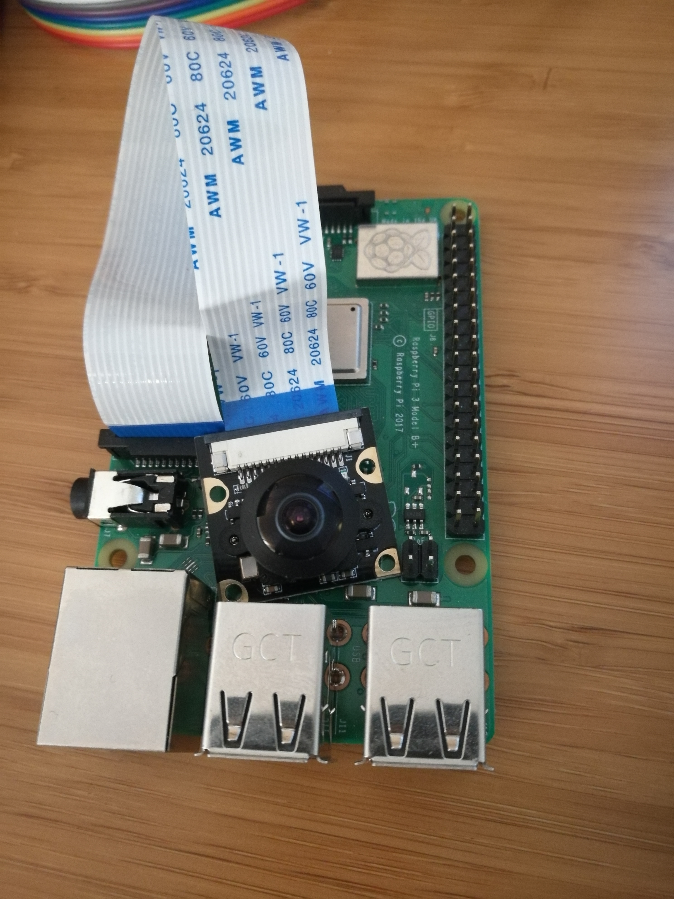

### Connect Button and LED to Raspberry Pi:

You can find Raspberry Pi GPIO pin mapping from <https://www.raspberrypi.org/documentation/usage/gpio/>.

Connect Button one pin to 3.3V, one pin to Ground and another pin to GPIO 14. Notice that you should add a resist between the button and Ground to avoid large current.


| Button | Raspberry Pi GPIO |
| ------- | ----------------- |
| PIN 1     | 3.3V                 |
| PIN 2     | Ground            |
| PIN 3     | 14            |

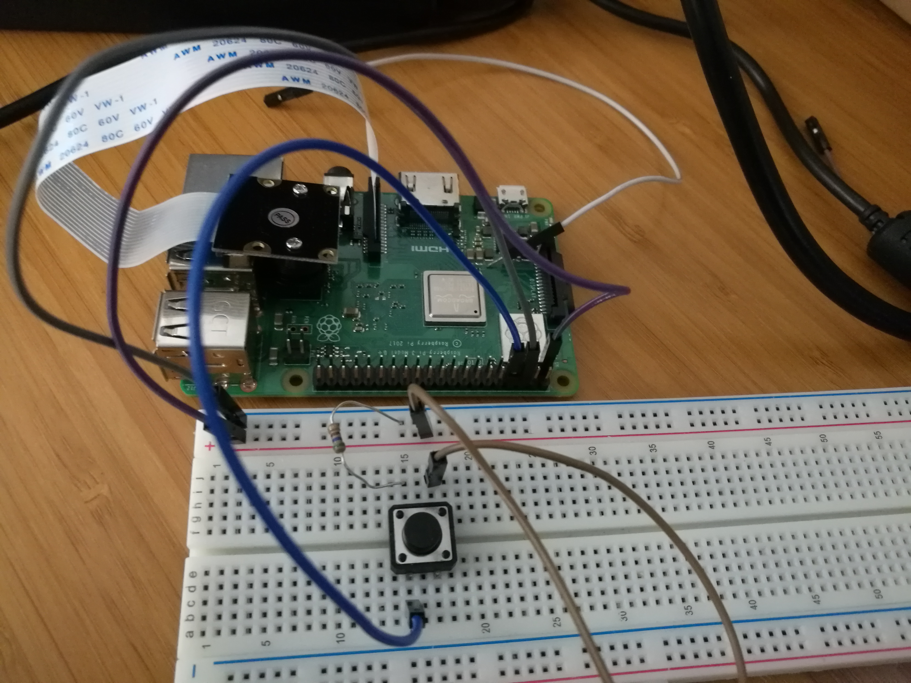


Connect Red LED VCC to GPIO 5, GND to Ground and Green LED VCC to GPIO 6, GND to Ground. Add a resistor to each circuit for protection.


| LED Pin     | Raspberry Pi GPIO |
| -------     | ----------------- |
| RED VCC     | 5                 |
| RED GND     | Ground            |
| GREEN VCC   | 6                 |
| GREEN GND   | Ground            |

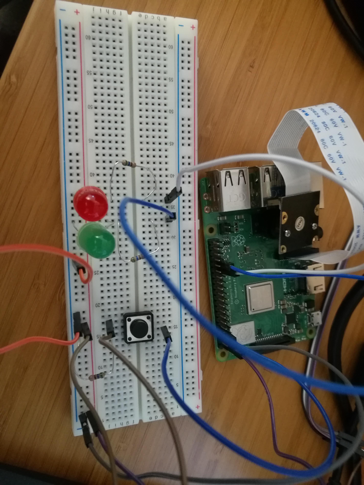

## Open the project folder

### Start VS Code

- Start VS Code.
- Make sure [Azure IoT Workbench](https://marketplace.visualstudio.com/items?itemName=vsciot-vscode.vscode-iot-workbench) is installed.

### Open IoT Workbench Examples

Use `F1` or `Ctrl+Shift+P` (macOS: `Cmd+Shift+P`) to open the command palette, type **IoT Workbench**, and then select **IoT Workbench: Examples**.


Select **Raspberry Pi**.


Then the **IoT Workbench Example** window is shown up.


Find **Face Recognition Access Control** and click **Open Sample** button. A new VS Code window with a project folder in it opens.

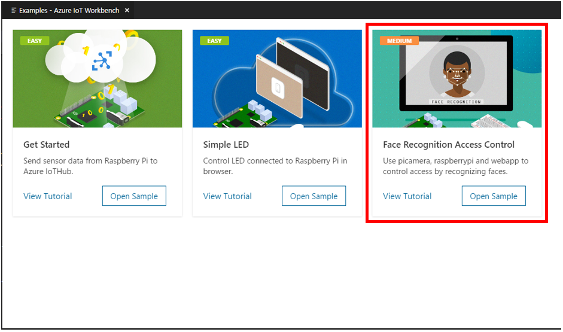

## Provision Cognitive Service
  1. Login to http://portal.azure.com
  2. Select the **Create a resource** option.
  3. Select **AI + Machine Learning** from the list of services.
  4. Select **Face**. You may need to click "See all" or search to see it.
	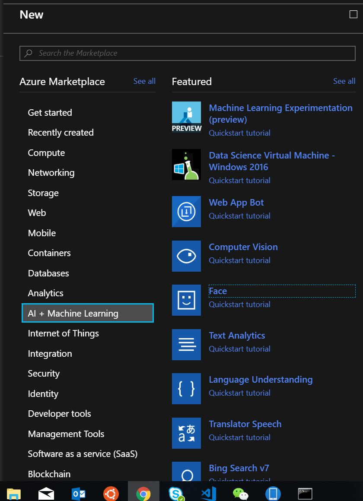
  5. Fill out the rest of the form, and click the **Create** button.
  6. You are now subscribed to Microsoft Face API.
  7. Go to **All Resources** and select the Microsoft Face you created.
  8. Copy your subscription endpoint to access the service. We will use that value in later sections.
  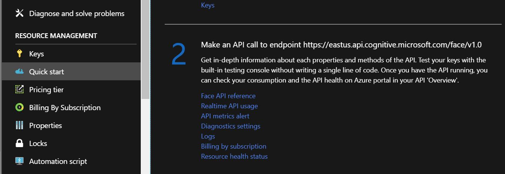
  9. Go to the **Keys** option and copy your subscription key to access the service. We will use that value in later sections.
	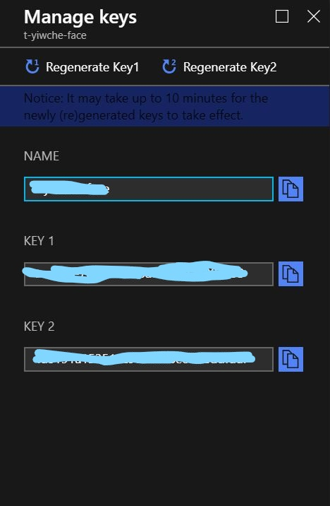
  

## Provision Azure Services

In the solution window, open the command palette and select **IoT Workbench: Cloud**.


Select **Azure Provision**.


Then VS Code guides you through provisioning the required Azure services.


The whole process includes:

- Select an existing IoT Hub or create a new IoT Hub.
- Select an existing IoT Hub device or create a new IoT Hub device. 
- Create a new Function App.

Please take a note of the Function App name and IoT Hub device name you created. It will be used in the next section.

## Modify code for Azure Functions

Open **raspberrypi-state\run.csx** and modify the following line with the device name you provisioned in previous step:
```cpp
static string deviceName = "";
```

## Modify code for Raspberry Pi

Open **Device\app.js** and modify the following lines with the subscription key and endpoint you recorded when provision face service.
```cpp
const subscriptionKey = ''; //face service key
const endpoint = ''; //face service endpoint
```

Enter the **groupid** and **groupdname** you want to name your access control service in the same file.
```cpp
const groupid = '';
const groupname = '';
```


## Deploy Azure Functions

Open the command palette and select **IoT Workbench: Cloud**, then select **Azure Deploy**.


## Config IoT Hub Connection String

1. Open the command palette and select **IoT Workbench: Device**.

   

2. Select **Config Device Settings**.

   

3. Select **Config connection of IoT Hub Device**.

  

4. Select **Select IoT Hub Device Connection String**.

  

  This sets the connection string that is retrieved from the `Provision Azure services` step.

5. The configuration success notification popup bottom right corner once it's done.

   

## Upload the device code

1. Open the command palette and select **IoT Workbench: Device**.

  

2. Select **Config Device Settings**.

  

3. Select **Select Config Raspberry Pi SSH**.

  

4. Input Raspberry Pi host name or IP, ssh port, user name, password and project name.

5. Open the command palette and select **IoT Workbench: Device**, then select **Device Upload**.

  

6. VS Code then starts uploading the code to Raspberry Pi and install node modules.

  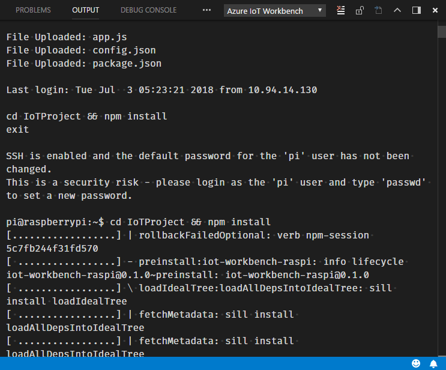

7. Login Raspberry Pi and run node code.

Use command below to connect your Raspberry Pi with SSH. Change `pi` to your own user name, and `raspberrypi` to real Raspberry Pi host or IP.

```bash
ssh pi@raspberrypi
```

Then switch to the project folder, such as IoTProject.

```bash
cd IoTProject
```

Run the Node script.

```bash
node app.js
```

If you cannot execute ssh command in the terminal on Windows, you can use any other SSH client, such [PuTTY](https://www.putty.org/).

  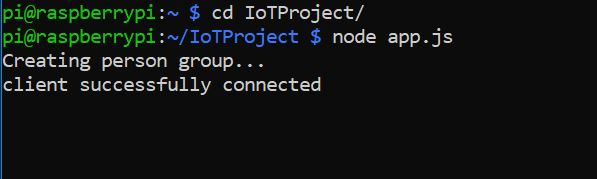

## Control Access Rights in Browser

1. Open `web\index.html` in browser.
2. Input the Function App name you write down.
3. Click connect button.
4. You can start adding and deleting person in a few seconds.
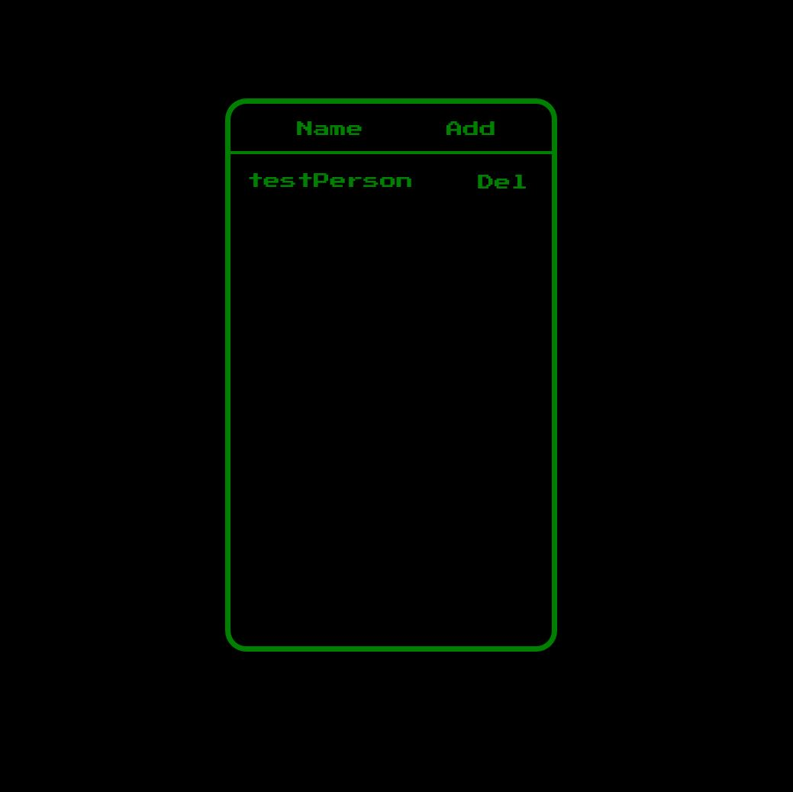
5. When adding person, follow the command in Raspberry Pi terminal to record photos and train models.
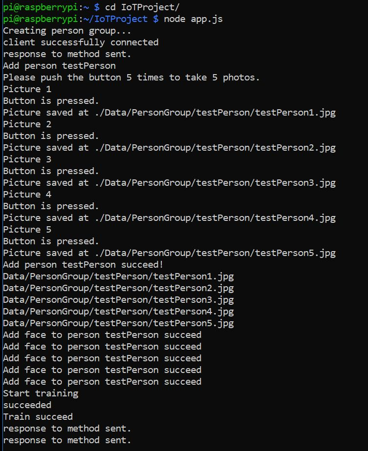


## Acquire Access with Raspberrypi

After addind some people, you can start trying to acquire control by push the button once. Once you push the button, the camera will take a photo and use that photo to determine whether you are allowed to enter. Here we use the LEDs to show the result. The green one will be on for two seconds if you are allowed. Similaryly, the red one will be on if you are denied. You can also see the result in the console.
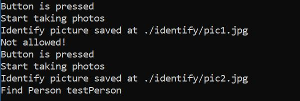
