# Simple LED

In this tutorial, you can control the LED connected to Raspberry Pi GPIO using Azure IoT Hub direct method.

## What you need

Finish the [Getting Started Guide](./raspi-get-started.md) to prepare the development environment.

An active Azure subscription. If you do not have one, you can register via one of these two methods:

- Activate a [free 30-day trial Microsoft Azure account](https://azure.microsoft.com/free/).
- Claim your [Azure credit](https://azure.microsoft.com/pricing/member-offers/msdn-benefits-details/) if you are MSDN or Visual Studio subscriber.

## Prepare your hardware

Connect LED to Raspberry Pi:

You can find Raspberry Pi GPIO pin mapping from <https://www.raspberrypi.org/documentation/usage/gpio/>.

Connect LED VCC to GPIO 4, and GND to Ground.

| LED Pin | Raspberry Pi GPIO |
| ------- | ----------------- |
| VCC     | 4                 |
| GND     | Ground            |

## Open the project folder

### Start VS Code

- Start VS Code.
- Make sure [Azure IoT Workbench](https://marketplace.visualstudio.com/items?itemName=vsciot-vscode.vscode-iot-workbench) is installed.

### Open IoT Workbench Examples

Use `F1` or `Ctrl+Shift+P` (macOS: `Cmd+Shift+P`) to open the command palette, type **IoT Workbench**, and then select **IoT Workbench: Examples**.

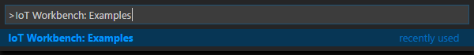

Select **Raspberry Pi**.

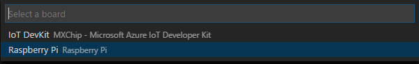

Then the **IoT Workbench Example** window is showed up.

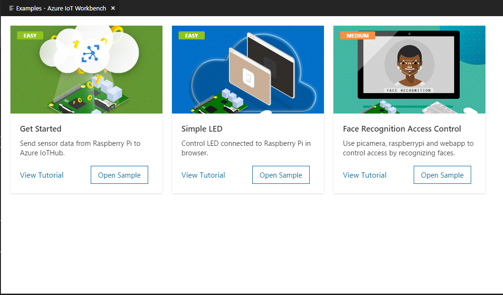

Find **Simple LED** and click **Open Sample** button. A new VS Code window with a project folder in it opens.

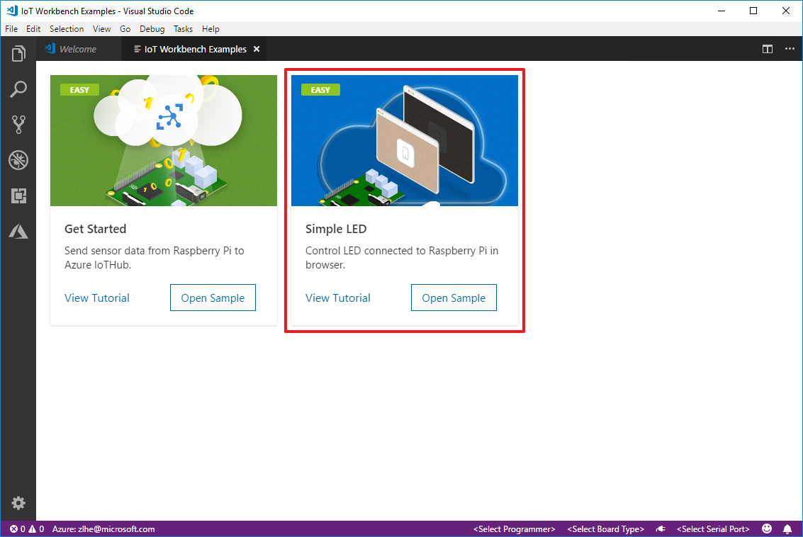

## Provision Azure Services

In the solution window, open the command palette and select **IoT Workbench: Cloud**.


Select **Azure Provision**.


Then VS Code guides you through provisioning the required Azure services.

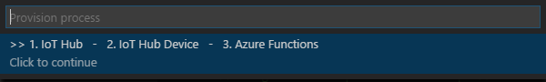

The whole process includes:

- Select an existing IoT Hub or create a new IoT Hub.
- Select an existing IoT Hub device or create a new IoT Hub device. 
- Create a new Function App.

Please take a note of the Function App name and IoT Hub device name you created. It will be used in the next section.

## Modify code for Azure Functions

Open **simple-led\run.csx** and modify the following line with the device name you provisioned in previous step:
```cpp
static string deviceName = "";
```

## Deploy Azure Functions

Open the command palette and select **IoT Workbench: Cloud**, then select **Azure Deploy**.

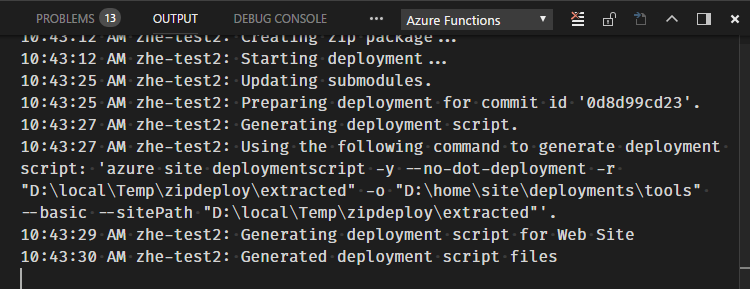

## Config IoT Hub Connection String

1. Open the command palette and select **IoT Workbench: Device**.

   

2. Select **Config Device Settings**.

   

3. Select **Config connection of IoT Hub Device**.

  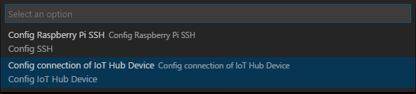

4. Select **Select IoT Hub Device Connection String**.

   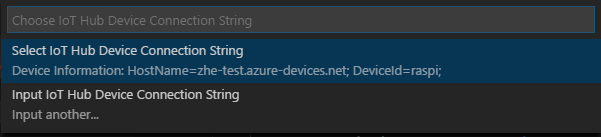

   This sets the connection string that is retrieved from the `Provision Azure services` step.

5. The configuration success notification popup bottom right corner once it's done.

   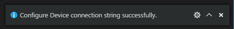 

## Upload the device code

1. Open the command palette and select **IoT Workbench: Device**.

  

2. Select **Config Device Settings**.

  

3. Select **Select Config Raspberry Pi SSH**.

  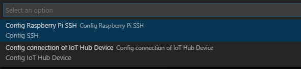

4. Input Raspberry Pi host name or IP, ssh port, user name, password and project name.

5. Open the command palette and select **IoT Workbench: Device**, then select **Device Upload**.

  

6. VS Code then starts uploading the code to Raspberry Pi and install node modules.

7. Login Raspberry Pi and run node code.

## Control LED in Browser

Open **web\index.html** and modify the following line with the function name you provisioned in previous step:
```javascript
var functionName = '';
```

1. Open `web\index.html` in browser.
2. Click the switch to control the LED.

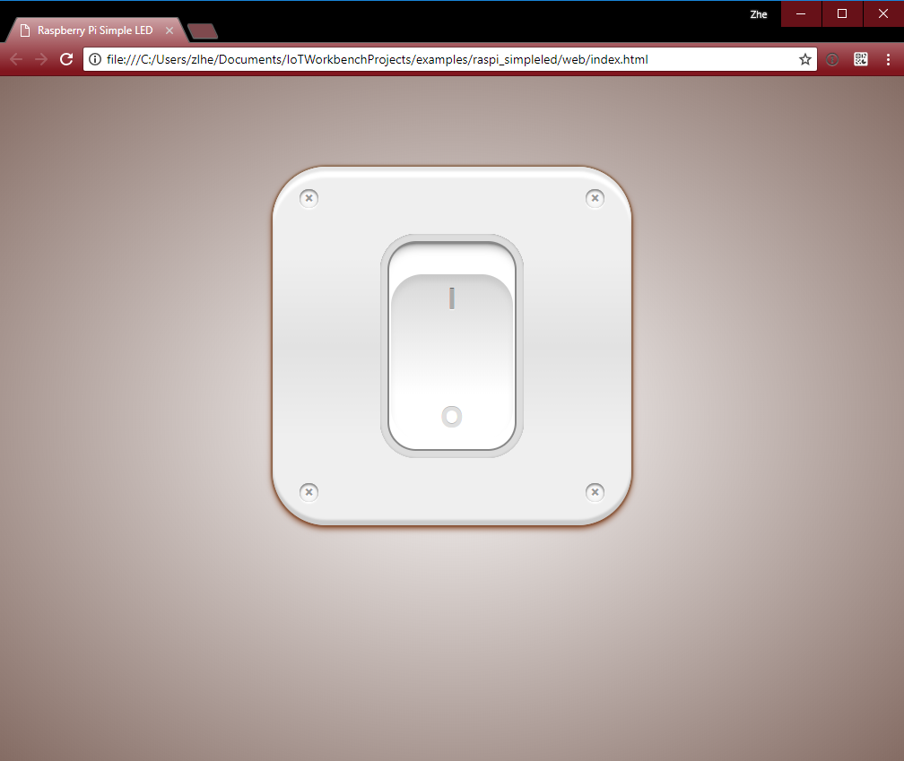